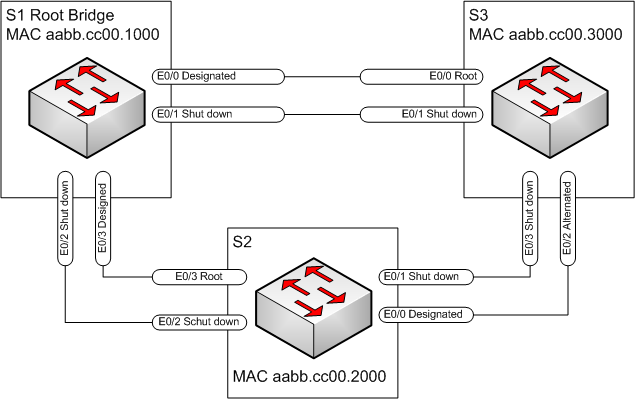

#  Развертывание коммутируемой сети с резервными каналами
### Топология


###  Цели

  1. Создание сети и настройка основных параметров устройств
  2. Выбор корневого моста
  3. Наблюдение за процессом выбора протоколом STP порта, исходя из стоимости портов
  4. Наблюдение за процессом выбора протоколом STP порта, исходя из приоритета портов
  
Таблица адресации

| Устройство     | Интерфейс    | IP-адрес             | Маска подсети| 
|-----------------:|:---------------|-------------------------:|:--------------------|
| S1   | VLAN 1 | 192.168.1.1    | 255.255.255.0 |  
| S2   | VLAN 1| 192.168.1.2    | 255.255.255.0 |
| S3   | VLAN 1| 192.168.1.3    | 255.255.255.0 |

###  Часть 1: Создание сети и настройка основных параметров устройства

  1. Создана сеть согдасно топологии;
  2. Настроены базовые параметры каждого коммутатора (на примере S3)
```
Switch#conf t
Switch(config)#no ip domain-lookup
Switch(config)#hostname S3
S3(config)#enable secret class
S3(config)#line console 0
S3(config-line)#pass cisco
S3(config-line)#login
S3(config-line)#logging synchronous
S3(config-line)#exit
S3(config)#line vty 0 4
S3(config-line)#pass cisco
S3(config-line)#login
S3(config-line)#transport input all
S3(config-line)#exit
S3(config)#service password-encryption
S3(config)#banner motd #
Enter TEXT message.  End with the character '#'.
**********************************************
Unauthorised access is prohibited!
**********************************************
#
```
  3. Заданы IP- адреса, указанные в таблице для VLAN 1 на всех коммутаторах (на примере S3), конфигурация сохранена.
```
S3(config)#int VLAN1
S3(config-if)#
S3(config-if)#ip address 192.168.1.3 255.255.255.0
S3(config-if)#^Z
S3#
S3#wr mem
```
  4.  Проверена связь
```
Выполнен эхо-запрос от коммутатора S1 на коммутатор S2 
S1#ping 192.168.1.2
Type escape sequence to abort.
Sending 5, 100-byte ICMP Echos to 192.168.1.2, timeout is 2 seconds:
.!!!!
Success rate is 80 percent (4/5), round-trip min/avg/max = 1/1/1 ms
```
```
Выполнен эхо-запрос от коммутатора S1 на коммутатор S3 
S1#ping 192.168.1.3
Type escape sequence to abort.
Sending 5, 100-byte ICMP Echos to 192.168.1.3, timeout is 2 seconds:
.!!!!
Success rate is 80 percent (4/5), round-trip min/avg/max = 1/1/1 ms
```
```
Выполнен эхо-запрос от коммутатора S2 на коммутатор S3 
S2#ping 192.168.1.3
Type escape sequence to abort.
Sending 5, 100-byte ICMP Echos to 192.168.1.3, timeout is 2 seconds:
.!!!!
Success rate is 80 percent (4/5), round-trip min/avg/max = 1/1/1 ms
```
###  Часть 2: Определение корневого коммутатора

  1. Отключила все порты на коммутаторах;
  2. Настроила подклюбченные порты в качестве транковых;
  3. Включила порты e0/0, e0/3 (S1); e0/0,e0/3 (S2); e0/0,e0/2 (S3);
  4. Данные протокола spanning-tree S1,S2 и S3 соответственно:
  ```
S1#sh spanning-tree

VLAN0001
  Spanning tree enabled protocol rstp
  Root ID    Priority    32769
             Address     aabb.cc00.1000
             This bridge is the root
             Hello Time   2 sec  Max Age 20 sec  Forward Delay 15 sec

  Bridge ID  Priority    32769  (priority 32768 sys-id-ext 1)
             Address     aabb.cc00.1000
             Hello Time   2 sec  Max Age 20 sec  Forward Delay 15 sec
             Aging Time  300 sec

Interface           Role Sts Cost      Prio.Nbr Type
------------------- ---- --- --------- -------- --------------------------------
Et0/0               Desg FWD 100       128.1    Shr
Et0/3               Desg FWD 100       128.4    Shr
```
```
S2#sh spanning-tree

VLAN0001
  Spanning tree enabled protocol rstp
  Root ID    Priority    32769
             Address     aabb.cc00.1000
             Cost        100
             Port        4 (Ethernet0/3)
             Hello Time   2 sec  Max Age 20 sec  Forward Delay 15 sec

  Bridge ID  Priority    32769  (priority 32768 sys-id-ext 1)
             Address     aabb.cc00.2000
             Hello Time   2 sec  Max Age 20 sec  Forward Delay 15 sec
             Aging Time  300 sec

Interface           Role Sts Cost      Prio.Nbr Type
------------------- ---- --- --------- -------- --------------------------------
Et0/0               Desg FWD 100       128.1    Shr
Et0/3               Root FWD 100       128.4    Shr

```
```
S3#sh spanning-tree

VLAN0001
  Spanning tree enabled protocol rstp
  Root ID    Priority    32769
             Address     aabb.cc00.1000
             Cost        100
             Port        1 (Ethernet0/0)
             Hello Time   2 sec  Max Age 20 sec  Forward Delay 15 sec

  Bridge ID  Priority    32769  (priority 32768 sys-id-ext 1)
             Address     aabb.cc00.3000
             Hello Time   2 sec  Max Age 20 sec  Forward Delay 15 sec
             Aging Time  300 sec

Interface           Role Sts Cost      Prio.Nbr Type
------------------- ---- --- --------- -------- --------------------------------
Et0/0               Root FWD 100       128.1    Shr
Et0/2               Altn BLK 100       128.3    Shr

```

#### С учетом данных, полученных с коммутаторов, имеем:

Корневым мостом является коммутатор S1;  
S1 выбран корневым коммутатором, так как при прочих равных составляющих имеет наименьший MAC адрес;  
Корневым портом называется порт, выбранный для передачи трафика корневому коммутатору, имеющий минимальную стоимость пути;
Назначенным называется порт, имеющий  наилучший путь для приема трафика, ведущего к корневому мосту;   
Порт e0/2 коммутатора S3 является альтернативным и в настоящее время заблокирован;  
В представленной схеме порт e0/2 коммутатора S3 не является ни корневым, ни назначенным. Следовательно он становится Alternated.

###  Часть 3: Наблюдение за процессом выбора протоколом STP порта, исходя из стоимости портов
В представленной схеме протокол STP блокирует порт e e0/2 на коммутаторе S2, так как S2 имеет наибольший BID (в нашем случае наибольший MAC).

1. Изменила стоимость корневого порта e0/0 крммутатора S3:
```
S3(config)#int e0/0
S3(config-if)#spanning-tree cost 18
```
2. Текущее состояние протокола STP на некорневых коммутаторах S2 и S3
```
S2#sh spanning-tree

VLAN0001
  Spanning tree enabled protocol rstp
  Root ID    Priority    32769
             Address     aabb.cc00.1000
             Cost        100
             Port        4 (Ethernet0/3)
             Hello Time   2 sec  Max Age 20 sec  Forward Delay 15 sec

  Bridge ID  Priority    32769  (priority 32768 sys-id-ext 1)
             Address     aabb.cc00.2000
             Hello Time   2 sec  Max Age 20 sec  Forward Delay 15 sec
             Aging Time  300 sec

Interface           Role Sts Cost      Prio.Nbr Type
------------------- ---- --- --------- -------- --------------------------------
Et0/0               Altn BLK 100       128.1    Shr
Et0/3               Root FWD 100       128.4    Shr
```
```
S3#sh spanning-tree

VLAN0001
  Spanning tree enabled protocol rstp
  Root ID    Priority    32769
             Address     aabb.cc00.1000
             Cost        18
             Port        1 (Ethernet0/0)
             Hello Time   2 sec  Max Age 20 sec  Forward Delay 15 sec

  Bridge ID  Priority    32769  (priority 32768 sys-id-ext 1)
             Address     aabb.cc00.3000
             Hello Time   2 sec  Max Age 20 sec  Forward Delay 15 sec
             Aging Time  300 sec

Interface           Role Sts Cost      Prio.Nbr Type
------------------- ---- --- --------- -------- --------------------------------
Et0/0               Root FWD 18        128.1    Shr
Et0/2               Desg FWD 100       128.3    Shr
```
На участке между S2 и S3 порты Designated и Alternated поменялись местами, так как Designated становится порт с наименьшей стоимостью пути к корневому мосту. Ранее решающим был номер порта, а сейчас стоимость порта.  
3. Удалила изменение стоимости порта.
```
S3(config)#int e0/0
S3(config-if)#spa
S3(config-if)#no spanning-tree cost 18
```
STP выполнил перерасчет и вернул прежние роли портам.

###  Part 4: Наблюдение за процессом выбора протоколом STP порта, исходя из приоритета портов   
1. Включила порты e0/2, e0/1 (S1); e0/2,e0/1 (S2); e0/3,e0/1 (S3);
2. Результат работы STP:
```
S2#sh spa

VLAN0001
  Spanning tree enabled protocol rstp
  Root ID    Priority    32769
             Address     aabb.cc00.1000
             Cost        100
             Port        3 (Ethernet0/2)
             Hello Time   2 sec  Max Age 20 sec  Forward Delay 15 sec

  Bridge ID  Priority    32769  (priority 32768 sys-id-ext 1)
             Address     aabb.cc00.2000
             Hello Time   2 sec  Max Age 20 sec  Forward Delay 15 sec
             Aging Time  300 sec

Interface           Role Sts Cost      Prio.Nbr Type
------------------- ---- --- --------- -------- --------------------------------
Et0/0               Desg FWD 100       128.1    Shr
Et0/1               Desg FWD 100       128.2    Shr
Et0/2               Root FWD 100       128.3    Shr
Et0/3               Altn BLK 100       128.4    Shr
```
```
S3#sh spa

VLAN0001
  Spanning tree enabled protocol rstp
  Root ID    Priority    32769
             Address     aabb.cc00.1000
             Cost        100
             Port        1 (Ethernet0/0)
             Hello Time   2 sec  Max Age 20 sec  Forward Delay 15 sec

  Bridge ID  Priority    32769  (priority 32768 sys-id-ext 1)
             Address     aabb.cc00.3000
             Hello Time   2 sec  Max Age 20 sec  Forward Delay 15 sec
             Aging Time  300 sec

Interface           Role Sts Cost      Prio.Nbr Type
------------------- ---- --- --------- -------- --------------------------------
Et0/0               Root FWD 100       128.1    Shr
Et0/1               Altn BLK 100       128.2    Shr
Et0/2               Altn BLK 100       128.3    Shr
Et0/3               Altn BLK 100       128.4    Shr
```
Root порт на коммутаторе S2 - e0/2, на коммутаторе S3-e0/0. В данной конфигурации решающее значение оказали номера портов (как состаляющая часть приоритета порта)
###  Ответы на вопросы  

1. Какое значение протокол STP использует первым после выбора корневого моста, чтобы определить выбор порта? _Стоимость порта_;
2. Если первое значение на двух портах одинаково, какое следующее значение будет использовать протокол STP при выборе порта? _Приоритет порта_;
3. Если оба значения на двух портах равны, каким будет следующее значение, которое использует протокол STP при выборе порта? _Номер порта_;

Файлы конфигурации можно посмотреть [здесь](configs/)
