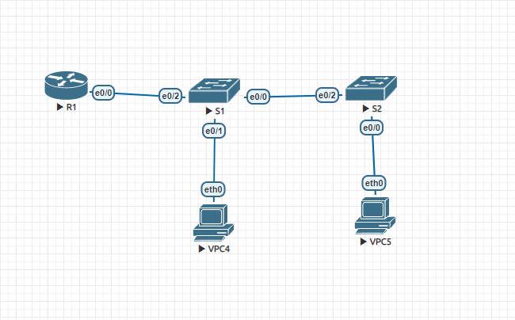

#  Configure Router-on-a-Stick Inter-Vlan Routing
### Topology


###  Objectives

  1. Build the Network and Configure Basic Devise Settings;
  2. Create VLANs snd Assign Switch Ports;
  3. Configure an 802.1Q Trunk between the Switches;
  4. Configure Inter-VLAN Routing on the Router
  5. Verify Inter-VLAN Routing is working


Addresssing and VLAN Table

| Device     | Interface    | IP Address             | Subnet Mask         | Default Gateway   | Vlan         |Name |
|-----------------:|:---------------|-------------------------:|:--------------------|:-------------:|-----------------|-----------------|
| R1   | e0/0.3 | 192.168.3.1    | 255.255.255.0 |    |  |
| R1   | e0/0.4 | 192.168.4.1    | 255.255.255.0 |   |  |
| S1   | Vl3| 192.168.3.11    | 255.255.255.0 |192.168.3.1   | 3 |Management|
| S2   | Vl3| 192.168.3.12    | 255.255.255.0 |192.168.3.1   | 3 |Management|
| VPC4   | Vl3| 192.168.3.3    | 255.255.255.0 |192.168.3.1   | 3 |Management|
| VPC5   | Vl4| 192.168.4.3    | 255.255.255.0 |192.168.4.1   | 4 |Operations|

###  Part 1: Building the Network and Configuring Basic Devise Settings
  1. The network as shown in the topology was cabled;
  2. Basic settings for the router was configured:
```
    a. Device Name R1 assigned;
    b. The privileged EXEC encrypted password class assigned;
    c. The console password cisco assigned;
    d. The VTY password cisco assigned;
    e. The plaintext passwords encrypted;
    f. The banner created;
    g. The clock on the router is set;
```
  3. Basic settings for each switch was configured:
```
    a. Device Names S1,S2 assigned;
    b. The privileged EXEC encrypted password class assigned;
    c. The console password cisco assigned;
    d. The VTY password cisco assigned;
    e. The plaintext passwords encrypted;
    f. The banner created;
    g. The clock on the switches is set;
```

###  Part 2: Creating VLANs and Assign Switch Ports 
  1. VlANs on the both switches created;
  1. VLANs to the correct interfaces assigned;
  ```
  S2#show vlan brief

VLAN Name                             Status    Ports
---- -------------------------------- --------- -------------------------------
1    default                          active    Et0/1, Et0/3
3    Management                       active
4    Operations                       active    Et0/0
```
```
S1#sh vl bri

VLAN Name                             Status    Ports
---- -------------------------------- --------- -------------------------------
1    default                          active    Et0/3
3    Management                       active    Et0/1
4    Operations                       active
```

###  Part 3: Configuring Trunk between the switches
1. Manually configured trung interface e0/0 (S1);
```
interface Ethernet0/0
 description link to S2
 switchport trunk encapsulation dot1q
 switchport mode trunk
end
```
2. Manually configured trung interface e0/2 (S2);
```
interface Ethernet0/2
 description link to S1
 switchport trunk encapsulation dot1q
 switchport mode trunk
end
```
3. Manually configured trunk interface e0/2 (S1);
```
S1#sh int tr

Port        Mode             Encapsulation  Status        Native vlan
Et0/0       on               802.1q         trunking      1
Et0/2       on               802.1q         trunking      1

Port        Vlans allowed on trunk
Et0/0       1-4094
Et0/2       1-4094

Port        Vlans allowed and active in management domain
Et0/0       1,3-4
Et0/2       1,3-4

Port        Vlans in spanning tree forwarding state and not pruned
Et0/0       1,3-4
Et0/2       1,3-4

```
###  Part 4: Configured inter-VLAN routing on the Router
```
R1#sh ip int brief
Interface                  IP-Address      OK? Method Status                Protocol
Ethernet0/0                unassigned      YES NVRAM  up                    up
Ethernet0/0.3              192.168.3.1     YES NVRAM  up                    up
Ethernet0/0.4              192.168.4.1     YES NVRAM  up                    up
Ethernet0/0.8              unassigned      YES unset  up                    up
```
###  Part 4: Verifyed inter-VLAN routing 
1. test from VPC4 to its default gateway;
```
VPCS> ip 192.168.3.3 255.255.255.0 192.168.3.1
Checking for duplicate address...
VPCS : 192.168.3.3 255.255.255.0 gateway 192.168.3.1

VPCS> ping 192.168.3.1

84 bytes from 192.168.3.1 icmp_seq=1 ttl=255 time=0.297 ms
84 bytes from 192.168.3.1 icmp_seq=2 ttl=255 time=0.474 ms
84 bytes from 192.168.3.1 icmp_seq=3 ttl=255 time=0.462 ms
84 bytes from 192.168.3.1 icmp_seq=4 ttl=255 time=0.447 ms
84 bytes from 192.168.3.1 icmp_seq=5 ttl=255 time=0.455 ms
```
2. test from VPC4 to VPC5;
```
VPCS> ping 192.168.4.1

84 bytes from 192.168.4.1 icmp_seq=1 ttl=255 time=0.448 ms
84 bytes from 192.168.4.1 icmp_seq=2 ttl=255 time=0.447 ms
84 bytes from 192.168.4.1 icmp_seq=3 ttl=255 time=0.417 ms
84 bytes from 192.168.4.1 icmp_seq=4 ttl=255 time=0.446 ms
84 bytes from 192.168.4.1 icmp_seq=5 ttl=255 time=0.460 ms
```
3. test from VPC4 to S2;
```
VPCS> ping 192.168.3.12

84 bytes from 192.168.3.12 icmp_seq=1 ttl=255 time=0.272 ms
84 bytes from 192.168.3.12 icmp_seq=2 ttl=255 time=0.440 ms
84 bytes from 192.168.3.12 icmp_seq=3 ttl=255 time=0.466 ms
84 bytes from 192.168.3.12 icmp_seq=4 ttl=255 time=0.402 ms
84 bytes from 192.168.3.12 icmp_seq=5 ttl=255 time=0.434 ms
```
4. test from VPC5 to VPC4;
```
trace to 192.168.3.3, 8 hops max, press Ctrl+C to stop
 1   192.168.4.1   0.404 ms  0.352 ms  0.335 ms
 2   *192.168.3.3   1.610 ms (ICMP type:3, code:3, Destination port unreachable)
```
###  The End