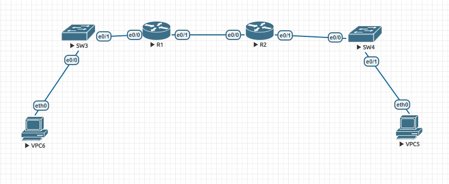

#  Implementation DHCPv4
### Topology


###  Objectives

  1. Build the Network and Configure Basic Devise Settings;
  2. Configure and verify two DHCPv4 Servers on R1;
  3. Configure and verify a DHCP Relay on R2;
  

Addresssing Table

| Device     | Interface    | IP Address             | Subnet Mask         | Default Gateway   |
|-----------------:|:---------------|:-------------------------|:--------------------|:-------------|
| R1   | e0/1 | 10.0.0.1    | 255.255.255.252 |
| R1   | e0/0 | | |
| R1   | e0/1.100 |192.168.1.1|255.255.255.192 |   |
| R1   | e0/1.200|192.168.1.65 |255.255.255.192|   | 
| R1   | e0/1.1000|  |  |  |
| R2   | e0/0|10.0.0.2 | 255.255.255.252 | |
| R2   | e0/1|192.168.1.129 | 255.255.255.192 | |
| S1   | VLAN 200|192.168.1.66 | 255.255.255.192 |192.168.1.65 |
| S2   | VLAN 1| | | |
| VPC5 | NIC|DHCP | DHCP |DHCP |
| VPC6 | NIC|DHCP | DHCP |DHCP |


VLAN Table

| VLAN | NAME | Interface Assigned |
|-----------------:|:---------------|:-------------------------|
| 1   |  | S2:e0/1 |
| 100   | Clients |S1:e0/0 |
| 200   | Management |S1:VLAN 200|
| 999   | Parking_Lot|S1:e0/2-3 | 
| 1000  | Native|  |


###  Part 1: Building the Network and Configuring Basic Devise Settings
  1. The network as shown in the topology was cabled;
  2. Establishing an addressing scheme. Network 192.168.1.0/24 was divided as follows:
```

    a. "Subnet A", have to supporting 58 hosts (the client VLAN at R1)
    192.168.1.0/26

    b. "Subnet B", have to supporting 28 hosts (the management VLAN at R1)
    192.168.1.64/26

    c. "Subnet C", have to supporting 12 hosts (the client network at R2)
    192.168.1.128/26 

    d. Subnet 192.168.1.192/26 is not assigned;
    
```

  3. Basic settings for each router was configured (shown for R1):
```
Router#conf t
Router(config)#no ip domain lookup
Router(config)#hostname R1
R1(config)#enable secret class
R1(config)#line console 0
R1(config-line)#pass cisco
R1(config-line)#login
R1(config-line)#exit
R1(config)#line vty 0 4
R1(config-line)#pass cisco
R1(config-line)#login
R1(config-line)#transport input all
R1(config-line)#exit
R1(config)#service password-encryption
R1(config)#banner motd #
Enter TEXT message.  End with the character '#'.
***************************************
UNAUTORISED ACCESS IS PROHIBITED!
***************************************
#
R1(config)#^Z
R1#cloc set 18:47:00 02 oct 2023
R1#
```
 4. Inter-VLAN Routing on R1 was conbfigured:

a. interface e0/0 on the router was activated.

b. Sub-interfaces for each VLAN as required by the IP addressing table was configured and verifyed.
```    
R1(config)#int Et0/0
R1(config-if)#no shut
R1(config-if)#^Z
R1#
R1#conf t
R1(config)#int e0/0
R1(config-if)#int e0/0.100
R1(config-subif)#desc Subnet A
R1(config-subif)#encapsulation dot1q 100
R1(config-subif)#ip address 192.168.1.1 255.255.255.192
R1(config-subif)#^Z
R1#
R1#conf t
R1(config)#int Et0/0.200
R1(config-subif)#desc Subnet B
R1(config-subif)#encapsulation dot1Q 200
R1(config-subif)#ip address 192.168.1.65 255.255.255.192
R1(config-subif)#^Z
R1#
R1#conf t
R1(config)#int e0/0.999
R1(config-subif)#desc Parking_Lot
R1(config-subif)#encapsulation dot1Q 999
R1(config-subif)#^Z
R1#
R1#conf t
R1(config)#int e0/0.1000
R1(config-subif)#encapsulation dot1Q 1000 native
R1(config-subif)#


R1#sh ip int brief
Interface                  IP-Address      OK? Method Status                Protocol
Ethernet0/0                unassigned      YES unset  up                    up
Ethernet0/0.100            192.168.1.1     YES manual up                    up
Ethernet0/0.200            192.168.1.65    YES manual up                    up
Ethernet0/0.999            unassigned      YES unset  up                    up
Ethernet0/0.1000           unassigned      YES unset  up                    up
Ethernet0/1                unassigned      YES unset  administratively down down
Ethernet0/2                unassigned      YES unset  administratively down down
Ethernet0/3                unassigned      YES unset  administratively down down
    
```
5. Interfaces e0/0-1 on R2 and static routing for both routers was conbfigured:

a. interface e0/1 on R2 was configured with the first IP address of "Subnet C".
```
R2#conf t
R2(config)#int e0/1
R2(config-if)#ip add
R2(config-if)#ip address 192.168.1.129 255.255.255.192
R2(config-if)#desc Subnet C
R2(config)#int e0/1
R2(config-if)#no shut
R2(config-if)#^Z
R2#

```

b. interfaces e0/1(R1) and e0/0(R2) was configured based on the IP Addressing table above.(listing for R2 only)
```
R2#sh ip int brie
Interface                  IP-Address      OK? Method Status                Protocol
Ethernet0/0                10.0.0.2        YES manual up                    up
Ethernet0/1                192.168.1.129   YES manual up                    up
Ethernet0/2                unassigned      YES unset  administratively down down
Ethernet0/3                unassigned      YES unset  administratively down down

```
    
c. default route on each router was configured.(listing for R1 only)
```
R1#conf t
R1(config)#ip route 0.0.0.0 0.0.0.0 10.0.0.2
R1(config)#^Z
R1#

```
d. static routing is working:
```
R1#ping 192.168.1.129
Type escape sequence to abort.
Sending 5, 100-byte ICMP Echos to 192.168.1.129, timeout is 2 seconds:
.!!!!
Success rate is 80 percent (4/5), round-trip min/avg/max = 1/1/1 ms

```
6. Basic settings for each switch was configured (shown for SW3):
```
Switch#conf t
Enter configuration commands, one per line.  End with CNTL/Z.
Switch(config)#hostname SW3
SW3(config)#no ip domain-lookup
SW3(config)#enable secret class
SW3(config)#line console 0
SW3(config-line)#pass cisco
SW3(config-line)#login
SW3(config-line)#logging synchronous
SW3(config-line)#exit
SW3(config)#line vty 0 4
SW3(config-line)#pass cisco
SW3(config-line)#login
SW3(config-line)#transport input all
SW3(config-line)#exit
SW3(config)#service password-e
SW3(config)#service password-encryption
SW3(config)#banner motd #
Enter TEXT message.  End with the character '#'.
**********************************************
Unauthorised access is prohibited!
**********************************************
#
SW3(config)#^Z
SW3#cloc set 17:39:00 03 oct 2023

```
7. Create VLANs on SW3 (SW4 is only configured with basic settings):

a. VLANs on SW3 was created as required in the table above.
```
SW3#conf t
Enter configuration commands, one per line.  End with CNTL/Z.
SW3(config)#vl 100
SW3(config-vlan)#name Clients
SW3(config-vlan)#exit
SW3(config)#vl 200
SW3(config-vlan)#name Management
SW3(config-vlan)#exit
SW3(config)#vl 999
SW3(config-vlan)#name Parking_Lot
SW3(config-vlan)#exit
SW3(config)#vl 1000
SW3(config-vlan)#name Native
SW3(config-vlan)#^Z

```
b. the management interface on SW3 (VLAN 200) was configured with second IP address from te "Subnet B" 192.168.1.66. Default gateway on SW3 is 192.168.1.65
```
SW3#sh run int Vl200
!
interface Vlan200
 ip address 192.168.1.66 255.255.255.192
end
```
c. the management interface on SW4 (VLAN 1) was configured with second IP address from te "Subnet C" 192.168.1.130 Default gateway on SW3 is 192.168.1.129
```
SW4#sh run int Vl1
!
interface Vlan1
 ip address 192.168.1.130 255.255.255.192
end
```
d. all unused ports on SW3 was assigned to the Parking_Lot VLAN? configured foor static access mode and administratively deactivated. 
```
interface Ethernet0/2
 switchport access vlan 999
 switchport mode access
 shutdown
!
interface Ethernet0/3
 switchport access vlan 999
 switchport mode access
 shutdown
!
```
d. all unused ports on SW4 was administratively deactivated. 
```
SW4#sh int desc
Interface                      Status         Protocol Description
Et0/0                          up             up
Et0/1                          up             up
Et0/2                          admin down     down
Et0/3                          admin down     down
Vl1                            up             up
SW4#
```
8. Assign VLANs to the correct switch interfaces.

a. used port on SW3 was assigned to the VLAN 100 and configured for static access mode 
```
SW3#sh run int e0/0
!
interface Ethernet0/0
 switchport access vlan 100
 switchport mode access
end
```
b. verifying VLANs on SW3 and SW4 
```
SW3#sh vl

VLAN Name                             Status    Ports
---- -------------------------------- --------- -------------------------------
1    default                          active
100  Clients                          active    Et0/0
200  Management                       active
999  Parking_Lot                      active    Et0/2, Et0/3
```
```
SW4#sh vl

VLAN Name                             Status    Ports
---- -------------------------------- --------- -------------------------------
1    default                          active    Et0/1, Et0/2, Et0/3
```
9. Manually configure SW3(e0/1), SW4(e0/0) as an 802.1Q trunk.

a. switchport mode on SW3(e0/1), SW4(e0/0) was changed to force trunking

b. native VLAN on  SW3(e0/1) was set to 1000

c. VLANs 100,200 and 1000 on  on  SW3(e0/1) was specifyed as allowed to cross the trunk
```
 SW3#sh run int e0/1

interface Ethernet0/1
 description uplink to R1
 switchport trunk allowed vlan 100,200,1000
 switchport trunk encapsulation dot1q
 switchport trunk native vlan 1000
 switchport mode trunk
end
```
```
SW4#sh run int e0/0

interface Ethernet0/0
 switchport trunk encapsulation dot1q
 switchport mode trunk
end
```
At this point, if the PC`s were connected to the network using DHCP, they would have IP address 169.254.0.1-254


###  Part 2: Configuring and verifying two DHCPv4 Servers on R1 
  1. Configuring R1 with DHCPv4 pools for the "Subnet A" and "Subnet C";
```
R1#conf t
R1(config)#ip dhcp excluded-address 192.168.1.1 192.168.1.5
R1(config)#ip dhcp pool SubnetA-POOL
R1(dhcp-config)#network 192.168.1.0 255.255.255.192
R1(dhcp-config)#domain-name ccna-lab.com
R1(dhcp-config)#default-router 192.168.1.1
R1(dhcp-config)#lease 2 12 30
R1(dhcp-config)#^Z
R1#
```
```
R1#conf t
R1(config)#ip dhcp excluded-address 192.168.1.129 192.168.1.133
R1(config)#ip dhcp pool R2_Client_LAN
R1(dhcp-config)#domain-name ccna.lab
R1(dhcp-config)#network 192.168.1.128 255.255.255.192
R1(dhcp-config)#default-router 192.168.1.129
R1(dhcp-config)#lease 2 12 30
R1(dhcp-config)#^Z
R1#
```
  2. Verifying the DHCPv4 Server configuration
```
R1#show ip dhcp pool

Pool SubnetA-POOL :
 Utilization mark (high/low)    : 100 / 0
 Subnet size (first/next)       : 0 / 0
 Total addresses                : 62
 Leased addresses               : 0
 Pending event                  : none
 1 subnet is currently in the pool :
 Current index        IP address range                    Leased addresses
 192.168.1.1          192.168.1.1      - 192.168.1.62      0

Pool R2_Client_LAN :
 Utilization mark (high/low)    : 100 / 0
 Subnet size (first/next)       : 0 / 0
 Total addresses                : 62
 Leased addresses               : 0
 Pending event                  : none
 1 subnet is currently in the pool :
 Current index        IP address range                    Leased addresses
 192.168.1.129        192.168.1.129    - 192.168.1.190     0
```
```
R1#sh ip dhcp bind
Bindings from all pools not associated with VRF:
IP address          Client-ID/              Lease expiration        Type
                    Hardware address/
                    User name
```
```
R1#sh ip dhcp server stat
Memory usage         24870
Address pools        2
Database agents      0
Automatic bindings   0
Manual bindings      0
Expired bindings     0
Malformed messages   0
Secure arp entries   0

Message              Received
BOOTREQUEST          0
DHCPDISCOVER         0
DHCPREQUEST          0
DHCPDECLINE          0
DHCPRELEASE          0
DHCPINFORM           0

Message              Sent
BOOTREPLY            0
DHCPOFFER            0
DHCPACK              0
DHCPNAK              0
R1#
```
  3. Acquiring an IP address from DHCP on VPC6

a. command *ip dhcp -r* were executed on VPC6 to obtain the IP address from DHCP
```
VPCS> ip dhcp -r
DDORA IP 192.168.1.6/26 GW 192.168.1.1

VPCS> sh ip all

NAME   IP/MASK              GATEWAY           MAC                DNS
VPCS1  192.168.1.6/26       192.168.1.1       00:50:79:66:68:06
```
b. Gateway availability checked 
```
VPCS> ping 192.168.1.1

84 bytes from 192.168.1.1 icmp_seq=1 ttl=255 time=0.241 ms
84 bytes from 192.168.1.1 icmp_seq=2 ttl=255 time=0.536 ms
84 bytes from 192.168.1.1 icmp_seq=3 ttl=255 time=0.489 ms
84 bytes from 192.168.1.1 icmp_seq=4 ttl=255 time=0.447 ms
84 bytes from 192.168.1.1 icmp_seq=5 ttl=255 time=0.441 ms
```

###  Part 3: Configuring and verifying a DHCP Relay on SW4
1. Configuring SW4 as a DHCP relay agent for the LAN on e0/1;

a. the *ip helper-address* command on e0/1 was configured (specifying SW3`se0/1 IP address)
```
R2#conf t
Enter configuration commands, one per line.  End with CNTL/Z.
R2(config)#int e0/1
R2(config-if)#ip helper-address 10.0.0.1
R2(config-if)#^Z
R2#
```
2. Acquiring an IP address from DHCP on VPC5

a. command *ip dhcp -r* were executed on VPC6 to obtain the IP address from DHCP
```
VPCS> ip dhcp -r
DDORA IP 192.168.1.134/26

VPCS> sh ip all

NAME   IP/MASK              GATEWAY           MAC                DNS
VPCS1  192.168.1.134/26     0.0.0.0           00:50:79:66:68:05
```
b. SW3 availability was checked
```
VPCS> ping 192.168.1.129

84 bytes from 192.168.1.129 icmp_seq=1 ttl=255 time=0.267 ms
84 bytes from 192.168.1.129 icmp_seq=2 ttl=255 time=0.468 ms
84 bytes from 192.168.1.129 icmp_seq=3 ttl=255 time=0.415 ms
84 bytes from 192.168.1.129 icmp_seq=4 ttl=255 time=0.422 ms
84 bytes from 192.168.1.129 icmp_seq=5 ttl=255 time=0.412 ms

```
c. verifying DHCP bindings on R1
```
R1#sh ip dhcp bind
Bindings from all pools not associated with VRF:
IP address          Client-ID/              Lease expiration        Type
                    Hardware address/
                    User name
192.168.1.6         0100.5079.6668.06       Oct 07 2023 06:21 AM    Automatic
192.168.1.134       0100.5079.6668.05       Oct 08 2023 05:00 AM    Automatic
```
d. verifying DHCP messages on R1
```
R1#sh ip dhcp server stat
Memory usage         41788
Address pools        2
Database agents      0
Automatic bindings   2
Manual bindings      0
Expired bindings     0
Malformed messages   0
Secure arp entries   0

Message              Received
BOOTREQUEST          0
DHCPDISCOVER         4
DHCPREQUEST          2
DHCPDECLINE          0
DHCPRELEASE          0
DHCPINFORM           0

Message              Sent
BOOTREPLY            0
DHCPOFFER            2
DHCPACK              2
DHCPNAK              0
R1#
```
e. verifying DHCP messages on R2
```
R2#sh ip dhcp server stat
Memory usage         22565
Address pools        0
Database agents      0
Automatic bindings   0
Manual bindings      0
Expired bindings     0
Malformed messages   0
Secure arp entries   0

Message              Received
BOOTREQUEST          0
DHCPDISCOVER         0
DHCPREQUEST          0
DHCPDECLINE          0
DHCPRELEASE          0
DHCPINFORM           0

Message              Sent
BOOTREPLY            0
DHCPOFFER            0
DHCPACK              0
DHCPNAK              0
R2#
```

Configs can be found [here](configs/).
###  The End