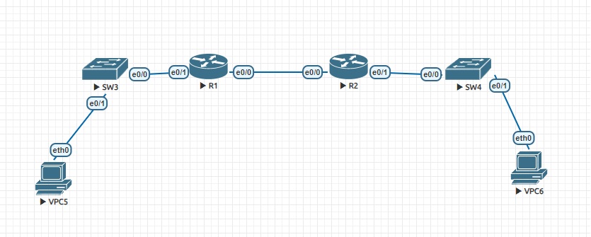

#  Configure DHCPv6
### Topology


###  Objectives

  1. Build the Network and Configure Basic Devise Settings;
  2. Verify SLAAC address assignment from R1;
  3. Configure and verify a Stateless DHCPv6 Server on R1;
  4. Configure and verify a Stateful DHCPv6 Server on R1;
  5. Configure and verify a DHCPv6 Relay on R2;

Addresssing Table

| Device     | Interface    | IPv6 Link-Local Address | IPv6 GUA| 
|-----------------:|:---------------|:-------------------------|:--------------------|
| R1   | e0/0 |fe80::1|2001:db8:acad:2::1/64|
| R1   | e0/1 |fe80::1|2001:db8:acad:1::1/64|
| R2   | e0/0 |fe80::2|2001:db8:acad:2::2/64|
| R2   | e0/1 |fe80::1|2001:db8:acad:3::1/64|
| VPC5 | eth0| | |DHCP |
| VPC6 | eth0| | |DHCP |


###  Part 1: Building the Network and Configuring Basic Devise Settings
  1. The network as shown in the topology was cabled;
  
  2. Basic settings have been configured for each switch, all unused ports have been disabled (shown for SW3):
```
Switch#conf t
Switch(config)#hostname SW3
SW3(config)#no ip domain-lookup
SW3(config)#enable secret class
SW3(config)#line console 0
SW3(config-line)#pass cisco
SW3(config-line)#login
SW3(config-line)#logging synchronous
SW3(config-line)#exit
SW3(config)#line vty 0 4
SW3(config-line)#pass cisco
SW3(config-line)#login
SW3(config-line)#transport input all
SW3(config-line)#exit
SW3(config)#service password-encryption
SW3(config)#banner motd #
Enter TEXT message.  End with the character '#'.
***********************************************
UNAUTHORISED ACCESS IS PROHIBITED!
***********************************************
#
SW3(config)#int range e0/2-3
SW3(config-if-range)#shut
SW3(config-if-range)#^Z
SW3#

```
 3. Basic settings have been configured for each router with ipv6 enabled (shown for R1):
 ```
Router#conf t
Router(config)#hostname R1
R1(config)#no ip domain lookup
R1(config)#enable secret class
R1(config)#line console 0
R1(config-line)#pass cisco
R1(config-line)#login
R1(config-line)#exit
R1(config)#line vty 0 4
R1(config-line)#pass cisco
R1(config-line)#login
R1(config-line)#transport input all
R1(config-line)#exit
R1(config)#service password-encryption
R1(config)#banner motd #
Enter TEXT message.  End with the character '#'.
***********************************************
UNAUTHORISED ACCESS IS PROHIBITED!
***********************************************
#
R1(config)#ipv6 unicast-routing
R1(config)#^Z
R1#
 ```

4. Interfaces and routing for both routers have been configured 

a. e0/0 and e0/1 interfaces on R1 and R2 have been configured with the IPv6 addresses specified in the table (shown for R2)
```
R2#conf t
R2(config)#int e0/0
R2(config-if)#ipv6 add fe80::2 link-local
R2(config-if)#ipv6 add 2001:db8:acad:2::2/64
R2(config-if)#exit
R2(config)#int e0/1
R2(config-if)#ipv6 add fe80::1 link
R2(config-if)#ipv6 add 2001:db8:acad:3::1/64
R2(config-if)#^Z
R2#
```
b. Default route on each router pointed to the IP adress of e0/0 of the other router have been configured 
```
R2#conf t
R2(config)#int e0/0
R2(config-if)#ipv6 route ::/0 2001:DB8:ACAD:2::1
R2(config)#^Z
R2#
```
```
R1#conf t
R1(config)#int e0/0
R1(config-if)#ipv6 route ::/0 2001:DB8:ACAD:2::2
R1(config)#^Z
R1#
```
c. Verifying routing is working by pinging R2's e0/1 address from R1
```
R1#ping ipv6  2001:DB8:ACAD:3::1
Type escape sequence to abort.
Sending 5, 100-byte ICMP Echos to 2001:DB8:ACAD:3::1, timeout is 2 seconds:
!!!!!
Success rate is 100 percent (5/5), round-trip min/avg/max = 1/4/17 ms
R1#
```
###  Part 2: Verifying SLAAC Address Assignment from R1

VPC5 was configured for IPv6 with automatic configuration
```
VPCS> sh ipv6

NAME              : VPCS[1]
LINK-LOCAL SCOPE  : fe80::250:79ff:fe66:6805/64
GLOBAL SCOPE      : 2001:db8:acad:1:2050:79ff:fe66:6805/64
DNS               :
ROUTER LINK-LAYER : aa:bb:cc:00:10:10
MAC               : 00:50:79:66:68:05
LPORT             : 20000
RHOST:PORT        : 127.0.0.1:30000
MTU:              : 1500
```

###  Part 3: Configuring and verifying a DHCPv6 server on R1

1. R1 have been configured to provide stateless DHCPv6 for VPC5

a. On R1 have been created an IPv6 DHCP pool named R1-STATELESS, was assigned the DNS server address and the domain name:
```
R1#conf t
R1(config)#ipv6 dhcp pool R1-STATELESS
R1(config-dhcpv6)#dns-server 2001:db8:acad::254
R1(config-dhcpv6)#domain-name STATELESS.com
R1(config-dhcpv6)#^Z
R1#
```
b. the e0/1 interface on R1 have been configured to provide the OTHER config flag to the R1 LAN and the DHCP pool have been specifyed for this interface
```
R1#conf t
R1(config)#int e0/1
R1(config-if)#ipv6 nd other-config-flag
R1(config-if)#ipv6 dhcp server R1-STATELESS
R1(config-if)#^Z
R1#
```

c. VPC5 was restarted, but not obtained adwanced configuration, so it`s the feil of EVE?

d. Testing connectivity by pinging R2`s e0/1 interface IP address
```
VPCS> ping 2001:db8:acad:3::1

2001:db8:acad:3::1 icmp6_seq=1 ttl=63 time=0.536 ms
2001:db8:acad:3::1 icmp6_seq=2 ttl=63 time=0.521 ms
2001:db8:acad:3::1 icmp6_seq=3 ttl=63 time=0.481 ms
2001:db8:acad:3::1 icmp6_seq=4 ttl=63 time=0.505 ms
2001:db8:acad:3::1 icmp6_seq=5 ttl=63 time=0.520 ms

```
###  Part 4: Configuring a statefull DHCPv6 server on R1

a. Creating a DHCPv6 pool on R1 for the 2001:db8:acad:3:aaaa::/80 network for the LAN connected to interface e0/1 on R2.
```
R1#conf t
R1(config)#ipv6 dhcp pool R2-STATEFUL
R1(config-dhcpv6)#address prefix 2001:db8:acad:3:aaa::/80
R1(config-dhcpv6)#dns-server 2001:db8:acad::254
R1(config-dhcpv6)#domain-name STATEFUL.com
R1(config-dhcpv6)#^Z
R1#
```
b. Assigning the DHCPv6 pool R2-STATEFUL to interface e0/0 on R1
```
R1#conf t
R1(config)#int e0/0
R1(config-if)#ipv6 dhcp server R2-STATEFUL
R1(config-if)#^Z
R1#
```
###  Part 5: Configuring and verifying DHCPv6 relay on R2
1. Checking the address obtained by the SLAAC method on VPC6
```
VPCS> sh ipv6

NAME              : VPCS[1]
LINK-LOCAL SCOPE  : fe80::250:79ff:fe66:6806/64
GLOBAL SCOPE      : 2001:db8:acad:3:2050:79ff:fe66:6806/64
DNS               :
ROUTER LINK-LAYER : aa:bb:cc:00:20:10
MAC               : 00:50:79:66:68:06
LPORT             : 20000
RHOST:PORT        : 127.0.0.1:30000
MTU:              : 1500
```
2. Configuring R2 as a DHCP relay agent for the LAN on e0/1

a. R2 interface e0/1 have been configured as *ipv6 DHCP relay*, the destination address is R1 e0/0. The *managed-config-flag* have been changed
```
R2#conf t
R2(config)#int e0/1
R2(config-if)#ipv6 nd managed-config-flag
R2(config-if)#ipv6 dhcp relay destination 2001:db8:acad:2::1 e0/0
R2(config-if)#^Z
R2#
```
```
R2#sh ipv6 int e0/1
Ethernet0/1 is up, line protocol is up
  IPv6 is enabled, link-local address is FE80::1
  No Virtual link-local address(es):
  Global unicast address(es):
    2001:DB8:ACAD:3::1, subnet is 2001:DB8:ACAD:3::/64
  Joined group address(es):
    FF02::1
    FF02::2
    FF02::1:2
    FF02::1:FF00:1
  MTU is 1500 bytes
  ICMP error messages limited to one every 100 milliseconds
  ICMP redirects are enabled
  ICMP unreachables are sent
  ND DAD is enabled, number of DAD attempts: 1
  ND reachable time is 30000 milliseconds (using 30000)
  ND advertised reachable time is 0 (unspecified)
  ND advertised retransmit interval is 0 (unspecified)
  ND router advertisements are sent every 200 seconds
  ND router advertisements live for 1800 seconds
  ND advertised default router preference is Medium
  Hosts use DHCP to obtain routable addresses.
R2#
```
3. VPC6 was restarted, but not obtained new configuration!
```
VPCS> sh ipv6

NAME              : VPCS[1]
LINK-LOCAL SCOPE  : fe80::250:79ff:fe66:6806/64
GLOBAL SCOPE      : 2001:db8:acad:3:2050:79ff:fe66:6806/64
DNS               :
ROUTER LINK-LAYER : aa:bb:cc:00:20:10
MAC               : 00:50:79:66:68:06
LPORT             : 20000
RHOST:PORT        : 127.0.0.1:30000
MTU:              : 1500

```
Testing connectivity by pinging R1's G0/0/1 interface IP address
```
VPCS> ping 2001:db8:acad:1::1/64

2001:db8:acad:1::1 icmp6_seq=1 ttl=63 time=39.538 ms
2001:db8:acad:1::1 icmp6_seq=2 ttl=63 time=0.533 ms
2001:db8:acad:1::1 icmp6_seq=3 ttl=63 time=0.497 ms
2001:db8:acad:1::1 icmp6_seq=4 ttl=63 time=0.508 ms
2001:db8:acad:1::1 icmp6_seq=5 ttl=63 time=0.542 ms

```
Configs can be found [here](configs/).

###  The End