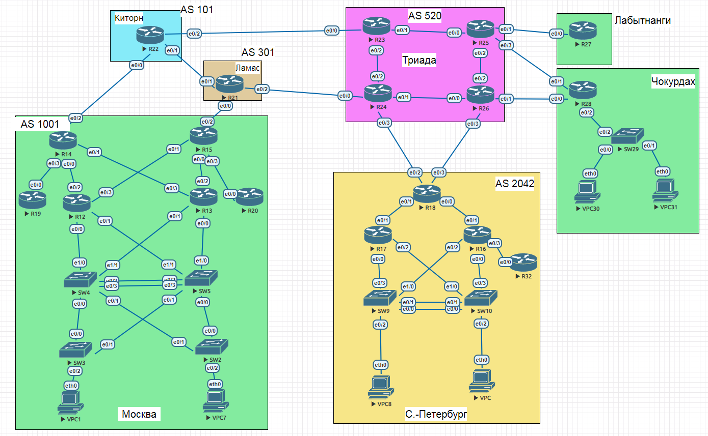

#  Проектирование сети
### Топология


###  Цели

  1. Распланировать адресное пространство
  2. Настроить IP на всех активных портах для дальнейшей работы над проектом
  3. Адресное пространство должно быть задокументировано
  
  

#### Часть 1. Распределение адресного пространства

 Адресное пространство распределено следующим образом: 

|Назначение| Сеть|
|:-----------:|--------------:|
|Активное оборудование Москва R|10.1.0.0/24|
|Активное оборудование Москва SW|10.1.100.0/24|
|Активное оборудование С.-Петербург R| 10.2.0.0/24|
|Активное оборудование С.-Петербург SW| 10.2.100.0/24|
|Активное оборудование Триада |10.3.0.0/24|
|Активное оборудование Лабытнанги |10.4.0.0/24 |
|Активное оборудование Чокурдах R|10.5.0.0/24 |
|Активное оборудование Чокурдах SW|10.5.100.0/24 |
|Активное обюорудование Киторн|10.6.0.0/24|
|Связи между активным оборудованием R|10.1.1.0/24|


Таблица адресации

|Локация| Устройство     | Интерфейс    | IP-адрес             | Маска подсети|Шлюз| 
|:-----------------|:---------------|-------------------------:|:--------------------|-------:|-----------:|
| Москва  | R12 | loopback    | 10.1.0.12 |255.255.255.255| |  
| Москва  | R12|e0/0  | || |
| Москва  | R12| e0/1 | || |
| Москва  | R12| e0/2 |10.1.1.193 |255.255.255.252| |
| Москва  | R12| e0/3 |10.1.1.225 |255.255.255.252| |
| Москва  | R13| loopback    | 10.1.0.13 |255.255.255.255| |
| Москва  | R13|e0/0  | || |
| Москва  | R13|e0/1  | || |
| Москва  | R13| e0/2 |10.1.1.129 |255.255.255.252| |
| Москва  | R13| e0/3 |10.1.1.1 |255.255.255.252| |
| Москва  | R14| loopback    | 10.1.0.14 |255.255.255.255| |
| Москва  | R14| e0/0 |10.1.1.194 |255.255.255.252| |
| Москва  | R14| e0/1 |10.1.1.2 |255.255.255.252| |
| Москва  | R14| e0/2 |10.1.1.133 |255.255.255.252| |
| Москва  | R14| e0/3 |10.1.1.137 |255.255.255.252| |
| Москва  | R15| loopback    | 10.1.0.15 |255.255.255.255| |
| Москва  | R15| e0/0 |10.1.1.130 |255.255.255.252| |
| Москва  | R15| e0/1 |10.1.1.126 |255.255.255.252| |
| Москва  | R15| e0/2 |10.1.1.253 |255.255.255.252| |
| Москва  | R15| e0/3 |10.1.1.250 |255.255.255.252| |
| Москва  | R19| loopback    | 10.1.0.19 |255.255.255.255| |
| Москва  | R19| e0/0 |10.1.1.138 |255.255.255.252| |
| Москва  | R19| e0/1 | || |
| Москва  | R19| e0/2 | || |
| Москва  | R19| e0/3 | || |
| Москва  | R20| loopback    | 10.1.0.20 |255.255.255.255| |
| Москва  | R20| e0/0 |10.1.1.249 |255.255.255.252| |
| Москва  | R20| e0/1 | || |
| Москва  | R20| e0/2 | || |
| Москва  | R20| e0/3 | || |
| Москва  | SW2| int vl99    | 10.1.100.2 |255.255.255.0| |
| Москва  | SW3| int vl99    | 10.1.100.3 |255.255.255.0| |
| Москва  | SW4| int vl99    | 10.1.100.4 |255.255.255.0| |
| Москва  | SW5| int vl99    | 10.1.100.5 |255.255.255.0| |
| Москва  | VPC1| Vlan 10    | DHCP |||
| Москва  | VPC7| Vlan 20    | DHCP |||
| Москва  | | Vlan 10    | 192.168.10.0 |255.255.255.0|192.168.10.1|
| Москва  | | Vlan 20    | 192.168.20.0 |255.255.255.0|192.168.20.1|
| С.Петербург  | R16| loopback    | 10.2.0.16 |255.255.255.255| |
| С.Петербург  | R16| e0/0 | || |
| С.Петербург  | R16| e0/1 |10.1.1.226 |255.255.255.252| |
| С.Петербург  | R16| e0/2 | || |
| С.Петербург  | R16| e0/3 |10.1.1.237 |255.255.255.252| |
| С.Петербург  | R17| loopback    | 10.2.0.17 |255.255.255.255| |
| С.Петербург  | R17| e0/0 | || |
| С.Петербург  | R17| e0/1 |10.1.1.230 |255.255.255.252| |
| С.Петербург  | R17| e0/2 | || |
| С.Петербург  | R17| e0/3 |10.1.1.237 |255.255.255.252| |
| С.Петербург  | R18| loopback    | 10.2.0.18 |255.255.255.255| |
| С.Петербург  | R18| e0/0 |10.1.1.225 |255.255.255.252| |
| С.Петербург  | R18| e0/1 |10.1.1.229 |255.255.255.252| |
| С.Петербург  | R18| e0/2 |10.1.1.174 |255.255.255.252| |
| С.Петербург  | R18| e0/3 |10.1.1.214 |255.255.255.252| |
| С.Петербург  | R32| loopback    | 10.2.0.32 |255.255.255.255| |
| С.Петербург  | R32| e0/0 |10.1.1.238 |255.255.255.252| |
| С.Петербург  | R32| e0/1 | || |
| С.Петербург  | R32| e0/2 | || |
| С.Петербург  | R32| e0/3 | || |
| С.Петербург  | SW9| int vl99    | 10.2.100.9 |255.255.255.0| |
| С.Петербург  | SW10| int vl99    | 10.2.100.10 |255.255.255.0| |
| С.Петербург  | VPC| Vlan 40    | DHCP |||
| С.Петербург  | VPC8| Vlan 30    | DHCP|||
| С.Петербург  | | Vlan 40    | 192.168.40.0 |255.255.255.0|192.168.40.1|
| С.Петербург  | | Vlan 30    | 192.168.30.0 |255.255.255.0|192.168.30.1|
| Триада  | R23| loopback    | 10.3.0.23 |255.255.255.255| |
| Триада  | R23| e0/0 |10.1.1.146 |255.255.255.252| |
| Триада  | R23| e0/1 |10.1.1.157 |255.255.255.252| |
| Триада  | R23| e0/2 |10.1.1.161 |255.255.255.252| |
| Триада  | R23| e0/3 | || |
| Триада  | R24| loopback    | 10.3.0.24 |255.255.255.255| |
| Триада  | R24| e0/0 |10.1.1.150 |255.255.255.252| |
| Триада  | R24| e0/1 |10.1.1.165 |255.255.255.252| |
| Триада  | R24| e0/2 |10.1.1.162 |255.255.255.252| |
| Триада  | R24| e0/3 |10.1.1.173 |255.255.255.252| |
| Триада  | R25| loopback    | 10.3.0.25 |255.255.255.255| |
| Триада  | R25| e0/0 |10.1.1.158 |255.255.255.252| |
| Триада  | R25| e0/1 |10.1.1.189 |255.255.255.252| |
| Триада  | R25| e0/2 |10.1.1.201 |255.255.255.252| |
| Триада  | R25| e0/3 |10.1.1.197 |255.255.255.252| |
| Триада  | R26| loopback    | 10.3.0.26 |255.255.255.255| |
| Триада  | R26| e0/0 |10.1.1.166 |255.255.255.252| |
| Триада  | R26| e0/1 |10.1.1.205 |255.255.255.252| |
| Триада  | R26| e0/2 |10.1.1.202 |255.255.255.252| |
| Триада  | R26| e0/3 |10.1.1.213 |255.255.255.252| |
| Лабытнанги  | R27| loopback    | 10.4.0.27 |255.255.255.255| |
| Лабытнанги  | R27| e0/0 |10.1.1.90 |255.255.255.252| |
| Лабытнанги  | R27| e0/1 | || |
| Лабытнанги  | R27| e0/2 | || |
| Лабытнанги  | R27| e0/3 | || |
| Чокурдах  | R28| loopback    | 10.5.0.28 |255.255.255.255| |
| Чокурдах  | R28| e0/0 |10.1.1.206 |255.255.255.252| |
| Чокурдах  | R28| e0/1 |10.1.1.198 |255.255.255.252| |
| Чокурдах  | R28| e0/2 | || |
| Чокурдах  | R28| e0/3 | || |
| Чокурдах  | SW29| int vl99 | 10.5.100.29 |255.255.255.0| |
| Чокурдах  | VPC30|Vlan 50| DHCP || |
| Чокурдах  | VPC31|Vlan 60| DHCP || |
| Чокурдах  | | Vlan 50    | 192.168.50.0 |255.255.255.0|192.168.50.1|
| Чокурдах  | | Vlan 60    | 192.168.60.0 |255.255.255.0|192.168.60.1|
| Ламас  | R21| loopback   | 10.7.0.21 |255.255.255.255| |
| Ламас  | R21| e0/0 |10.1.0.254 |255.255.255.252| |
| Ламас  | R21| e0/1 |10.1.1.142|255.255.255.252| |
| Ламас  | R21| e0/2 |10.1.1.149|255.255.255.252| |
| Ламас  | R21| e0/3 | || |
| Киторн  | R22| loopback   | 10.6.0.22 |255.255.255.255| |
| Киторн | R22| e0/0 |10.1.1.134 |255.255.255.252| |
| Киторн | R22| e0/1 |10.1.1.141|255.255.255.252| |
| Киторн | R22| e0/2 |10.1.1.145|255.255.255.252| |
| Киторн | R22| e0/3 | || |


###  Часть 2: Настройка ip адресов

  1. На линках между всеми роутерами на интерфейсах прописаны адреса согласно таблице адресации.

```
R14(config)#int e0/2
R14(config-if)#ip add 10.1.1.133 255.255.255.252
R14(config-if)#no shut
R14(config-if)#exi
```


  2. Настроены VLAN/Loopbackup interface управления для сетевых устройств
  ```
R14(config)#int loopback 0
R14(config-if)#
R14(config-if)#ip add 10.1.0.14 255.255.255.255
R14(config-if)#^Z
```
```
SW29(config-vlan)#vl 99
SW29(config-vlan)#int vl 99
SW29(config-if)#
SW29(config-if)#ip add 10.5.100.29 255.255.0.0
SW29(config-if)#^Z
```
3. Каждый VPC подключен в отдельный Vlan в соответствии с таблицей адресации.
  
4. Между парами коммутаторов SW4-SW5 и SW9-SW10 настроены Port-Channel
```
SW9#sh ethercha summ

Number of channel-groups in use: 1
Number of aggregators:           1

Group  Port-channel  Protocol    Ports
------+-------------+-----------+-----------------------------------------------
1      Po1(SD)         LACP      Et0/0(s)    Et0/1(s)
```