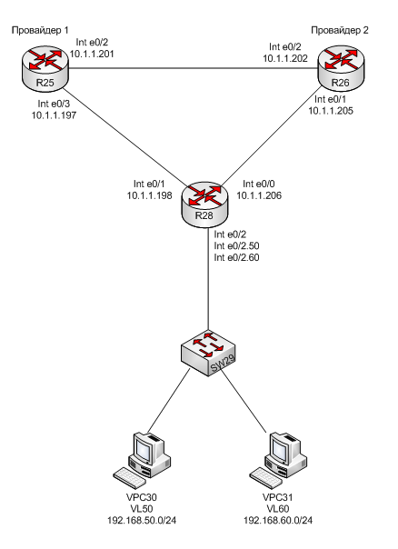

#  Маршрутизация на основе политик
### Топология


###  Цели

  1. Настроить политику маршрутизации в офисе Чокурдах
  2. Распределить трафик между двумя линками
  
  

#### Часть 1. Настройка отслеживания линка с помощью технологии IP SLA

##### Укрупненная схема офиса Чокурдах



 Таблица адресации

|Локация| Устройство     | Интерфейс    | IP-адрес             | Маска подсети|Шлюз| 
|:-----------------|:---------------|-------------------------:|:--------------------|-------:|-----------:|
| Триада  | R25 (Провайдер 1)| loopback    | 10.3.0.25 |255.255.255.255| |
| Триада  | R25 (Провайдер 1)| e0/0 |10.1.1.158 |255.255.255.252| |
| Триада  | R25 (Провайдер 1)| e0/1 |10.1.1.189 |255.255.255.252| |
| Триада  | R25 (Провайдер 1)| e0/2 |10.1.1.201 |255.255.255.252| |
| Триада  | R25 (Провайдер 1)| e0/3 |10.1.1.197 |255.255.255.252| |
| Триада  | R26 (Провайдер 2)| loopback    | 10.3.0.26 |255.255.255.255| |
| Триада  | R26 (Провайдер 2)| e0/0 |10.1.1.166 |255.255.255.252| |
| Триада  | R26 (Провайдер 2)| e0/1 |10.1.1.205 |255.255.255.252| |
| Триада  | R26 (Провайдер 2)| e0/2 |10.1.1.202 |255.255.255.252| |
| Триада  | R26 (Провайдер 2)| e0/3 |10.1.1.213 |255.255.255.252| |
| Лабытнанги  | R27| loopback    | 10.4.0.27 |255.255.255.255| |
| Лабытнанги  | R27| e0/0 |10.1.1.90 |255.255.255.252| |
| Лабытнанги  | R27| e0/1 | || |
| Лабытнанги  | R27| e0/2 | || |
| Лабытнанги  | R27| e0/3 | || |
| Чокурдах  | R28| loopback    | 10.5.0.28 |255.255.255.255| |
| Чокурдах  | R28| e0/0 |10.1.1.206 |255.255.255.252| |
| Чокурдах  | R28| e0/1 |10.1.1.198 |255.255.255.252| |
| Чокурдах  | R28| e0/2 | || |
| Чокурдах  | R28| e0/3 | || |
| Чокурдах  | SW29| int vl99 | 10.5.100.29 |255.255.255.0| |
| Чокурдах  | VPC30|Vlan 50| DHCP || |
| Чокурдах  | VPC31|Vlan 60| DHCP || |
| Чокурдах  | | Vlan 50    | 192.168.50.0 |255.255.255.0|192.168.50.1|
| Чокурдах  | | Vlan 60    | 192.168.60.0 |255.255.255.0|192.168.60.1|
| Чокурдах  |mgmt | Vlan 99    | 10.1.100.0 |255.255.255.0|10.1.100.1|


1. R28 настроен в соответствии с таблицей маршрутизации. Настроены подынтерфейсы для Vlan 60 и Vlan 50  и Vlan управлени 
```
interface Loopback0
 ip address 10.5.0.28 255.255.255.255
!
interface Ethernet0/0
 ip address 10.1.1.206 255.255.255.252
!
interface Ethernet0/1
 ip address 10.1.1.198 255.255.255.252
!
interface Ethernet0/2
 no ip address
!
interface Ethernet0/2.50
 encapsulation dot1Q 50
 ip address 192.168.50.1 255.255.255.0
!
interface Ethernet0/2.60
 encapsulation dot1Q 60
 ip address 192.168.60.1 255.255.255.0
!
interface Ethernet0/2.99
 description mgmt
 encapsulation dot1Q 99
 ip address 10.1.100.1 255.255.255.0
```
2. Порты R25 настроены в соответствии с таблицей маршрутизации
```
interface Loopback0
 ip address 10.3.0.25 255.255.255.255
!
interface Ethernet0/0
 ip address 10.1.1.158 255.255.255.252
!
interface Ethernet0/1
 ip address 10.1.1.189 255.255.255.252
!
interface Ethernet0/2
 ip address 10.1.1.201 255.255.255.252
!
interface Ethernet0/3
 ip address 10.1.1.197 255.255.255.252
```
3. Порты R26 настроены в соответствии с таблицей маршрутизации
```
interface Loopback0
 ip address 10.3.0.26 255.255.255.255
!
interface Ethernet0/0
 ip address 10.1.1.166 255.255.255.252
!
interface Ethernet0/1
 ip address 10.1.1.205 255.255.255.252
!
interface Ethernet0/2
 ip address 10.1.1.202 255.255.255.252
!
interface Ethernet0/3
 ip address 10.1.1.213 255.255.255.252
```
4. На R25  настроен маршрут до сетей Vlan 50 ,Vlan 60
```
R25(config)#ip route 192.168.50.0 255.255.255.0 10.1.1.198 name to_R28_e0/1
R25(config)#ip route 192.168.60.0 255.255.255.0 10.1.1.198 name to_R28_e0/1
```

5. На R26  настроен маршрут до сетей Vlan 50 ,Vlan 60
```
R26(config)#ip route 192.168.50.0 255.255.255.0 10.1.1.206 name to_R28_e0/0
R26(config)#ip route 192.168.60.0 255.255.255.0 10.1.1.206 name to_R28_e0/0
```

6. Проверка, что  VPC30,VPC31 пингуют обоих провайдеров. На этом этапе маршрут по умолчанию на R28 не прописан. 

VPC30
```
VPCS> ping 10.1.1.197

84 bytes from 10.1.1.197 icmp_seq=1 ttl=254 time=0.418 ms
84 bytes from 10.1.1.197 icmp_seq=2 ttl=254 time=0.620 ms
84 bytes from 10.1.1.197 icmp_seq=3 ttl=254 time=0.579 ms
84 bytes from 10.1.1.197 icmp_seq=4 ttl=254 time=0.607 ms
84 bytes from 10.1.1.197 icmp_seq=5 ttl=254 time=0.663 ms

VPCS> ping 10.1.1.205

84 bytes from 10.1.1.205 icmp_seq=1 ttl=254 time=0.555 ms
84 bytes from 10.1.1.205 icmp_seq=2 ttl=254 time=0.629 ms
84 bytes from 10.1.1.205 icmp_seq=3 ttl=254 time=0.507 ms
84 bytes from 10.1.1.205 icmp_seq=4 ttl=254 time=0.621 ms
84 bytes from 10.1.1.205 icmp_seq=5 ttl=254 time=0.585 ms
```
VPC31
```
VPCS> ping 10.1.1.197

84 bytes from 10.1.1.197 icmp_seq=1 ttl=254 time=0.437 ms
84 bytes from 10.1.1.197 icmp_seq=2 ttl=254 time=0.559 ms
84 bytes from 10.1.1.197 icmp_seq=3 ttl=254 time=0.586 ms
84 bytes from 10.1.1.197 icmp_seq=4 ttl=254 time=0.596 ms
84 bytes from 10.1.1.197 icmp_seq=5 ttl=254 time=0.626 ms

VPCS> ping 10.1.1.205

84 bytes from 10.1.1.205 icmp_seq=1 ttl=254 time=0.516 ms
84 bytes from 10.1.1.205 icmp_seq=2 ttl=254 time=0.566 ms
84 bytes from 10.1.1.205 icmp_seq=3 ttl=254 time=0.483 ms
84 bytes from 10.1.1.205 icmp_seq=4 ttl=254 time=0.621 ms
84 bytes from 10.1.1.205 icmp_seq=5 ttl=254 time=0.487 ms

```
7. Для отслеживания результата применения политик настроила маршруты по умолчанию Провайдра 1 и Провйдера 2 в сторону друг друга
```
R26(config)#ip route 0.0.0.0 0.0.0.0 10.1.1.201
R25(config)#ip route 0.0.0.0 0.0.0.0 10.1.1.202
```

8. Политика маршрутизации будет такая: Провайдер 1- основной, Провайдер 2- резервный, используется в случае, если связь с Провайдером 1 нарушается. В случае восстановления связи трафик вновь идет к Провайдеру 1. Чтобы реализовать такое резрвирование, R28 настроила следующим образом:

Сформировала track 1 , с помощью которого будем отслеживать доступность Провайдера 1
```
R28#conf t
R28(config)#ip sla 1
R28(config-ip-sla)#icmp-echo 10.1.1.197 source-ip 10.1.1.198
R28(config-ip-sla-echo)#exit
R28(config)#ip sla schedule 1 life forever start-time now
R28(config)#track 1 ip sla 1 reachability
R28(config-track)#delay up 1 down 1
R28(config-track)#exit

```
Настроила 2 маршрута по умолчанию с разным приоритетом
```
R28(config)#ip route 0.0.0.0 0.0.0.0 10.1.1.197 50 track 1
R28(config)#ip route 0.0.0.0 0.0.0.0 10.1.1.205 100
```
9. Проверка правильности настройки IP SLA и маршрута по умолчанию
```
R28#sh ip sla stat
IPSLAs Latest Operation Statistics

IPSLA operation id: 1
        Latest RTT: 1 milliseconds
Latest operation start time: 13:37:28 UTC Wed Nov 29 2023
Latest operation return code: OK
Number of successes: 5
Number of failures: 0
Operation time to live: Forever
```
```
R28#sh ip sla conf
IP SLAs Infrastructure Engine-III
Entry number: 1
Owner:
Tag:
Operation timeout (milliseconds): 5000
Type of operation to perform: icmp-echo
Target address/Source address: 10.1.1.197/10.1.1.198
Type Of Service parameter: 0x0
Request size (ARR data portion): 28
Verify data: No
Vrf Name:
Schedule:
   Operation frequency (seconds): 60  (not considered if randomly scheduled)
   Next Scheduled Start Time: Start Time already passed
   Group Scheduled : FALSE
   Randomly Scheduled : FALSE
   Life (seconds): Forever
   Entry Ageout (seconds): never
   Recurring (Starting Everyday): FALSE
   Status of entry (SNMP RowStatus): Active
Threshold (milliseconds): 5000
Distribution Statistics:
   Number of statistic hours kept: 2
   Number of statistic distribution buckets kept: 1
   Statistic distribution interval (milliseconds): 20
Enhanced History:
History Statistics:
   Number of history Lives kept: 0
   Number of history Buckets kept: 15
   History Filter Type: None
```
```
R28#sh ip route

Gateway of last resort is 10.1.1.197 to network 0.0.0.0

S*    0.0.0.0/0 [1/0] via 10.1.1.197
      10.0.0.0/8 is variably subnetted, 7 subnets, 3 masks
C        10.1.1.196/30 is directly connected, Ethernet0/1
L        10.1.1.198/32 is directly connected, Ethernet0/1
C        10.1.1.204/30 is directly connected, Ethernet0/0
L        10.1.1.206/32 is directly connected, Ethernet0/0
C        10.1.100.0/24 is directly connected, Ethernet0/2.99
L        10.1.100.1/32 is directly connected, Ethernet0/2.99
C        10.5.0.28/32 is directly connected, Loopback0
      192.168.50.0/24 is variably subnetted, 2 subnets, 2 masks
C        192.168.50.0/24 is directly connected, Ethernet0/2.50
L        192.168.50.1/32 is directly connected, Ethernet0/2.50
      192.168.60.0/24 is variably subnetted, 2 subnets, 2 masks
C        192.168.60.0/24 is directly connected, Ethernet0/2.60
L        192.168.60.1/32 is directly connected, Ethernet0/2.60
```
10. Для того, чтобы достичь Провайдера 2, понадобится 3 хопа (ping от VPC30). Используется адрес Loopback
```
VPCS> ping 10.3.0.26

84 bytes from 10.3.0.26 icmp_seq=1 ttl=254 time=0.477 ms
84 bytes from 10.3.0.26 icmp_seq=2 ttl=254 time=0.691 ms
84 bytes from 10.3.0.26 icmp_seq=3 ttl=254 time=0.663 ms
84 bytes from 10.3.0.26 icmp_seq=4 ttl=254 time=0.612 ms
84 bytes from 10.3.0.26 icmp_seq=5 ttl=254 time=0.577 ms

VPCS> trace 10.3.0.26
trace to 10.3.0.26, 8 hops max, press Ctrl+C to stop
 1   192.168.60.1   0.358 ms  0.245 ms  0.224 ms
 2   10.1.1.197   0.390 ms  0.348 ms  0.337 ms /Провайдер 1
 3   *10.1.1.202   0.454 ms (ICMP type:3, code:3, Destination port unreachable)  * /Провайдер 2, порт e0/2

```
11. Моделирую ситуацию недоступности Провайдера 1 (R28 int e0/1 shut). В этом случае для достижения Провайдера 2 понадобится 2 хопа (ping от VPC30), что говорит об автоматическом переключении маршрута по умолчанию.
```
PCS> ping 10.3.0.26

84 bytes from 10.3.0.26 icmp_seq=1 ttl=254 time=0.476 ms
84 bytes from 10.3.0.26 icmp_seq=2 ttl=254 time=0.689 ms
84 bytes from 10.3.0.26 icmp_seq=3 ttl=254 time=0.678 ms
84 bytes from 10.3.0.26 icmp_seq=4 ttl=254 time=0.622 ms
84 bytes from 10.3.0.26 icmp_seq=5 ttl=254 time=0.691 ms

VPCS> trace 10.3.0.26
trace to 10.3.0.26, 8 hops max, press Ctrl+C to stop
 1   192.168.60.1   0.453 ms  0.311 ms  0.409 ms
 2   *10.1.1.205   0.509 ms (ICMP type:3, code:3, Destination port unreachable)  * /Провайдер 2, порт e0/1

```
###  Часть 2: Настройка PBR
С помощью PBR настрою маршрутизацию таким образоми, чтобы пользователи из Vlan 60 всегда маршрутизировались на Провайдера 2. 

```
Router#conf t

Router(config)#ip access-list standard 10
Router(config-std-nacl)#permit 192.168.60.0 0.0.0.255
Router(config-std-nacl)#exit

Router(config)#route-map MAP10 permit
Router(config-route-map)#match ip address 10
Router(config-route-map)#set ip next-hop 10.1.1.205
Router(config-route-map)#exit

Router(config)#int e0/2.60
Router(config-if)#ip policy route-map MAP10
Router(config-if)#^Z
Router#
```
Теперь VPC30 (Vlan 50) и VPC (Vlan 60) Достигают Провайдера 1 (Loopback0 10.3.0.25) разными путями: VPC31 через Провайдера 2, VPC30- напрямую

VPC30
```
VPCS> ip dhcp -r
DORA IP 192.168.50.3/24 GW 192.168.50.1

VPCS> ping 10.3.0.25

84 bytes from 10.3.0.25 icmp_seq=1 ttl=254 time=0.435 ms
84 bytes from 10.3.0.25 icmp_seq=2 ttl=254 time=0.634 ms
84 bytes from 10.3.0.25 icmp_seq=3 ttl=254 time=0.672 ms
84 bytes from 10.3.0.25 icmp_seq=4 ttl=254 time=0.571 ms
84 bytes from 10.3.0.25 icmp_seq=5 ttl=254 time=0.652 ms

VPCS> trace 10.3.0.25
trace to 10.3.0.25, 8 hops max, press Ctrl+C to stop
 1   192.168.50.1   0.465 ms  0.283 ms  0.250 ms
 2   *10.1.1.197   0.375 ms (ICMP type:3, code:3, Destination port unreachable)  */Провайдер 1 e0/3
```
VPC31
```
VPCS> ping 10.3.0.25

84 bytes from 10.3.0.25 icmp_seq=1 ttl=254 time=0.577 ms
84 bytes from 10.3.0.25 icmp_seq=2 ttl=254 time=0.662 ms
84 bytes from 10.3.0.25 icmp_seq=3 ttl=254 time=0.738 ms
84 bytes from 10.3.0.25 icmp_seq=4 ttl=254 time=0.670 ms
84 bytes from 10.3.0.25 icmp_seq=5 ttl=254 time=0.653 ms

VPCS> trace 10.3.0.25
trace to 10.3.0.25, 8 hops max, press Ctrl+C to stop
 1   192.168.60.1   0.425 ms  0.297 ms  0.221 ms
 2   10.1.1.205   0.388 ms  0.329 ms  0.306 ms /Провайдер 2
 3   *10.1.1.201   0.478 ms (ICMP type:3, code:3, Destination port unreachable) /Провайдер 1 e0/2

```
Статистика на R28 также свидетельствует о том, что route-map отработала
```
R28#sh route-map
route-map 10, permit, sequence 10
  Match clauses:
    ip address (access-lists): 10
  Set clauses:
    ip next-hop 10.1.1.205
  Policy routing matches: 14 packets, 1488 bytes

```
###  Часть 3: Настройка маршрута по умолчанию для Лабытнанги
Настройка в соответствии с таблицей маршрутизации и топологией
```
R27(config)#ip route 0.0.0.0 0.0.0.0 10.1.1.189
```