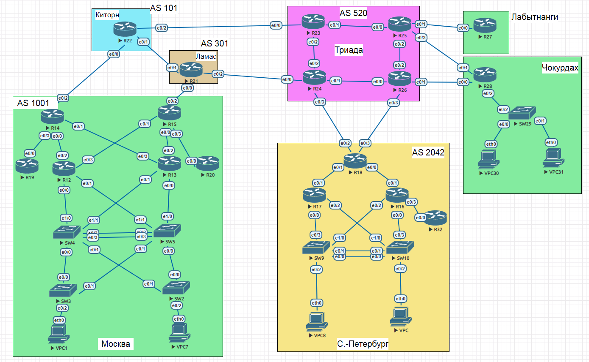
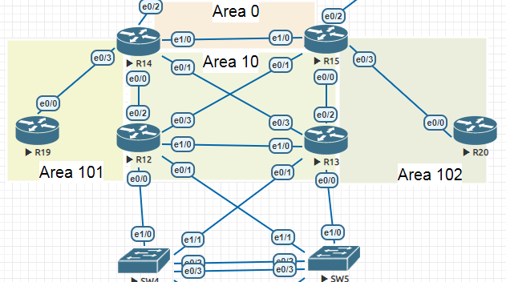

#  OSPF
### Топология


###  Цели

  1. Настроить OSPF в офисе Москва
  2. Разделить сеть на зоны
  3. Настроить фильтрацию между зонами
  
  
  Условия задания:
  - маршрутизаторы R14-R15 находятся в зоне 0-backbone
  - маршрутизаторы R12-R13 находятся в зоне 10. Дополнительно к маршрутам должны получать маршрут по умолчанию.
  - Маршрутизатор R19 находится в зоне 101 и получает только маршрут по умолчанию.
  - Маршрутизатор R20 находится в зоне 102 и получает все маршруты. кроме маршрутов до зоны 101.

#### Часть 1.

Для того, чтобы организовать Area 0 на R14-R15 необходимо добавить линк между этими маршрутизаторами. Также добавляю линк между R12-R13 для оптимизации трафика и повышения отказоустойчивости. 

##### Измененный участок схемы офиса Москва с отображением деления на Area OSPF


 Таблица адресации

|Локация| Устройство     | Интерфейс    | IP-адрес             | Маска подсети|Префикс сети| 
|:-----------------|:---------------|-------------------------:|:--------------------|-------:|-----------:|
| Москва  | R12 | loopback    | 10.1.0.12 |255.255.255.255| |
| Москва  | R12 | e0/0 |10.1.1.17 |255.255.255.252|10.1.1.16/30 |
| Москва  | R12 | e0/1 |10.1.1.21 |255.255.255.252|10.1.1.20/30 |
| Москва  | R12| e0/2 |10.1.1.193 |255.255.255.252|10.1.1.192/30 |
| Москва  | R12 | e0/3 |10.1.1.225 |255.255.255.252|10.1.1.224/30 |
| Москва  | R12 | e1/0 |10.1.1.13 |255.255.255.252|10.1.1.12/30 |
| Москва  | R13 | loopback    | 10.1.0.13 |255.255.255.255| |
| Москва  | R13 | e0/0 | 10.1.1.22|255.255.255.252|10.1.1.20/30 |
| Москва  | R13 | e0/1 |10.1.1.18 |255.255.255.252| 10.1.1.16/30|
| Москва  | R13 | e0/2 |10.1.1.129 |255.255.255.252|10.1.1.128/30 |
| Москва  | R13 | e0/3 |10.1.1.1 |255.255.255.252|10.1.1.0/30 |
| Москва  | R13 | e1/0 |10.1.1.14 |255.255.255.252|10.1.1.12/30 |
| Москва  | R14| loopback    | 10.1.0.14 |255.255.255.255| |
| Москва  | R14| e0/0 |10.1.1.194 |255.255.255.252|10.1.1.192/30 |
| Москва  | R14| e0/1 |10.1.1.2 |255.255.255.252|10.1.1.0/30 |
| Москва  | R14| e0/2 |10.1.1.133 |255.255.255.252|10.1.1.132/30 |
| Москва  | R14| e0/3 |10.1.1.137 |255.255.255.252|10.1.1.136/30 |
| Москва  | R14| e1/0 |10.1.1.9 |255.255.255.252|10.1.1.8/30 |
| Москва  | R15| loopback    | 10.1.0.15 |255.255.255.255| |
| Москва  | R15| e0/0 |10.1.1.130 |255.255.255.252|10.1.1.128/30 |
| Москва  | R15| e0/1 |10.1.1.226 |255.255.255.252|10.1.1.224/30 |
| Москва  | R15| e0/2 |10.1.1.253 |255.255.255.252|10.1.1.252 |
| Москва  | R15| e0/3 |10.1.1.250 |255.255.255.252|10.1.1.248/30 |
| Москва  | R15| e1/0 |10.1.1.10 |255.255.255.252|10.1.1.10/30 |
| Москва  | R19 | loopback    | 10.1.0.19 |255.255.255.255| |
| Москва  | R19 | e0/0 |10.1.1.138 |255.255.255.252|10.1.1.136/30 |
| Москва  | R19 | e0/1 | || |
| Москва  | R19 | e0/2 | || |
| Москва  | R19 | e0/3 | || |
| Москва  | R20 | loopback    | 10.1.0.20 |255.255.255.255| |
| Москва  | R20 | e0/0 |10.1.1.249 |255.255.255.252|10.1.1.248/30 |
| Москва  | R20 | e0/1 | || |
| Москва  | R20 | e0/2 | || |
| Москва  | R20 | e0/3 | || |
 
#### Часть 2. Настройка OSPF и фильтрации

1. На R14 е1/0 и R15 е1/0 настроила OSPF Area 0

```
R14(config)#router ospf 1
R14(config-router)#passive-interface def
R14(config-router)#no passive-interface Ethernet1/0
R14(config-router)#int Ethernet1/0
R14(config-if)#ip ospf 1 area 0
```
```
R15#conf t
R15(config)#router ospf 1
R15(config-router)#passive-interface def
R15(config-router)#no passive-interface Ethernet1/0
R15(config-router)#int Ethernet1/0
R15(config-if)#ip ospf 1 area 0
R15(config-if)#^Z
R15#
```
Между R14 и R15 установилось соседство  и заработал протокол OSPF
```
R14#sh ip ospf database

            OSPF Router with ID (10.1.0.14) (Process ID 1)

                Router Link States (Area 0)

Link ID         ADV Router      Age         Seq#       Checksum Link count
10.1.0.14       10.1.0.14       228         0x80000002 0x00725A 1
10.1.0.15       10.1.0.15       229         0x80000002 0x007059 1

                Net Link States (Area 0)

Link ID         ADV Router      Age         Seq#       Checksum
10.1.1.9        10.1.0.14       228         0x80000001 0x000BD0
```


2.  На интерфейсах (R14 е0/0, e0/1)  (R15 е0/0, е0/1)  (R13 е0/2, е0/3 е1/0, е0/1, е0/0) (R12 е0/2, е0/3, e1/0, е0/0, е0/1)    настроен OSPF Area 10 . 

Настройка OSPF на примере R14, R15 
```
R14(config)#
R14(config)#router ospf 1
R14(config-router)#no passive-interface Ethernet0/0
R14(config-router)#no passive-interface Ethernet0/1
R14(config-router)#int Ethernet0/0
R14(config-if)#ip ospf 1 area 10
R14(config-if)#int Ethernet0/1
R14(config-if)#ip ospf 1 area 10
R14(config-if)#^Z
R14#
```
```
R15>ena
R15#conf t
R15(config)#router ospf 1
R15(config-router)#no passive-interface Ethernet0/0
R15(config-router)#no passive-interface Ethernet0/1
R15(config-router)#int Ethernet0/1
R15(config-if)#ip ospf 1 area 10
R15(config-if)#int Ethernet0/0
R15(config-if)#ip ospf 1 area 10
R15(config-if)#^Z
R15#
```
Между роутерами сформировалось соседство. На примере R12, R13
```
R12#sh ip ospf nei

Neighbor ID     Pri   State           Dead Time   Address         Interface
10.1.0.13         1   FULL/BDR        00:00:38    10.1.1.22       Ethernet0/1
10.1.0.13         1   FULL/BDR        00:00:39    10.1.1.18       Ethernet0/0
10.1.0.13         1   FULL/BDR        00:00:31    10.1.1.14       Ethernet1/0
10.1.0.15         1   FULL/DR         00:00:35    10.1.1.226      Ethernet0/3
10.1.0.14         1   FULL/DR         00:00:31    10.1.1.194      Ethernet0/2

```
```
R13#sh ip ospf nei

Neighbor ID     Pri   State           Dead Time   Address         Interface
10.1.0.12         1   FULL/DR         00:00:39    10.1.1.17       Ethernet0/1
10.1.0.12         1   FULL/DR         00:00:34    10.1.1.21       Ethernet0/0
10.1.0.12         1   FULL/DR         00:00:32    10.1.1.13       Ethernet1/0
10.1.0.14         1   FULL/DR         00:00:32    10.1.1.2        Ethernet0/3
10.1.0.15         1   FULL/DR         00:00:33    10.1.1.130      Ethernet0/2

```
Area 10 имеет тип Normal. По условиям работы она должна получать дополнительно маршрут по умолчанию. Для этого на R14, который является ABR для Area 10 выполнила следующую настройку:
```
R14#conf t
R14(config)#ip route 0.0.0.0 0.0.0.0 Null0
R14(config)#router ospf 1
R14(config-router)#default-information originate
R14(config-router)#end
R14#
```
В результате этих действий в Area 10 появился маршрут по умалчаниюю. На примере R12
```
R12#sh ip route

Gateway of last resort is 10.1.1.194 to network 0.0.0.0

O*E2  0.0.0.0/0 [110/1] via 10.1.1.194, 1d03h, Ethernet0/2
      10.0.0.0/8 is variably subnetted, 16 subnets, 2 masks
C        10.1.0.12/32 is directly connected, Loopback0
O        10.1.1.0/30 [110/20] via 10.1.1.194, 4d22h, Ethernet0/2
                     [110/20] via 10.1.1.22, 02:18:34, Ethernet0/1
                     [110/20] via 10.1.1.18, 02:18:24, Ethernet0/0
                     [110/20] via 10.1.1.14, 4d22h, Ethernet1/0
O IA     10.1.1.8/30 [110/20] via 10.1.1.226, 4d22h, Ethernet0/3
                     [110/20] via 10.1.1.194, 4d22h, Ethernet0/2
C        10.1.1.12/30 is directly connected, Ethernet1/0
L        10.1.1.13/32 is directly connected, Ethernet1/0
C        10.1.1.16/30 is directly connected, Ethernet0/0
L        10.1.1.17/32 is directly connected, Ethernet0/0
C        10.1.1.20/30 is directly connected, Ethernet0/1
L        10.1.1.21/32 is directly connected, Ethernet0/1
O        10.1.1.128/30 [110/20] via 10.1.1.226, 4d22h, Ethernet0/3
                       [110/20] via 10.1.1.22, 02:18:34, Ethernet0/1
                       [110/20] via 10.1.1.18, 02:18:24, Ethernet0/0
                       [110/20] via 10.1.1.14, 4d22h, Ethernet1/0
O IA     10.1.1.136/30 [110/20] via 10.1.1.194, 4d22h, Ethernet0/2
C        10.1.1.192/30 is directly connected, Ethernet0/2
L        10.1.1.193/32 is directly connected, Ethernet0/2
C        10.1.1.224/30 is directly connected, Ethernet0/3
L        10.1.1.225/32 is directly connected, Ethernet0/3
O IA     10.1.1.248/30 [110/20] via 10.1.1.226, 4d21h, Ethernet0/3
      192.168.10.0/24 is variably subnetted, 2 subnets, 2 masks
C        192.168.10.0/24 is directly connected, Ethernet0/0.10
L        192.168.10.1/32 is directly connected, Ethernet0/0.10
      192.168.20.0/24 is variably subnetted, 2 subnets, 2 masks
C        192.168.20.0/24 is directly connected, Ethernet0/1.20
L        192.168.20.254/32 is directly connected, Ethernet0/1.20
R12#

```

3. По условиям Area 101 получает только дефолт. Для этого она должна иметь тип totally stub. Линки R14 e0/3 и R19 e0/0 настроила следующим образом
```
R19(config)#router ospf 1
R19(config-router)#network 10.1.1.0 0.0.0.255 area 101 stub
```
```
R14#conf t
R14(config)#router ospf 1
R14(config-router)#no passive-interface e0/3
R14(config-router)#int e0/3
R14(config-if)#ip ospf 1 area 101 stub no-summary
```
Area 101 сформировалась как totally stub Area
```
R14#sh run | sec ospf
 ip ospf 1 area 10
 ip ospf 1 area 10
 ip ospf 1 area 101
 ip ospf 1 area 0
router ospf 1
 area 101 stub no-summary
 passive-interface default
 no passive-interface Ethernet0/0
 no passive-interface Ethernet0/1
 no passive-interface Ethernet0/3
 no passive-interface Ethernet1/0
 default-information originate
```
```
R19#sh run | sec ospf
router ospf 1
 area 101 stub
 network 10.1.1.0 0.0.0.255 area 101

```
Таблица маршрутизации R19 не содержит никаких маршрутов извне, кроме дефолта
```
R19#sh ip route

Gateway of last resort is 10.1.1.137 to network 0.0.0.0

O*IA  0.0.0.0/0 [110/11] via 10.1.1.137, 4d21h, Ethernet0/0
      10.0.0.0/8 is variably subnetted, 3 subnets, 2 masks
C        10.1.0.19/32 is directly connected, Loopback0
C        10.1.1.136/30 is directly connected, Ethernet0/0
L        10.1.1.138/32 is directly connected, Ethernet0/0
```

4. По условиям задания Area 102 не должна получать маршрут до зоны 101, а именно маршрут до сети 10.1.1.136/30. Area 102 имеет тим Normal.  До настройки фильтрации ТМ на R20 содержит маршрут до Area 101:
```
R20#sh ip route

Gateway of last resort is 10.1.1.250 to network 0.0.0.0

O*E2  0.0.0.0/0 [110/1] via 10.1.1.250, 00:17:49, Ethernet0/0
      10.0.0.0/8 is variably subnetted, 10 subnets, 2 masks
C        10.1.0.20/32 is directly connected, Loopback0
O IA     10.1.1.0/30 [110/30] via 10.1.1.250, 3d18h, Ethernet0/0
O IA     10.1.1.8/30 [110/20] via 10.1.1.250, 3d18h, Ethernet0/0
O IA     10.1.1.12/30 [110/30] via 10.1.1.250, 3d18h, Ethernet0/0
O IA     10.1.1.128/30 [110/20] via 10.1.1.250, 3d18h, Ethernet0/0
O IA     10.1.1.136/30 [110/30] via 10.1.1.250, 00:00:09, Ethernet0/0
O IA     10.1.1.192/30 [110/30] via 10.1.1.250, 3d18h, Ethernet0/0
O IA     10.1.1.224/30 [110/20] via 10.1.1.250, 3d18h, Ethernet0/0
C        10.1.1.248/30 is directly connected, Ethernet0/0
L        10.1.1.249/32 is directly connected, Ethernet0/0
```
Настроила фильтрацию на R15, так как он является ABR для Area 102.
```
R15#conf t
R15(config)#ip prefix-list Area101 deny 10.1.1.136/30
R15(config)#ip prefix-list Area101 permit 0.0.0.0/0 le 32
R15(config)#do sh run | sec Area101
ip prefix-list Area101 seq 5 deny 10.1.1.136/30
ip prefix-list Area101 seq 10 permit 0.0.0.0/0 le 32
R15(config)#router ospf 1
R15(config-router)#area 102 filter-list prefix Area101 in
R15(config-router)#^Z
R15#
```
После настройки фильтрации маршрут до сети 10.1.1.136/30 исчез из ТМ.
```
R20#sh ip route

Gateway of last resort is 10.1.1.250 to network 0.0.0.0

O*E2  0.0.0.0/0 [110/1] via 10.1.1.250, 00:15:43, Ethernet0/0
      10.0.0.0/8 is variably subnetted, 9 subnets, 2 masks
C        10.1.0.20/32 is directly connected, Loopback0
O IA     10.1.1.0/30 [110/30] via 10.1.1.250, 3d18h, Ethernet0/0
O IA     10.1.1.8/30 [110/20] via 10.1.1.250, 3d18h, Ethernet0/0
O IA     10.1.1.12/30 [110/30] via 10.1.1.250, 3d18h, Ethernet0/0
O IA     10.1.1.128/30 [110/20] via 10.1.1.250, 3d18h, Ethernet0/0
O IA     10.1.1.192/30 [110/30] via 10.1.1.250, 3d18h, Ethernet0/0
O IA     10.1.1.224/30 [110/20] via 10.1.1.250, 3d18h, Ethernet0/0
C        10.1.1.248/30 is directly connected, Ethernet0/0
L        10.1.1.249/32 is directly connected, Ethernet0/0
```
Configs can be found [here](configs/).
###  The End 