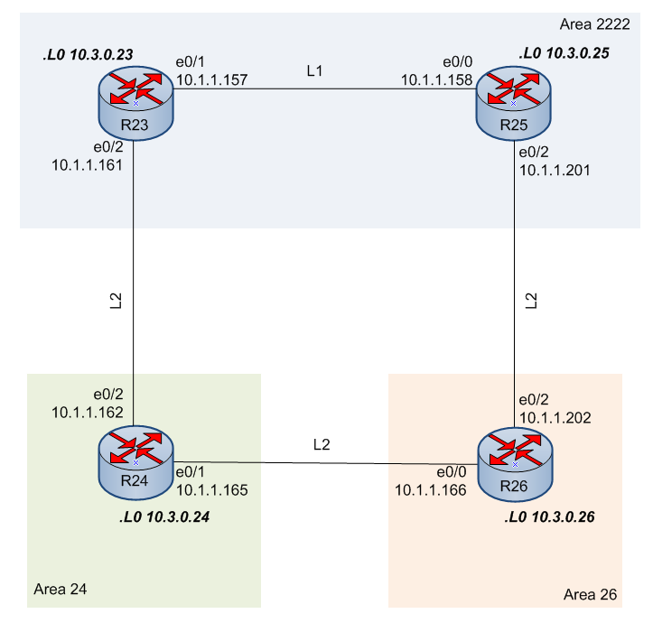

#  IS-IS
### Топология


###  Цель

  Настроить IS-IS в офисе Триада 
    
  Условия задания:
  - маршрутизаторы R23-R25 находятся в зоне 2222.
  - маршрутизатор R24 находится в зоне 24. 
  - Маршрутизатор R26 находится в зоне 26.
 
#### Часть 1.

##### Укрупненный участок схемы офиса Триада с отображением деления на зоны


 Таблица адресации

|Локация| Устройство     | Интерфейс    | IP-адрес             | Маска подсети|Префикс сети| 
|:-----------------|:---------------|-------------------------:|:--------------------|-------:|-----------:|
| Триада  | R23 | loopback    | 10.3.0.23 |255.255.255.255| |
| Триада  | R23 | e0/1 |10.1.1.157 |255.255.255.252|10.1.1.156/30 |
| Триада  | R23 | e0/2 |10.1.1.161 |255.255.255.252|10.1.1.160/30 |
| Триада  | R24 | loopback    | 10.3.0.24 |255.255.255.255| |
| Триада  | R24 | e0/1 |10.1.1.165 |255.255.255.252| 10.1.1.164/30|
| Триада  | R24 | e0/2 |10.1.1.162|255.255.255.252|10.1.1.160/30 |
| Триада  | R25| loopback    | 10.3.0.25 |255.255.255.255| |
| Триада  | R25| e0/0 |10.1.1.158 |255.255.255.252|10.1.1.156/30 |
| Триада  | R25| e0/2 |10.1.1.201 |255.255.255.252|10.1.1.200/30 |
| Триада  | R26| loopback    | 10.3.0.26 |255.255.255.255| |
| Триада  | R26| e0/0 |10.1.1.166 |255.255.255.252|10.1.1.164/30 |
| Триада  | R26| e0/1 |10.1.1.202 |255.255.255.252|10.1.1.200 |
 
#### Часть 2. Настройка IS-IS
Интерфейсы маршрутизаторов настроила в соответствии с таблицей адресации.

1. На R23 (е0/1, е0/2) и R25 (е0/0, е0/2) настроила IS-IS зона 2222

```
R23#conf t
R23(config)#router isis
R23(config-router)#passive-interface l0
R23(config-router)#net 49.2222.0000.0000.0023.00
R23(config-router)#exit
R23(config)#int e0/1
R23(config-if)#ip router isis
R23(config)#int e0/2
R23(config-if)#ip router isis
R23(config-if)#^Z
R23#

```
```
R25#conf t
R25(config)#router isis
R25(config-router)#passive-interface Loopback0
R25(config-router)#net 49.2222.0000.0000.0025.00
R25(config-router)#int e0/0
R25(config-if)#ip router isis
R25(config-if)#int e0/2
R25(config-if)#ip router isis
R25(config-if)#^Z
R25#
```
2. На R24 (е0/1, е0/2) настроила IS-IS зона 24.

```
R24#conf t
R24(config)#router isis
R24(config-router)#passive-interface Loopback0
R24(config-router)#net 49.0024.0000.0000.0024.00
R24(config-router)#int e0/2
R24(config-if)#ip router isis
R24(config-if)#int e0/1
R24(config-if)#ip router isis
R24(config-if)#exit
```
3. На R26 (е0/1, е0/2) настроила IS-IS зона 26.
```
R26#conf t
R26(config)#router isis
R26(config-router)#passive-interface Loopback0
R26(config-router)#net 49.0026.0000.0000.0026.00
R26(config-router)#int e0/0
R26(config-if)#ip router isis
R26(config-if)#int e0/2
R26(config-if)#ip router isis
R26(config-if)#^Z
R26#
```
4.  Линк между R23 и R25 находится внутри зоны 2222 и для оптимизации трафика указала на соответствующих интерфейсах, что этот линк будет Level-1. 
```
R23#conf t
R23(config)#int e0/1
R23(config-if)#isis circuit-type level-1
R23(config-if)#^Z
R23#
```
```
R25#conf t
R25(config)#int e0/0
R25(config-if)#isi circuit-type level-1
R25(config-if)#^Z
R25#
```
Между R23 И R25 установилось соседство, где R25 является DIS
```
R25#sh isis nei

System Id      Type Interface   IP Address      State Holdtime Circuit Id
R23            L1   Et0/0       10.1.1.157      UP    20       R25.01           
R26            L2   Et0/2       10.1.1.202      UP    9        R26.02         
```
```
R23#sh isis nei

System Id      Type Interface   IP Address      State Holdtime Circuit Id
R24            L2   Et0/2       10.1.1.162      UP    8        R24.01
R25            L1   Et0/1       10.1.1.158      UP    7        R25.01
```
5.  На R24 и R26 также установилось соседство и заработал протокол IS-IS
```
R24#sh isis nei

System Id      Type Interface   IP Address      State Holdtime Circuit Id
R23            L2   Et0/2       10.1.1.161      UP    29       R24.01           
R26            L2   Et0/1       10.1.1.166      UP    9        R26.01           
```
```
R26#sh isis nei

System Id      Type Interface   IP Address      State Holdtime Circuit Id
R24            L2   Et0/0       10.1.1.165      UP    27       R26.01           
R25            L2   Et0/2       10.1.1.201      UP    22       R26.02           
```
```
R24#sh ip route
Codes: L - local, C - connected, S - static, R - RIP, M - mobile, B - BGP
       D - EIGRP, EX - EIGRP external, O - OSPF, IA - OSPF inter area
       N1 - OSPF NSSA external type 1, N2 - OSPF NSSA external type 2
       E1 - OSPF external type 1, E2 - OSPF external type 2
       i - IS-IS, su - IS-IS summary, L1 - IS-IS level-1, L2 - IS-IS level-2
       ia - IS-IS inter area, * - candidate default, U - per-user static route
       o - ODR, P - periodic downloaded static route, H - NHRP, l - LISP
       a - application route
       + - replicated route, % - next hop override

Gateway of last resort is not set

      10.0.0.0/8 is variably subnetted, 14 subnets, 2 masks
C        10.1.1.148/30 is directly connected, Ethernet0/0
L        10.1.1.150/32 is directly connected, Ethernet0/0
i L2     10.1.1.156/30 [115/20] via 10.1.1.161, 1d00h, Ethernet0/2
C        10.1.1.160/30 is directly connected, Ethernet0/2
L        10.1.1.162/32 is directly connected, Ethernet0/2
C        10.1.1.164/30 is directly connected, Ethernet0/1
L        10.1.1.165/32 is directly connected, Ethernet0/1
C        10.1.1.172/30 is directly connected, Ethernet0/3
L        10.1.1.173/32 is directly connected, Ethernet0/3
i L2     10.1.1.200/30 [115/20] via 10.1.1.166, 18:49:04, Ethernet0/1
i L2     10.3.0.23/32 [115/10] via 10.1.1.161, 1d00h, Ethernet0/2
C        10.3.0.24/32 is directly connected, Loopback0
i L2     10.3.0.25/32 [115/20] via 10.1.1.166, 18:50:30, Ethernet0/1
                      [115/20] via 10.1.1.161, 18:50:30, Ethernet0/2
i L2     10.3.0.26/32 [115/10] via 10.1.1.166, 18:49:04, Ethernet0/1
R24#

```
Для версии ipv6 произвела следующие настройки на всех причастных коммутаторах
```
R23#conf t
R23(config)#ipv6 unicast-routing
R23(config)#int range e0/1-2
R23(config-if-range)#ipv6 enable
R23(config-if-range)#ipv6 router isis
R23(config-if-range)#^Z
R23#


R24#conf t
R24(config)#ipv6 unicast-routing
R24(config)#int range e0/1-2
R24(config-if-range)#ipv6 enable
R24(config-if-range)#ipv6 router isis
R24(config-if-range)#^Z
R24#


R25#conf t
R25(config)#ipv6 unicast-routing
R25(config)#int range e0/1-2
R25(config-if-range)#ipv6 enable
R25(config-if-range)#ipv6 router isis
R25(config-if-range)#^Z
R25#

R26(config)#ipv6 unicast-routing
R26(config)#int e0/0
R26(config-if)#ipv6 ena
R26(config-if)#ipv6 router isis
R26(config-if)#int e0/2
R26(config-if)#ipv6 ena
R26(config-if)#ipv6 router isis
R26(config-if)#^Z

```
Файлы конфигурации можно посмотреть [здесь](configs/).
###  The End