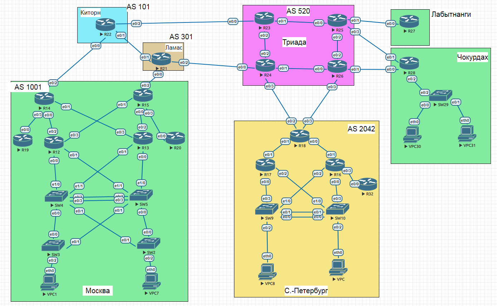

#  EIGRP
### Топология


###  Цели

  1. Настроить EIGRP в офисе C.-Петербург
  2. Использовать named EIGRP
    
  
  Условия задания:
  - маршрутизатор R32 получает только маршрут по умолчанию
  - маршрутизаторы R16-R17 анонсируют только суммарные префиксы.
  
#### Часть 1. Подготовительная.

Для того, чтобы настрить EIGRP в офисе СПб, целесообразно добавить линк между R16 и R17 для оптимизации трафика.

##### Измененный участок схемы офиса СПб с отображением некоторых настроек


 Таблица адресации

|Локация| Устройство     | Интерфейс    | IPV4 адрес             | Маска подсети|IPV6 адрес| 
|:-----------------|:---------------|-------------------------:|:--------------------|-------:|-----------:|
| С.-Петербург  | R16 | loopback    | 10.2.0.16 |255.255.255.255| |
| С.-Петербург  | R16 | e0/0 |172.16.1.0 |255.255.255.0|2001:DB8:DB8:3::1/64 |
| С.-Петербург  | R16 | e0/1 |10.1.1.226 |255.255.255.252|2001:DB8:CAFE.A002::2/64 |
| С.-Петербург  | R16| e0/2 |172.16.2.0 |255.255.255.0|2001:DB8:DB8:4::2/64 |
| С.-Петербург  | R16 | e0/3 |10.1.1.237 |255.255.255.252|2001:DB8:FEDD:1::1/64 |
| С.-Петербург  | R16 | e1/0 |10.1.1.26 |255.255.255.252|2001:DB8:CAFE:A003::2/64 |
| С.-Петербург  | R17 | loopback    | 10.2.0.17 |255.255.255.255| |
| С.-Петербург  | R17 | e0/0 | 192.168.40.1|255.255.255.0|2001:DB8:CAFE:1::1/64 |
| С.-Петербург  | R17 | e0/1 |10.1.1.230 |255.255.255.252|2001:DB8:CAFE:A001::1/64|
| С.-Петербург  | R17 | e0/2 |192.168.30.1 |255.255.255.0|2001:DB8:CAFE:A004::1/64 |
| С.-Петербург  | R17 | e0/3 |10.1.1.25 |255.255.255.252|2001:DB8:CAFE:A003::1/64 |
| С.-Петербург  | R18| loopback    | 10.2.0.18 |255.255.255.0| |
| С.-Петербург  | R18| e0/0 |10.1.1.225 |255.255.255.252|2001:DB8:CAFE.A002::1/64 |
| С.-Петербург  | R14| e0/1 |10.1.1.229 |255.255.255.252|2001:DB8:CAFE:A001::2/64 |
| С.-Петербург  | R18| e0/2 |10.1.1.174 |255.255.255.252|2001:DB8:CAFE:2::1/64 |
| С.-Петербург  | R32| loopback    | 10.2.0.32 |255.255.255.255| |
| С.-Петербург  | R32| e0/0 |10.1.1.238 |255.255.255.252|2001:DB8:FEDD:1::2/64 |

Интерфейсы роутеров настроила в соответствии с таблицей адресации. 

В части IPv6 отредактировала link-local адреса на всех роутерах, для удобства. Пример R16
```
R16#conf t
R16(config)#int e0/0
R16(config-if)#ipv6 add Fe80::16 link-local
R16(config-if)#int e0/1
R16(config-if)#ipv6 add Fe80::16 link-local
R16(config-if)#int e0/2
R16(config-if)#ipv6 add Fe80::16 link-local
R16(config-if)#int e0/3
R16(config-if)#ipv6 add Fe80::16 link-local
R16(config-if)#int e1/0
R16(config-if)#ipv6 add Fe80::16 link-local
R16(config-if)#^Z
R16#


R16#sh ipv6 int brie
Ethernet0/0            [up/up]
    FE80::16
    2001:DB8:CAFE:3::1
Ethernet0/1            [up/up]
    FE80::16
    2001:DB8:CAFE:A002::2
Ethernet0/2            [up/up]
    FE80::16
    2001:DB8:CAFE:A005::2
Ethernet0/3            [up/up]
    FE80::16
    2001:DB8:FEDD:1::1
Ethernet1/0            [up/up]
    FE80::16
    2001:DB8:CAFE:A003::2
```

Включила IPv6 на всех роутерах. Пример R16
```
R16#conf t
R16(config)#ipv6 unicast-routing
R16(config)#^Z
R16#
```
 
#### Часть 2. Настройка Named EIGRP для IPv4 и IPv6

1. Включила EIGRP на всех интерфейсах всех роутеров. Пример R18
```
R18#conf t
R18(config)#router eigrp NG
R18(config-router)#address-family ipv4 unicast autonomous-system 1
R18(config-router-af)#network 0.0.0.0
R18(config-router-af)#eigrp router-id 18.18.18.18
R18(config-router-af)#no shut
R18(config-router-af)#exit-address-family
R18(config-router)#address-family ipv6 unicast autonomous-system 1
R18(config-router-af)#eigrp router-id 18.18.18.18
R18(config-router-af)#no shut
R18(config-router-af)#exit-address-family
R18(config-router)#^Z
R18#
```
Протокол заработал, установилось соседство. Пример R18
```
R18#sh ip eigrp nei
EIGRP-IPv4 VR(NG) Address-Family Neighbors for AS(1)
H   Address                 Interface              Hold Uptime   SRTT   RTO  Q  Seq
                                                   (sec)         (ms)       Cnt Num
1   10.1.1.226              Et0/0                    12 00:09:46    8   100  0  24
0   10.1.1.230              Et0/1                    12 00:16:21    5   100  0  26
R18#sh ipv6 eigrp nei
EIGRP-IPv6 VR(NG) Address-Family Neighbors for AS(1)
H   Address                 Interface              Hold Uptime   SRTT   RTO  Q  Seq
                                                   (sec)         (ms)       Cnt Num
1   Link-local address:     Et0/0                    11 00:07:12   11   100  0  30
    FE80::16
0   Link-local address:     Et0/1                    12 00:15:37    5   100  0  33
    FE80::17
```

2. Интерфейсы, не учавствующие в EIGRP, обозначила как passive:
R18 e0/2 и e0/3
R17 e0/0 и e0/2
R16 e0/0 и e0/2

Пример R18
```
R18#conf t
R18(config)#router eigrp NG
R18(config-router)#address-family ipv4 unicast autonomous-system 1
R18(config-router-af)#af-interface e0/2
R18(config-router-af-interface)#passive-interface
R18(config-router-af-interface)#af-interface e0/3
R18(config-router-af-interface)#passive-interface
R18(config-router-af-interface)#exit-af-interface
R18(config-router-af)#ex
R18(config-router)#address-family ipv6 unicast autonomous-system 1
R18(config-router-af)#af-interface e0/2
R18(config-router-af-interface)#passive-interface
R18(config-router-af-interface)#af-interface e0/3
R18(config-router-af-interface)#passive-interface
R18(config-router-af)#ex
R18(config-router)#ex
R18(config)#^Z
```
3. Маршрутизаторы R16-R17 должны анонсировать только суммарные префиксы, для этого произвела следующие настройки на соответствующих интерфейсах R16 :
```
 address-family ipv4 unicast autonomous-system 1
  !
  af-interface Ethernet1/0
   summary-address 172.16.0.0 255.255.0.0
  exit-af-interface
  !
  af-interface Ethernet0/1
   summary-address 172.16.0.0 255.255.0.0
  exit-af-interface
```
```
 address-family ipv6 unicast autonomous-system 1
  !
  af-interface Ethernet1/0
   summary-address 2001:DB8:DB8::/64
  exit-af-interface
  !
  af-interface Ethernet0/1
   summary-address 2001:DB8:DB8::/64
  exit-af-interface
  !

```
И на соответствующих интерфейсах R17.
В таблице маршрутизации R18 зафиксировала изменения. Например
было:
```
D     192.168.30.0/24 [90/1536000] via 10.1.1.230, 00:37:45, Ethernet0/1
D     192.168.40.0/24 [90/1536000] via 10.1.1.230, 00:37:45, Ethernet0/1
```
стало:
```
D     192.168.0.0/16 [90/1536000] via 10.1.1.230, 02:52:07, Ethernet0/1
```
3. Маршрутизатор R32 получает только маршрут по умолчанию. Для этого задала маршрут по умолчанию на R18 через интерфейс e0/2
```
R18#conf t
R18(config)#ip route 0.0.0.0 0.0.0.0 e0/2
R18(config)#ipv6 route ::/0 e0/2
R18(config)#^Z
R18#
```
Следующим шагом настроила распространение этого маршрута по домену EIGRP СПб
```
R18#conf t
R18(config)#router eigrp NG
R18(config-router)#add ipv4 uni auto 1
R18(config-router-af)#topology base
R18(config-router-af-topology)#redistribute static
R18(config-router-af-topology)#ex
R18(config-router-af)#ex
R18(config-router)#add ipv6 uni auto 1
R18(config-router-af)#topology base
R18(config-router-af-topology)#redistribute stat
R18(config-router-af-topology)#^Z
```
Убедилась, что маршрут по умолчанию появился на остальных роутерах. Пример R16
```
R16#sh ip rout

Gateway of last resort is 10.1.1.225 to network 0.0.0.0

D*    0.0.0.0/0 [90/1536000] via 10.1.1.225, 00:08:29, Ethernet0/1
```
На R16 e0/3 настроила фильтрацию маршрутов в сторону R32
```
R16#conf t
R16(config)#ip prefix-list ONLYDEF seq 10 permit 0.0.0.0/0
R16(config)#ipv6 prefix-list ONLYDEF seq 10 permit ::/0
R16(config)#router eigrp NG
R16(config-router)#add ipv4 uni auto 1
R16(config-router-af)#topology base
R16(config-router-af-topology)#distribute-list prefix ONLYDEF out e0/3
R16(config-router-af-topology)#ex
R16(config-router-af)#ex
R16(config-router)#add ipv6 uni auto 1
R16(config-router-af)#topology base
R16(config-router-af-topology)#distribute-list prefix ONLYDEF out e0/3
R16(config-router-af-topology)#^Z
R16#
``` 
После этого таблица маршрутизации R32 приобрела требуемый вид:

```
R32#   sh ip route
Codes: L - local, C - connected, S - static, R - RIP, M - mobile, B - BGP
       D - EIGRP, EX - EIGRP external, O - OSPF, IA - OSPF inter area
       N1 - OSPF NSSA external type 1, N2 - OSPF NSSA external type 2
       E1 - OSPF external type 1, E2 - OSPF external type 2
       i - IS-IS, su - IS-IS summary, L1 - IS-IS level-1, L2 - IS-IS level-2
       ia - IS-IS inter area, * - candidate default, U - per-user static route
       o - ODR, P - periodic downloaded static route, H - NHRP, l - LISP
       a - application route
       + - replicated route, % - next hop override

Gateway of last resort is 10.1.1.237 to network 0.0.0.0

D*    0.0.0.0/0 [90/2048000] via 10.1.1.237, 00:39:58, Ethernet0/0
      10.0.0.0/8 is variably subnetted, 3 subnets, 2 masks
C        10.1.1.236/30 is directly connected, Ethernet0/0
L        10.1.1.238/32 is directly connected, Ethernet0/0
C        10.2.0.32/32 is directly connected, Loopback0
R32#
```
```
R32#sh ipv6 route
IPv6 Routing Table - default - 4 entries
Codes: C - Connected, L - Local, S - Static, U - Per-user Static route
       B - BGP, HA - Home Agent, MR - Mobile Router, R - RIP
       H - NHRP, I1 - ISIS L1, I2 - ISIS L2, IA - ISIS interarea
       IS - ISIS summary, D - EIGRP, EX - EIGRP external, NM - NEMO
       ND - ND Default, NDp - ND Prefix, DCE - Destination, NDr - Redirect
       O - OSPF Intra, OI - OSPF Inter, OE1 - OSPF ext 1, OE2 - OSPF ext 2
       ON1 - OSPF NSSA ext 1, ON2 - OSPF NSSA ext 2, la - LISP alt
       lr - LISP site-registrations, ld - LISP dyn-eid, a - Application
EX  ::/0 [170/2048000]
     via FE80::16, Ethernet0/0
C   2001:DB8:FEDD:1::/64 [0/0]
     via Ethernet0/0, directly connected
L   2001:DB8:FEDD:1::2/128 [0/0]
     via Ethernet0/0, receive
L   FF00::/8 [0/0]
     via Null0, receive
R32#

```


Configs can be found [here](configs/).
###  The End 