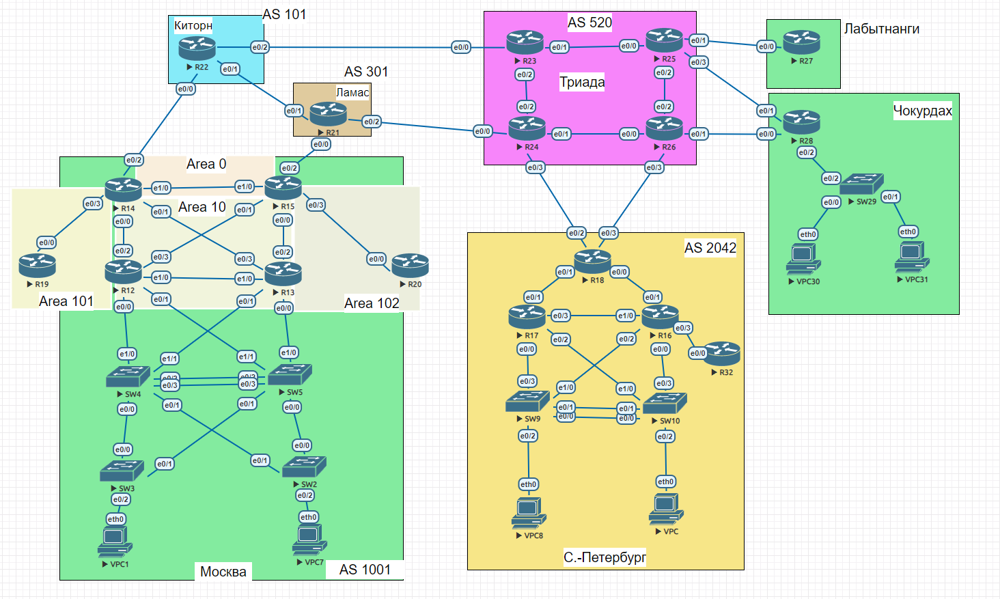
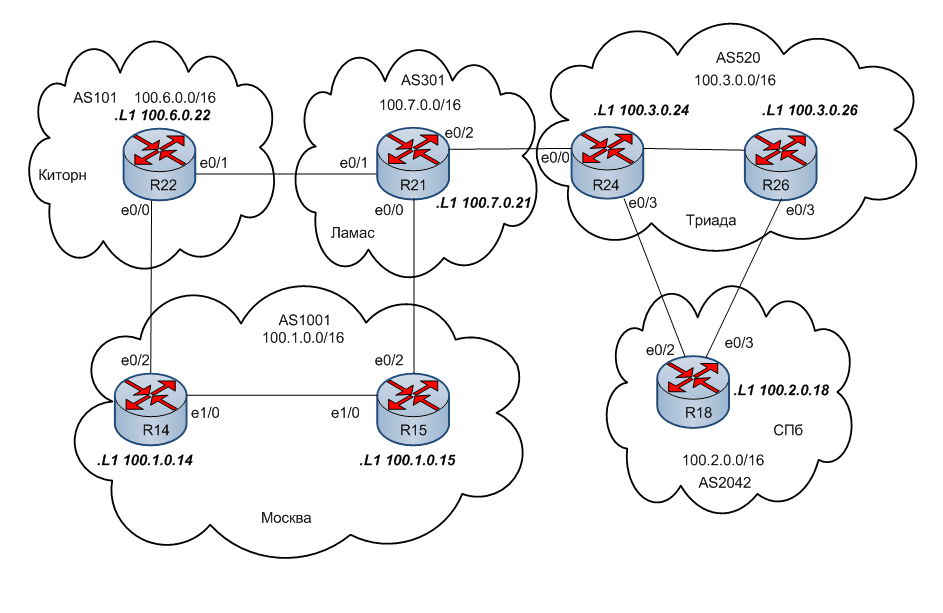

#  BGP. Основы
### Топология


###  Цели

  1. Настроить BGP между автономными системами.
  2. Организовать доступность между офисами Москва и С.-Петербург.
    
  
  Описание задания:
  - Настроить eBGP между офисом Москва и двумя провайдерами - Киторн и Ламас.
  - Настроить eBGP между провайдерами Киторн и Ламас.
  - Настроить eBGP между Ламас и Триада.
  - Настроить eBGP между офисом С.-Петербург и провайдером Триада.
  - Организовать IP доступность между пограничным роутерами офисами Москва и С.-Петербург.
  
#### Часть 1. Подготовительная.
Данные для каждой локации, необходимые для настройки eBGP
|Локация| Номер AS     | Блок адресов    | 
|:-----------------|:---------------|-------------------------:|
| Москва  | 1001 | 100.1.0.0/16    |
| С.-Петербург  | 2042 | 100.2.0.0/16    |
| Киторн | 101 | 100.6.0.0/16    |
| Ламас | 301 | 100.7.0.0/16    |
| Триада | 520 | 100.3.0.0/16    | 
##### Укрупненный участок общей схемы с отображением некоторых настроек


 Таблица адресации

|Локация| Устройство     | Интерфейс    | IP адрес             | Маска подсети| 
|:-----------------|:---------------|-------------------------:|:--------------------|-------:|
| С.-Петербург  | R18| loopback 1   | 100.2.0.18 |255.255.255.255| |
| С.-Петербург  | R18| e0/2 |100.3.0.6 |255.255.255.252|
| С.-Петербург  | R18| e0/3 |10.3.0.10 |255.255.255.252|
| Москва  | R14|  loopback 1 |100.1.0.14 |255.255.255.255|
| Москва  | R14|  e0/2 |100.6.0.2 |255.255.255.252|
| Москва  | R15|  loopback 1 |100.1.0.15 |255.255.255.255|
| Москва  | R15|  e0/2 |100.7.0.2 |255.255.255.252|
| Киторн  | R22|  loopback 1 |100.6.0.22 |255.255.255.255|
| Киторн  | R22|  e0/0 |100.6.0.1 |255.255.255.252|
| Киторн  | R22|  e0/1 |100.7.0.6 |255.255.255.252|
| Ламас  | R21|  loopback 1 |100.7.0.21 |255.255.255.255|
| Ламас  | R21|  e0/0 |100.7.0.1 |255.255.255.252|
| Ламас  | R21|  e0/1 |100.7.0.5 |255.255.255.252|
| Ламас  | R21|  e0/2 |100.3.0.2 |255.255.255.252|
| Триада  | R24|  loopback 1 |100.3.0.24 |255.255.255.255|
| Триада  | R24|  e0/0 |100.3.0.1 |255.255.255.252|
| Триада  | R24|  e0/3 |100.3.0.5 |255.255.255.252|
| Триада  | R26|  loopback 1 |100.3.0.26 |255.255.255.255|
| Триада  | R26|  e0/3 |100.3.0.9 |255.255.255.252|

Интерфейсы роутеров настроила в соответствии с таблицей адресации. 


 
#### Часть 2. Настройка eBGP

1. Настройка eBGP Москва- Киторн (R14-R22)
```
R14#conf t
R14(config)#router bgp 1001
R14(config-router)#neighbor 100.6.0.1 remote-as 101
R14(config-router)#^Z
R14#
```
```
R22#conf t
R22(config)#router bgp 101
R22(config-router)#neighbor 100.6.0.2 remote-as 1001
R22(config-router)#^Z
R22#
```
Между R14 и R22 установилось соседство.
```
R22#sh ip bgp nei
BGP neighbor is 100.6.0.2,  remote AS 1001, external link
  BGP version 4, remote router ID 100.1.0.14
  BGP state = Established, up for 00:02:43
  Last read 00:00:01, last write 00:00:55, hold time is 180, keepalive interval is 60 seconds
  Neighbor sessions:
    1 active, is not multisession capable (disabled)
  Neighbor capabilities:
    Route refresh: advertised and received(new)
    Four-octets ASN Capability: advertised and received
    Address family IPv4 Unicast: advertised and received
    Enhanced Refresh Capability: advertised and received
    Multisession Capability:
    Stateful switchover support enabled: NO for session 1
  Message statistics:
    InQ depth is 0
    OutQ depth is 0

                         Sent       Rcvd
    Opens:                  1          1
    Notifications:          0          0
    Updates:                1          1
    Keepalives:             4          5
    Route Refresh:          0          0
    Total:                  6          7
  Default minimum time between advertisement runs is 30 seconds
```
2. Настройка eBGP Москва- Ламас (R15-R21)
```
R15#conf t
R15(config)#router bgp 1001
R15(config-router)#nei 100.7.0.1 remote 301
R15(config-router)#^Z
R15#
```
```
R21#conf t
R21(config)#router bgp 301
R21(config-router)#nei 100.7.0.2 remote 1001
R21(config-router)#^Z
R21#
```
Между R15 и R21 установилось соседство.
```
R15#sh ip bgp nei
BGP neighbor is 100.7.0.1,  remote AS 301, external link
  BGP version 4, remote router ID 100.7.0.21
  BGP state = Established, up for 00:00:33
  Last read 00:00:33, last write 00:00:33, hold time is 180, keepalive interval is 60 seconds
  Neighbor sessions:
    1 active, is not multisession capable (disabled)
  Neighbor capabilities:
    Route refresh: advertised and received(new)
    Four-octets ASN Capability: advertised and received
    Address family IPv4 Unicast: advertised and received
    Enhanced Refresh Capability: advertised and received
    Multisession Capability:
    Stateful switchover support enabled: NO for session 1
  Message statistics:
    InQ depth is 0
    OutQ depth is 0

                         Sent       Rcvd
    Opens:                  1          1
    Notifications:          0          0
    Updates:                1          0
    Keepalives:             2          1
    Route Refresh:          0          0
    Total:                  4          2
  Default minimum time between advertisement runs is 30 seconds

```
3. Настройка eBGP Ламас- Триада (R21-R24)
```
R24#conf t
R24(config)#router bgp 520
R24(config-router)#nei 100.3.0.2 remote 301
R24(config-router)#^Z
R24#
```
```
R21#conf t
R21(config)#router bgp 301
R21(config-router)#nei 100.3.0.1 remote 520
R21(config-router)#^Z
R21#
```
Между R21 и R24 установилось соседство.

4. Настройка eBGP Петербург- Триада (R18-R24, R18-R26)


Для лучшей отказоустойчивости СПб имеет два линка к Триаде

```
R24# conf t
R24(config)#router bgp 520
R24(config-router)#nei 100.3.0.6 remote 2042
R24(config-router)#^Z
R24#
```
```
R26#conf t
R26(config)#router bgp 520
R26(config-router)#nei 100.3.0.10 remote 2042
R26(config-router)#^Z
R26#
```
```
R18#conf t
R18(config)#router bgp 2042
R18(config-router)#nei 100.3.0.5 remote 520
R18(config-router)#^Z
R18#
```
```
R18#conf t
R18(config)#router bgp 2042
R18(config-router)#nei 100.3.0.9 remote 520
R18(config-router)#^Z
R18#
```
По обоим линкам установилось соседство.
```
R18#sh ip bgp nei
BGP neighbor is 100.3.0.5,  remote AS 520, external link
  BGP version 4, remote router ID 100.3.0.24
  BGP state = Established, up for 03:59:19


BGP neighbor is 100.3.0.9,  remote AS 520, external link
  BGP version 4, remote router ID 100.3.0.26
  BGP state = Established, up for 04:00:51
```
5. На каждом роутере, непосредственно участвующем в eBGP, прописала сети, которые будут анонсироваться, в соответствии с таблицей в подготовительной части работы. На примере R14
```
R14#conf t
R14(config)#router bgp 1001
R14(config-router)#network 100.1.0.0 mask 255.255.0.0
R14(config-router)#exit
R14(config)#ip route 100.1.0.0 255.255.0.0 null 0
R14(config)#^Z
R14#
```
Сформировалась таблица BGP (R14)
```
R14#sh ip bgp
BGP table version is 11, local router ID is 100.1.0.14
Status codes: s suppressed, d damped, h history, * valid, > best, i - internal,
              r RIB-failure, S Stale, m multipath, b backup-path, f RT-Filter,
              x best-external, a additional-path, c RIB-compressed,
Origin codes: i - IGP, e - EGP, ? - incomplete
RPKI validation codes: V valid, I invalid, N Not found

     Network          Next Hop            Metric LocPrf Weight Path
 * i 100.1.0.0/16     10.1.1.10                0    100      0 i
 *>                   0.0.0.0                  0         32768 i
 * i 100.2.0.0/16     100.7.0.1                0    100      0 301 520 2042 i
 *>                   100.6.0.1                              0 101 301 520 2042                                                                            i
 * i 100.3.0.0/16     100.7.0.1                0    100      0 301 520 i
 *>                   100.6.0.1                              0 101 301 520 i
 *>  100.6.0.0/16     100.6.0.1                0             0 101 i
 *>i 100.7.0.0/16     100.7.0.1                0    100      0 301 i
 *                    100.6.0.1                              0 101 301 i
R14#

```
Оптимальные с точки зрения протокола маршруты пропали в таблицу маршрутизации (R14)
```
B        100.2.0.0/16 [20/0] via 100.6.0.1, 03:09:20
B        100.3.0.0/16 [20/0] via 100.6.0.1, 03:09:20
B        100.6.0.0/16 [20/0] via 100.6.0.1, 03:32:00

```
6. Для того, чтобы обеспечить IP связность пограничных роутеров Москвы и СПб, на Loopback1 R14 и R15 включила OSPF (Пример R14)
```
interface Loopback1
 ip address 100.1.0.14 255.255.255.255
 ip ospf 1 area 0

```
7. Проверка связности между пограничными роутерами Москвы и Спб
```
R14#traceroute 100.2.0.18
Type escape sequence to abort.
Tracing the route to 100.2.0.18
VRF info: (vrf in name/id, vrf out name/id)
  1 100.6.0.1 [AS 101] 0 msec 0 msec 1 msec
  2 100.7.0.5 0 msec 0 msec 0 msec
  3 100.3.0.1 1 msec 0 msec 1 msec
  4 100.3.0.6 0 msec *  0 msec
R14#ping 100.2.0.18
Type escape sequence to abort.
Sending 5, 100-byte ICMP Echos to 100.2.0.18, timeout is 2 seconds:
!!!!!
Success rate is 100 percent (5/5), round-trip min/avg/max = 1/1/1 ms
R14#
```
```
R15#ping 100.2.0.18
Type escape sequence to abort.
Sending 5, 100-byte ICMP Echos to 100.2.0.18, timeout is 2 seconds:
!!!!!
Success rate is 100 percent (5/5), round-trip min/avg/max = 1/1/1 ms
R15#

```
```
R18#ping 100.1.0.14
Type escape sequence to abort.
Sending 5, 100-byte ICMP Echos to 100.1.0.14, timeout is 2 seconds:
!!!!!
Success rate is 100 percent (5/5), round-trip min/avg/max = 1/1/1 ms
R18#
```


Configs can be found [here](configs/).
###  The End 