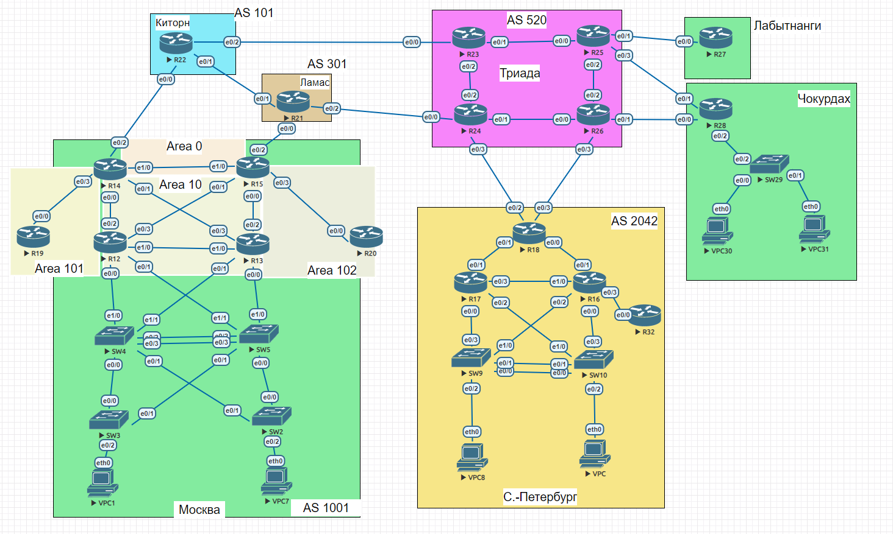
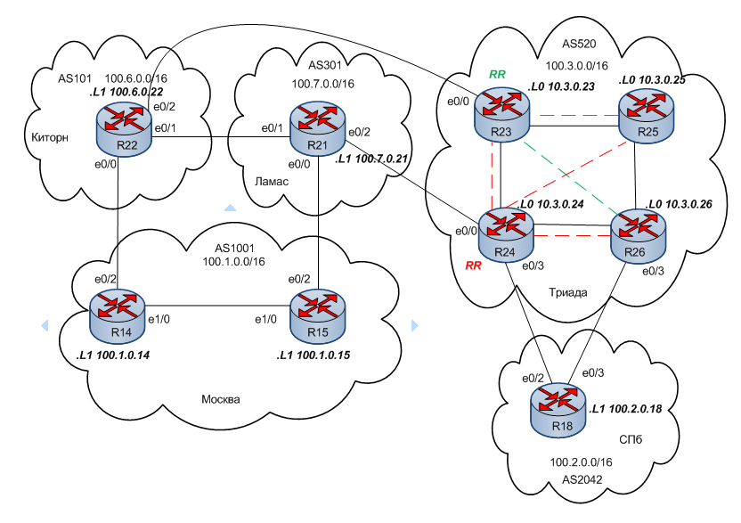

#  iBGP
### Топология


###  Цели 

  1. Настроить iBGP в офисе Москва.
  2. Настроить iBGP в сети Триада.
  3. Организовать полную IP связность всех сетей  
  
  Описание задания:
  - Настроить iBGP в офисе Москва.
  - Настроить iBGP в провайдере Триада c использованием RR.
  - Настроить офис Москва так, чтобы приоритетным провайдером стал Ламас.
  - Настроить офис С.-Петербург так, чтобы трафик до любого офиса распределялся по двум линкам одновременно.
  - Все сети должны иметь IP связность.
  
#### Часть 1. Подготовительная.
Данные для каждой локации, необходимые для настройки eBGP
|Локация| Номер AS     | Блок адресов    | 
|:-----------------|:---------------|-------------------------:|
| Москва  | 1001 | 100.1.0.0/16    |
| С.-Петербург  | 2042 | 100.2.0.0/16    |
| Киторн | 101 | 100.6.0.0/16    |
| Ламас | 301 | 100.7.0.0/16    |
| Триада | 520 | 100.3.0.0/16    | 
##### Укрупненный участок общей схемы с отображением некоторых настроек


 Таблица адресации

|Локация| Устройство     | Интерфейс    | IP адрес             | Маска подсети| 
|:-----------------|:---------------|-------------------------:|:--------------------|-------:|
| С.-Петербург  | R18| loopback 1   | 100.2.0.18 |255.255.255.255| |
| С.-Петербург  | R18| e0/2 |100.3.0.6 |255.255.255.252|
| С.-Петербург  | R18| e0/3 |10.3.0.10 |255.255.255.252|
| Москва  | R14|  loopback 1 |100.1.0.14 |255.255.255.255|
| Москва  | R14|  e0/2 |100.6.0.2 |255.255.255.252|
| Москва  | R15|  loopback 1 |100.1.0.15 |255.255.255.255|
| Москва  | R15|  e0/2 |100.7.0.2 |255.255.255.252|
| Киторн  | R22|  loopback 1 |100.6.0.22 |255.255.255.255|
| Киторн  | R22|  e0/0 |100.6.0.1 |255.255.255.252|
| Киторн  | R22|  e0/1 |100.7.0.6 |255.255.255.252|
| Киторн  | R22|  e0/2 |100.6.0.5 |255.255.255.252|
| Ламас  | R21|  loopback 1 |100.7.0.21 |255.255.255.255|
| Ламас  | R21|  e0/0 |100.7.0.1 |255.255.255.252|
| Ламас  | R21|  e0/1 |100.7.0.5 |255.255.255.252|
| Ламас  | R21|  e0/2 |100.3.0.2 |255.255.255.252|
| Триада  | R24|  loopback 1 |100.3.0.24 |255.255.255.255|
| Триада  | R24|  e0/0 |100.3.0.1 |255.255.255.252|
| Триада  | R24|  e0/3 |100.3.0.5 |255.255.255.252|
| Триада  | R24|  e0/2 |10.1.1.162 |255.255.255.252|
| Триада  | R24|  e0/1 |10.1.1.165 |255.255.255.252|
| Триада  | R26|  loopback 1 |100.3.0.26 |255.255.255.255|
| Триада  | R26|  e0/3 |100.3.0.9 |255.255.255.252|
| Триада  | R26|  e0/2 |10.1.1.202 |255.255.255.252|
| Триада  | R26|  e0/0 |10.1.1.166 |255.255.255.252|
| Триада  | R23|  loopback 0 |10.3.0.23 |255.255.255.255|
| Триада  | R23|  e0/0 |100.6.0.6 |255.255.255.252|
| Триада  | R23|  e0/1 |10.1.1.157 |255.255.255.252|
| Триада  | R23|  e0/2 |10.1.1.161 |255.255.255.252|
| Триада  | R25|  loopback 1 |100.3.0.25 |255.255.255.255|
| Триада  | R25|  e0/0 |10.1.1.158 |255.255.255.252|
| Триада  | R25|  e0/2 |10.1.1.201 |255.255.255.252|


Интерфейсы роутеров настроила в соответствии с таблицей адресации. 


 
#### Часть 2. Настройка iBGP в офисе Москва между R14 R15

2. На R14 и R15 настраиваю iBGP. для настройки iBGP использую Loopback 1 
```
R14#conf t
R14(config)#router bgp 1001
R14(config-router)#nei 100.1.0.15 remote 1001
R14(config-router)#nei 100.1.0.15 update loo 1
R14(config-router)#nei 100.1.0.15 next-hop-s
R14(config-router)#^Z
R14#
```
```
R15#conf t
R15(config)#router bgp 1001
R15(config-router)#nei 100.1.0.14 remote 1001
R15(config-router)#nei 100.1.0.14 update loo 1
R15(config-router)#nei 100.1.0.14 next-hop-s
R15(config-router)#^Z
R15#
```
Между R14 R15 установилось iBGP соседство
```
R14#sh ip bgp summ

Neighbor        V           AS MsgRcvd MsgSent   TblVer  InQ OutQ Up/Down  State/PfxRcd
100.1.0.15      4         1001      18      14       86    0    0 00:02:47        4
100.6.0.1       4          101   14270   14321       86    0    0 1w1d            4
```
Для того, чтобы информация о Loopback 0 сети Москва передавалась в остальные локации, добавила эту сеть в настройки BGP R14 R15 (на примере R15). Также добавила соответствующий маршрут в ТМ на R14 R15
(на примере R15)
```
R15#conf t
R15(config)#router bgp 1001
R15(config-router)#network 10.1.0.0 mask 255.255.0.0
R15(config-router)#exit
R15(config)#ip route 10.1.0.0 255.255.0.0 null0
R15(config)#^Z
R15#
```

R14 и R15 получили друг от друга маршруты и проинсталировали их в свои ТМ

```
R14#sh ip route bgp

Gateway of last resort is 0.0.0.0 to network 0.0.0.0

      100.0.0.0/8 is variably subnetted, 10 subnets, 3 masks
B        100.2.0.0/16 [200/0] via 100.1.0.15, 00:05:03
B        100.3.0.0/16 [200/0] via 100.1.0.15, 00:05:03
B        100.6.0.0/16 [20/0] via 100.6.0.1, 1w1d
B        100.7.0.0/16 [200/0] via 100.1.0.15, 00:05:03
```
```
R14#sh ip bgp

     Network          Next Hop            Metric LocPrf Weight Path
 * i 10.1.0.0/16      100.1.0.15               0    100      0 i
 *>                   0.0.0.0                  0         32768 i
 * i 100.1.0.0/16     100.1.0.15               0    100      0 i
 *>                   0.0.0.0                  0         32768 i
 *>i 100.2.0.0/16     100.1.0.15               0    100      0 301 520 2042 i
 *                    100.6.0.1                              0 101 301 520 2042 i
 *>i 100.3.0.0/16     100.1.0.15               0    100      0 301 520 i
 *                    100.6.0.1                              0 101 301 520 i
 *>  100.6.0.0/16     100.6.0.1                0             0 101 i
 *>i 100.7.0.0/16     100.1.0.15               0    100      0 301 i
 *                    100.6.0.1                              0 101 301 i
R14#
```
```
R15#sh ip bgp

     Network          Next Hop            Metric LocPrf Weight Path
 *>  10.1.0.0/16      0.0.0.0                  0         32768 i
 * i                  100.1.0.14               0    100      0 i
 * i 100.1.0.0/16     100.1.0.14               0    100      0 i
 *>                   0.0.0.0                  0         32768 i
 *>  100.2.0.0/16     100.7.0.1                              0 301 520 2042 i
 *>  100.3.0.0/16     100.7.0.1                              0 301 520 i
 *>i 100.6.0.0/16     100.1.0.14               0    100      0 101 i
 *                    100.7.0.1                              0 301 101 i
 *>  100.7.0.0/16     100.7.0.1                0             0 301 i

```
```
R15#sh ip route bgp

Gateway of last resort is 10.1.1.9 to network 0.0.0.0

      100.0.0.0/8 is variably subnetted, 10 subnets, 3 masks
B        100.2.0.0/16 [20/0] via 100.7.0.1, 1w1d
B        100.3.0.0/16 [20/0] via 100.7.0.1, 1w1d
B        100.6.0.0/16 [200/0] via 100.1.0.14, 00:09:11
B        100.7.0.0/16 [20/0] via 100.7.0.1, 1w1d
R15#
```
#### Часть 3. Настройка RR на R24 R23 в офисе Триада

Настроила RR на R24. R26 R23 R25 являются клиентами RR


R24
```
R24#conf t
R24(config)#router bgp 520
R24(config-router)#nei AS520 peer-group
R24(config-router)#nei AS520 remote-as 520
R24(config-router)#nei AS520 update-source Loo 0
R24(config-router)#nei AS520 route-reflector-client
R24(config-router)#nei AS520 next-hop-s
R24(config-router)#nei 10.3.0.23 peer-group AS520
R24(config-router)#nei 10.3.0.25 peer-group AS520
R24(config-router)#nei 10.3.0.26 peer-group AS520
R24(config-router)#exit
R24(config-router)#^Z
R24#
```
R23

```
R23#sh run | sec bgp
router bgp 520
 bgp log-neighbor-changes
 network 10.3.0.0 mask 255.255.0.0
 network 100.3.0.0 mask 255.255.0.0
 neighbor 10.3.0.24 remote-as 520
 neighbor 10.3.0.24 update-source Loopback0
 neighbor 10.3.0.24 next-hop-self
R23#
```
Аналогичные настройки сделала на R25 R26.


Убедилась, что RR настроен 
```
R24#sh ip bgp update-gr
BGP version 4 update-group 1, external, Address Family: IPv4 Unicast
  BGP Update version : 13/0, messages 0
  Topology: global, highest version: 13, tail marker: 13
  Format state: Current working (OK, last minimum advertisement interval)
                Refresh blocked (not in list, last not in list)
  Update messages formatted 12, replicated 24, current 0, refresh 0, limit 1000
  Number of NLRIs in the update sent: max 1, min 0
  Minimum time between advertisement runs is 30 seconds
  Has 2 members:
   100.3.0.2        100.3.0.6

BGP version 4 update-group 2, internal, Address Family: IPv4 Unicast
  BGP Update version : 13/0, messages 0
  Route-Reflector Client
  NEXT_HOP is always this router for eBGP paths
  Topology: global, highest version: 13, tail marker: 13
  Format state: Current working (OK, last not in list)
                Refresh blocked (not in list, last not in list)
  Update messages formatted 15, replicated 15, current 0, refresh 0, limit 1000
  Number of NLRIs in the update sent: max 2, min 0
  Minimum time between advertisement runs is 0 seconds
  Has 3 members:
   10.3.0.23        10.3.0.25        10.3.0.26
```

Настроила RR на R23. R26 R25 являются клиентами RR. Такое решение повысит отказоустройчивость сети провайдера Триада. 

Сначала настроила eBGP соседство между RR23 и RR22
```
R22#sh ip bgp nei 100.6.0.6
BGP neighbor is 100.6.0.6,  remote AS 520, external link
  BGP version 4, remote router ID 10.3.0.23
  BGP state = Established, up for 00:01:54
```
Далее настроила RR 23 также, как и в предыдущем случае.


R23
```
R23#conf t
R23(config)#router bgp 520
R23(config-router)#nei AS520 peer-g
R23(config-router)#nei AS520 remote 520
R23(config-router)#nei AS520 update-s loo 0
R23(config-router)#nei AS520 route-ref
R23(config-router)#nei AS520 route-reflector-client
R23(config-router)#nei AS520 next-hop-s
R23(config-router)#nei 10.3.0.26 peer-g AS520
R23(config-router)#nei 10.3.0.25 peer-g AS520
R23(config-router)#^Z
R23#
```
R25
```
R25#conf t
R25(config)#router bgp 520
R25(config-router)#nei 10.3.0.23 remote 520
R25(config-router)#nei 10.3.0.23 update loo 0
R25(config-router)#nei 10.3.0.23 next-hop-s
R25(config-router)#^Z
R25#
```
R26
```
R26#conf t
R26(config)#router bgp 520
R26(config-router)#nei 10.3.0.23 remote 520
R26(config-router)#nei 10.3.0.23 update-source loo 0
R26(config-router)#nei 10.3.0.23 next-hop-s
R26(config-router)#^Z
R26#
```
Проверила, что RR настроен
```
R23#sh ip bgp update-g
BGP version 4 update-group 2, internal, Address Family: IPv4 Unicast
  BGP Update version : 13/0, messages 0
  NEXT_HOP is always this router for eBGP paths
  Topology: global, highest version: 13, tail marker: 13
  Format state: Current working (OK, last not in list)
                Refresh blocked (not in list, last not in list)
  Update messages formatted 8, replicated 8, current 0, refresh 0, limit 1000
  Number of NLRIs in the update sent: max 2, min 0
  Minimum time between advertisement runs is 0 seconds
  Has 1 member:
   10.3.0.24

BGP version 4 update-group 3, external, Address Family: IPv4 Unicast
  BGP Update version : 13/0, messages 0
  Topology: global, highest version: 13, tail marker: 13
  Format state: Current working (OK, last minimum advertisement interval)
                Refresh blocked (not in list, last not in list)
  Update messages formatted 8, replicated 8, current 0, refresh 0, limit 1000
  Number of NLRIs in the update sent: max 2, min 0
  Minimum time between advertisement runs is 30 seconds
  Has 1 member:
   100.6.0.5

BGP version 4 update-group 4, internal, Address Family: IPv4 Unicast
  BGP Update version : 13/0, messages 0
  Route-Reflector Client
  NEXT_HOP is always this router for eBGP paths
  Topology: global, highest version: 13, tail marker: 13
  Format state: Current working (OK, last not in list)
                Refresh blocked (not in list, last not in list)
  Update messages formatted 12, replicated 12, current 0, refresh 0, limit 1000
  Number of NLRIs in the update sent: max 2, min 0
  Minimum time between advertisement runs is 0 seconds
  Has 2 members:
   10.3.0.25        10.3.0.26


```
#### Часть 4. Настройка приоритетного провайдера Ламас в офисе Москва

Для настройки предпочтительного провайдера Ламас использовала параметр Local Preference.Москва подключена к Ламасу через R15.
На R15 настроила LP 150 в сторону Ламаса, используя route-map.

```
R15#conf t
R15(config)#router bgp 1001
R15(config-router)#nei 100.7.0.1 remote-as 301
R15(config-router)#nei 100.7.0.1 route-map LP in
R15(config-router)#^Z
```
```
R15#conf t
R15(config)#route-map LP permit 10
R15(config-route-map)#set local-preference 150
R15(config-route-map)#^Z
R15#

```
Теперь при просмотре маршрутов bgp с R14 видно, что маршрут через R15 является приоритетным (даже для сети 100.6.0.0/16)
```
R14#sh ip bgp


     Network          Next Hop            Metric LocPrf Weight Path
 * i 10.1.0.0/16      100.1.0.15               0    100      0 i
 *>                   0.0.0.0                  0         32768 i
 *>i 10.3.0.0/16      100.1.0.15               0    150      0 301 520 i
 *                    100.6.0.1                              0 101 520 i
 * i 100.1.0.0/16     100.1.0.15               0    100      0 i
 *>                   0.0.0.0                  0         32768 i
 *>i 100.2.0.0/16     100.1.0.15               0    150      0 301 520 2042 i
 *                    100.6.0.1                              0 101 520 2042 i
 *>i 100.3.0.0/16     100.1.0.15               0    150      0 301 520 i
 *                    100.6.0.1                              0 101 520 i
 *>i 100.6.0.0/16     100.1.0.15               0    150      0 301 101 i
 *                    100.6.0.1                0             0 101 i
 *>i 100.7.0.0/16     100.1.0.15               0    150      0 301 i
 *                    100.6.0.1                              0 101 301 i
R14#
```
Для того, чтобы и внешний трафик заходил в Москву преимущественно через Ламас, нужно сделать путь через Киторн (R14)  менее привлекательным. Для этой цели искусственно удлиню путь через R14.

Сконфигурировала соответствующую route-map, сети указывать не стала, так как правило применю для всего, что анонсируется (на данный момент это одна сеть 100.1.0.0/16):

```
R14#sh route-map
route-map Prepend, permit, sequence 10
  Match clauses:
  Set clauses:
    as-path prepend 1001 1001 1001
  Policy routing matches: 0 packets, 0 bytes
R14#
```
Разместила route-map на интерфейсе в сторону провайдера  Киторн

```
R14#conf t
R14(config)#router bgp 1001
R14(config-router)#neighbor 100.6.0.1 route-map Prepend
```
Результат можно наблюдать на R22. Теперь маршрут в Москву (100.1.0.0/16) через R14 (Next Hop 100.6.0.2) удлинился и стал невыгодным. Для входящего трафика в AS1001 (100.1.0.0/16) он больше не выбирается, если только это жестко не указано.
```
R22#sh ip bgp
BGP table version is 12, local router ID is 100.6.0.22
Status codes: s suppressed, d damped, h history, * valid, > best, i - internal,
              r RIB-failure, S Stale, m multipath, b backup-path, f RT-Filter,
              x best-external, a additional-path, c RIB-compressed,
Origin codes: i - IGP, e - EGP, ? - incomplete
RPKI validation codes: V valid, I invalid, N Not found

     Network          Next Hop            Metric LocPrf Weight Path
 *>  0.0.0.0          100.6.0.2                              0 1001 1001 1001 1001 301 i
                      0.0.0.0                                0 i
 *   10.3.0.0/16      100.7.0.5                              0 301 520 i
 *>                   100.6.0.6                0             0 520 i
 *   10.5.0.0/16      100.7.0.5                              0 301 520 i
 *>                   100.6.0.6                              0 520 i
 *   100.1.0.0/16     100.6.0.6                              0 520 301 1001 i
 *>                   100.7.0.5                              0 301 1001 i
 *                    100.6.0.2                0             0 1001 1001 1001 1001 i
 *   100.2.0.0/16     100.6.0.2                              0 1001 1001 1001 1001 301 520 2042 i
 *                    100.7.0.5                              0 301 520 2042 i
 *>                   100.6.0.6                              0 520 2042 i
 *   100.3.0.0/16     100.7.0.5                              0 301 520 i
 *>                   100.6.0.6                              0 520 i
 *   100.5.0.0/16     100.7.0.5                              0 301 520 i
 *>                   100.6.0.6                              0 520 i
 *>  100.6.0.0/16     0.0.0.0                  0         32768 i
 *   100.7.0.0/16     100.6.0.6                              0 520 301 i
 *>                   100.7.0.5                0             0 301 i
```


#### Часть 5. Балансировка трафика из офиса СПБ
Для того, чтобы трафик из СПб уходил по двум равноценным линкам к одному  провайдеру одновременно, сделала настройку:
```
R18#conf t
R18(config)#router bgp 2042
R18(config-router)#maximum-paths 2
R18(config-router)#^Z
R18#

```
ТМ на R18 изменилась, для каждого направления появилось по два пути
```
R18#sh ip route bgp

Gateway of last resort is 0.0.0.0 to network 0.0.0.0

      10.0.0.0/8 is variably subnetted, 13 subnets, 3 masks
B        10.1.0.0/16 [20/0] via 100.3.0.9, 01:09:51
                     [20/0] via 100.3.0.5, 01:09:51
B        10.3.0.0/16 [20/0] via 100.3.0.9, 01:09:51
                     [20/0] via 100.3.0.5, 01:09:51
      100.0.0.0/8 is variably subnetted, 10 subnets, 3 masks
B        100.1.0.0/16 [20/0] via 100.3.0.9, 01:09:51
                      [20/0] via 100.3.0.5, 01:09:51
B        100.3.0.0/16 [20/0] via 100.3.0.9, 01:09:51
                      [20/0] via 100.3.0.5, 01:09:51
B        100.6.0.0/16 [20/0] via 100.3.0.9, 01:09:51
                      [20/0] via 100.3.0.5, 01:09:51
B        100.7.0.0/16 [20/0] via 100.3.0.9, 01:09:51
                      [20/0] via 100.3.0.5, 01:09:51
R18#
```
#### Часть 5. Проверка связности сети
Для прверки выбрала роутеры из разных AS R18-R22. Одновремепнно с проверкой связности отображается балансировка трафика из СПб
```
R18#ping 100.6.0.22 source 10.2.0.18
Type escape sequence to abort.
Sending 5, 100-byte ICMP Echos to 100.6.0.22, timeout is 2 seconds:
Packet sent with a source address of 10.2.0.18
!!!!!
Success rate is 100 percent (5/5), round-trip min/avg/max = 1/1/1 ms
R18#trace 100.6.0.22 source 10.2.0.18
Type escape sequence to abort.
Tracing the route to 100.6.0.22
VRF info: (vrf in name/id, vrf out name/id)
  1 100.3.0.9 [AS 520] 1 msec
    100.3.0.5 [AS 520] 0 msec
    100.3.0.9 [AS 520] 0 msec
  2 10.1.1.161 [AS 1001] 1 msec
    10.1.1.201 [AS 1001] 0 msec
    10.1.1.161 [AS 1001] 0 msec
  3 10.1.1.157 [AS 1001] 1 msec
    100.6.0.5 [AS 101] 0 msec
    10.1.1.157 [AS 1001] 1 msec
```
R15-R18
```
R15#ping 10.2.0.18
Type escape sequence to abort.
Sending 5, 100-byte ICMP Echos to 10.2.0.18, timeout is 2 seconds:
!!!!!
Success rate is 100 percent (5/5), round-trip min/avg/max = 1/1/1 ms
R15#trace 10.2.0.18
Type escape sequence to abort.
Tracing the route to 10.2.0.18
VRF info: (vrf in name/id, vrf out name/id)
  1 100.7.0.1 [AS 301] 1 msec 0 msec 1 msec
  2 100.3.0.1 [AS 520] 0 msec 1 msec 0 msec
  3 100.3.0.6 [AS 520] 0 msec *  1 msec
R15#

```

Файлы конфигурации [here](configs/).
###  The End 