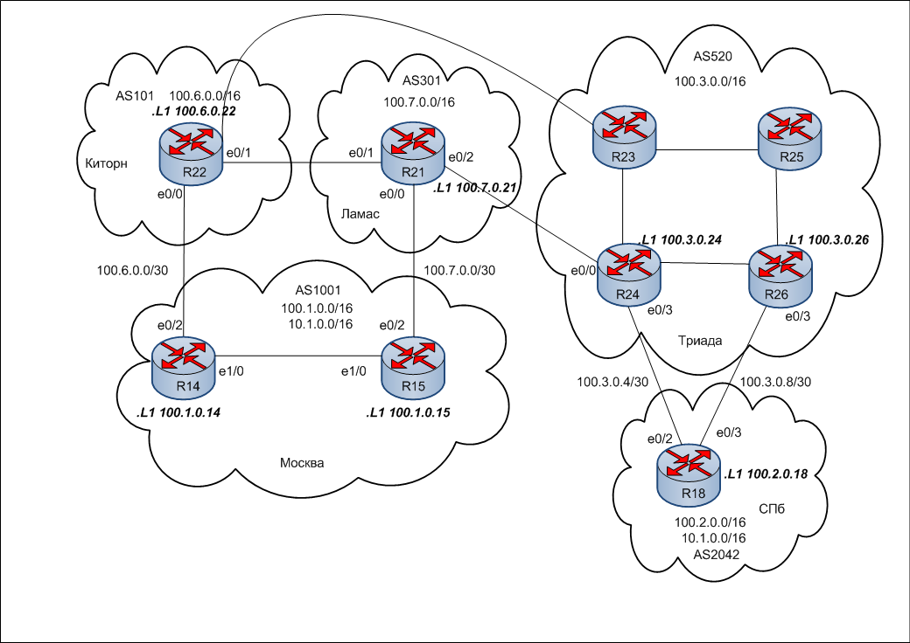

#  BGP. Фильтрация
### Топология


###  Цели 

  1. Настроить фильтрацию для офиса Москва.
  2. Настроить фильтрацию для офиса С.-Петербург.
   
  
  Описание задания:
  - Настроить фильтрацию в офисе Москва так, чтобы не появлялось транзитного трафика (As-path)
  - Настроить фильтрацию в офисе СПб так, чтобы не появлялось транзитного трафика (Prefix-list)
  - Настроить провайдера Киторн так, чтобы в офис Москва отдавался только маршрут по умолчанию.
  - Настроить провайдера Ламас так, чтобы в офис Москва отдавался только маршрут по умолчанию и префикс офиса С.-Петербург.
  - Все сети должны иметь IP связность.
  
#### Часть 1. Подготовительная.
Данные для каждой локации, необходимые для настройки eBGP
|Локация| Номер AS     | Блок адресов    | 
|:-----------------|:---------------|-------------------------:|
| Москва  | 1001 | 100.1.0.0/16    |
| Москва  | 1001 | 10.1.0.0/16    |
| С.-Петербург  | 2042 | 100.2.0.0/16    |
| С.-Петербург  | 2042 | 10.2.0.0/16    |
| Киторн | 101 | 100.6.0.0/16    |
| Ламас | 301 | 100.7.0.0/16    |
| Триада | 520 | 100.3.0.0/16    | 
##### Укрупненный участок общей схемы с отображением некоторых настроек


 Таблица адресации

|Локация| Устройство     | Интерфейс    | IP адрес             | Маска подсети| 
|:-----------------|:---------------|-------------------------:|:--------------------|-------:|
| С.-Петербург  | R18| loopback 1   | 100.2.0.18 |255.255.255.255| |
| С.-Петербург  | R18| e0/2 |100.3.0.6 |255.255.255.252|
| С.-Петербург  | R18| e0/3 |10.3.0.10 |255.255.255.252|
| Москва  | R14|  loopback 1 |100.1.0.14 |255.255.255.255|
| Москва  | R14|  e0/2 |100.6.0.2 |255.255.255.252|
| Москва  | R15|  loopback 1 |100.1.0.15 |255.255.255.255|
| Москва  | R15|  e0/2 |100.7.0.2 |255.255.255.252|
| Киторн  | R22|  loopback 1 |100.6.0.22 |255.255.255.255|
| Киторн  | R22|  e0/0 |100.6.0.1 |255.255.255.252|
| Киторн  | R22|  e0/1 |100.7.0.6 |255.255.255.252|
| Киторн  | R22|  e0/2 |100.6.0.5 |255.255.255.252|
| Ламас  | R21|  loopback 1 |100.7.0.21 |255.255.255.255|
| Ламас  | R21|  e0/0 |100.7.0.1 |255.255.255.252|
| Ламас  | R21|  e0/1 |100.7.0.5 |255.255.255.252|
| Ламас  | R21|  e0/2 |100.3.0.2 |255.255.255.252|
| Триада  | R24|  loopback 1 |100.3.0.24 |255.255.255.255|
| Триада  | R24|  e0/0 |100.3.0.1 |255.255.255.252|
| Триада  | R24|  e0/3 |100.3.0.5 |255.255.255.252|
| Триада  | R26|  loopback 1 |100.3.0.26 |255.255.255.255|
| Триада  | R26|  e0/3 |100.3.0.9 |255.255.255.252|


Интерфейсы роутеров настроены в соответствии с таблицей адресации. 


 
#### Часть 2. Настройка фильтрации

1. Настройка фильтрации в офисе Москва так, чтобы не появлялось транзитного трафика (As-path). Для этого R15 и R14 настроила так, чтобы они отдавали наружу только тот трафик, который оригинируется в Москве.

Для отслеживания изменений посмотрела маршруты, которые отдаются из Москвы в Ламас до настроек
```
R15#sh ip bgp nei 100.7.0.2 advertised-routes

     Network          Next Hop            Metric LocPrf Weight Path
 *>  10.1.0.0/16      0.0.0.0                  0         32768 i
 *>i 10.3.0.0/16      100.1.0.14               0    100      0 101 520 i
 *>  100.1.0.0/16     0.0.0.0                  0         32768 i
 *>i 100.3.0.0/16     100.1.0.14               0    100      0 101 520 i
 *>i 100.6.0.0/16     100.1.0.14               0    100      0 101 i
 *>i 100.7.0.0/16     100.1.0.14               0    100      0 101 301 i

Total number of prefixes 6
```
На R15 настроила Route-map на выход из Москвы в сторону Ламас

```
R15#conf t
R15(config)#ip as-path access-list 3 permit ^$
route-map ONLYMOS permit 10
R15(config-route-map)#match as-pa
R15(config-route-map)#match as-path 3
R15(config-route-map)#exit
R15(config)#router bgp 1001
R15(config-router)#nei 100.7.0.1 route-map ONLYMOS out
R15(config-router)#^Z
R15#
```
Теперь R15 отдает в Ламас только два маршрута
```
R15#sh ip bgp nei 100.7.0.1 advertised-routes

     Network          Next Hop            Metric LocPrf Weight Path
 *>  10.1.0.0/16      0.0.0.0                  0         32768 i
 *>  100.1.0.0/16     0.0.0.0                  0         32768 i

Total number of prefixes 2 
```
Аналогичные настройки произвела на R14 в сторону Киторна

```
R14#conf t
R14(config)#ip as-path access-list 1 permit ^S
R14(config)#route-map ONLYMOS permit 10
R14(config-route-map)#match as-path 1
R14(config-route-map)#exit
R14(config)#router bgp 1001
R14(config-router)#nei 100.6.0.1 route-map ONLYMOS out
R14(config-router)#^Z
R14#
```
Убедилась, что в Киторн уходят только оригинируемые в Москве маршруты
```
R14#sh ip bgp nei 100.6.0.1 advertised-routes

     Network          Next Hop            Metric LocPrf Weight Path
 *>  10.1.0.0/16      0.0.0.0                  0         32768 i
 *>  100.1.0.0/16     0.0.0.0                  0         32768 i

Total number of prefixes 2

```

2. Настройка фильтрации в офисе СПб так, чтобы не появлялось транзитного трафика (Prefix-list).


Для выполнения задания создается префикс-лист, в который вклюючаются сети, оригинируемые в СПб, затем настраивается роут-мап на выход в сторону Триады.
```
R18#conf t
R18(config)#ip prefix-list 1 seq 10 permit 10.2.0.0/16 le 32
R18(config)#ip prefix-list 1 seq 20 permit 100.2.0.0/16 le 32
R18(config)#route-map SPBOUT permit 10
R18(config-route-map)#match ip add prefix-list 1
R18(config-route-map)#exit
R18(config)#router bgp 2042
R18(config-router)#nei 100.3.0.5 route-m SPBOUT out
R18(config-router)#nei 100.3.0.9 route-m SPBOUT out
R18(config-router)#^Z
R18#

```
Убедилась, что произведенные настройки работают корректно (на примере линка к R24)
```
R18#sh ip bgp nei 100.3.0.5 advertised-routes
BGP table version is 111, local router ID is 100.2.0.18
Status codes: s suppressed, d damped, h history, * valid, > best, i - internal,
              r RIB-failure, S Stale, m multipath, b backup-path, f RT-Filter,
              x best-external, a additional-path, c RIB-compressed,
Origin codes: i - IGP, e - EGP, ? - incomplete
RPKI validation codes: V valid, I invalid, N Not found

     Network          Next Hop            Metric LocPrf Weight Path
 *>  10.2.0.0/16      0.0.0.0                  0         32768 i
 *>  100.2.0.0/16     0.0.0.0                  0         32768 i

Total number of prefixes 2
```

3. Настройка провайдера Киторн так, чтобы в офис Москва отдавался только маршрут по умолчанию.


На R22 (Киторн) произвела соответствующую настройку в сторону соседа R14 (Москва)
```
R22#conf t
R22(config)#router bgp 101
R22(config-router)#nei 100.6.0.2 default-originate
R22(config-router)#^Z
R22#
```
На выход в сторону R14 настроила роут-мап
```
R22#conf t
R22(config)#ip prefix-list 1 seq 10 permit 0.0.0.0/0
R22(config)#route-map NAMOSKVU permit 10
R22(config-route-map)#match ip add prefix-list 1
R22(config-route-map)#^Z
R22#

R22#conf t
R22(config)#router bgp 101
R22(config-router)#nei 100.6.0.2 route-m NAMOSKVU out
R22(config-router)#^Z
R22#

```
Убедилась, что R14 получает от R22 только дефолтный маршрут
```
R14#sh ip bgp nei 100.6.0.1 received-routes

     Network          Next Hop            Metric LocPrf Weight Path
 *   0.0.0.0          100.6.0.1                              0 101 i

Total number of prefixes 1
R14#

```

4. Настройка провайдера Ламас так, чтобы в офис Москва отдавался только маршрут по умолчанию и префикс офиса СПб.

Настроила отдачу дефолта из Ламаса в Москву (R21-R15)
```
R21#conf t
R21(config)#router bgp 301
R21(config-router)#nei 100.7.0.2 def
R21(config-router)#nei 100.7.0.2 default-originate
R21(config-router)#^Z
R21

```
Создала as-path access-list и prefix-list, которые затем использовала в route-map в сторону R15
```
ip as-path access-list 1 permit _2042$
!

ip prefix-list 2 seq 10 permit 0.0.0.0/0
!
route-map NAMOSKVU permit 10
 match as-path 1
!
route-map NAMOSKVU permit 20
 match ip address prefix-list 2
!
```
Созданную роут-мап разместила на выходе в сторону R15 (100.7.0.2)
```
router bgp 301
 bgp log-neighbor-changes
 network 100.7.0.0 mask 255.255.0.0
 neighbor 100.3.0.1 remote-as 520
 neighbor 100.7.0.2 remote-as 1001
 neighbor 100.7.0.2 default-originate
 neighbor 100.7.0.2 route-map NAMOSKVU out
 neighbor 100.7.0.6 remote-as 101
!

```
Убедилась, что R15 получает из Ламас только дефолт и маршруты СПб
```
R15#sh ip bgp nei 100.7.0.1 received-routes

     Network          Next Hop            Metric LocPrf Weight Path
 *   0.0.0.0          100.7.0.1                              0 301 i
 *   10.2.0.0/16      100.7.0.1                              0 301 520 2042 i
 *   100.2.0.0/16     100.7.0.1                              0 301 520 2042 i

Total number of prefixes 3
```

5. Проверка связности сети.
Москва-СПб
```
R14#ping 100.2.0.18
Type escape sequence to abort.
Sending 5, 100-byte ICMP Echos to 100.2.0.18, timeout is 2 seconds:
!!!!!
Success rate is 100 percent (5/5), round-trip min/avg/max = 1/1/1 ms
R14#trace 100.2.0.18
Type escape sequence to abort.
Tracing the route to 100.2.0.18
VRF info: (vrf in name/id, vrf out name/id)
  1 10.1.1.10 0 msec 0 msec 0 msec
  2 100.7.0.1 [AS 301] 1 msec 0 msec 0 msec
  3 100.3.0.1 [AS 301] 1 msec 0 msec 0 msec
  4 100.3.0.6 [AS 301] 1 msec *  1 msec
R14#

```
СПб-Москва
```
R18#ping 100.1.0.15 source 100.2.0.18
Type escape sequence to abort.
Sending 5, 100-byte ICMP Echos to 100.1.0.15, timeout is 2 seconds:
Packet sent with a source address of 100.2.0.18
!!!!!
Success rate is 100 percent (5/5), round-trip min/avg/max = 1/1/1 ms
R18#trace 100.1.0.15 source 100.2.0.18
Type escape sequence to abort.
Tracing the route to 100.1.0.15
VRF info: (vrf in name/id, vrf out name/id)
  1 100.3.0.5 [AS 520] 0 msec
    100.3.0.9 [AS 520] 1 msec
    100.3.0.5 [AS 520] 1 msec
  2 10.1.1.165 [AS 1001] 0 msec
    100.3.0.2 [AS 520] 0 msec
    10.1.1.165 [AS 1001] 1 msec
  3 100.7.0.2 [AS 301] 1 msec
    100.3.0.2 [AS 520] 0 msec
    100.7.0.2 [AS 301] 1 msec
R18#
```

Файлы конфигурации [here](configs/).
###  The End 