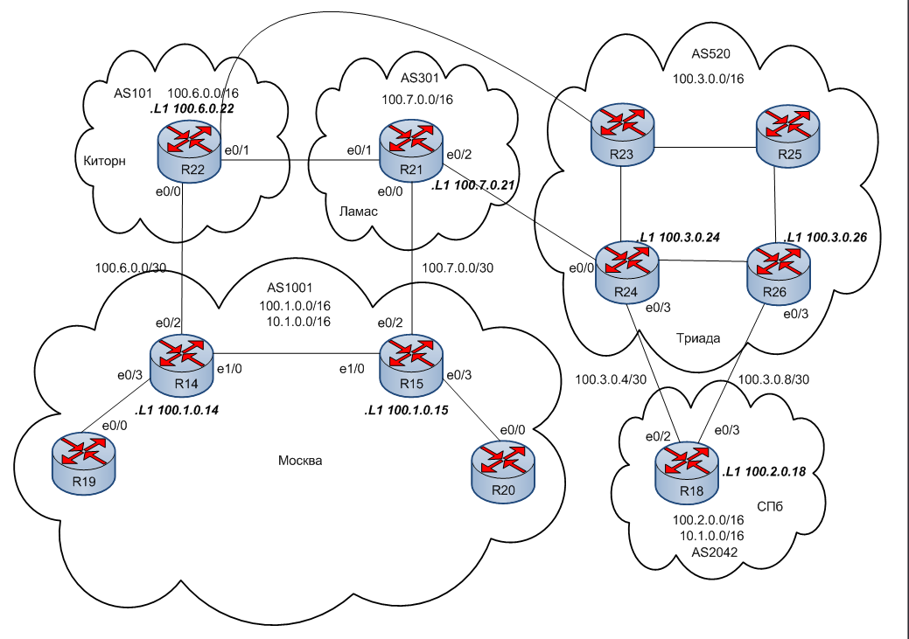

#  iBGP
### Топология


###  Цели

  1. Настроить DHCP в офисе Москва.
  2. Настроить синхронизацию времени в офисе Москва.
  3. Настроить NAT в офисе Москва, С-Петербург и Чокурдах  
  
  Описание задания:
  - Настроить NTP сервер  на R12 и R13. Все устройства в офисе Москва должны синхронизировать время с R12 и R13.
  - Настроить для IPv4 DHCP сервер в офисе Москва на маршрутизаторах R12 и R13. VPC1 и VPC7 должны получать сетевые настройки по DHCP.
  - Настроить NAT(PAT) на R14 и R15. Трансляция должна осуществляться в адрес автономной системы AS1001.
  - Настроите NAT(PAT) на R18. Трансляция должна осуществляться в пул из 5 адресов автономной системы AS2042.
  - Настроите статический NAT для R20.
  - Настроите NAT так, чтобы R19 был доступен с любого узла для удаленного управления.
  - Настроите статический NAT для офиса Чокурдах.
  - Все сети должны иметь IP связность.
  
#### Часть 1. Подготовительная.
Данные для каждой локации необходимые для понимания структуры сети
|Локация| Номер AS     | Блок адресов    | 
|:-----------------|:---------------|-------------------------:|
| Москва  | 1001 | 100.1.0.0/16    |
| С.-Петербург  | 2042 | 100.2.0.0/16    |
| Киторн | 101 | 100.6.0.0/16    |
| Ламас | 301 | 100.7.0.0/16    |
| Триада | 520 | 100.3.0.0/16    | 
##### Укрупненный участок общей схемы с отображением некоторых настроек


 Интерфейсы роутеров настроены  в предыдущих работах.

 R14

 ```
Interface                  IP-Address      OK? Method Status                Protocol
Ethernet0/0                10.1.1.194      YES NVRAM  up                    up
Ethernet0/1                10.1.1.2        YES NVRAM  up                    up
Ethernet0/2                100.1.1.14      YES NVRAM  up                    up
Ethernet0/3                10.1.1.137      YES NVRAM  up                    up
Ethernet1/0                10.1.1.9        YES NVRAM  up                    up
Loopback0                  10.1.0.14       YES NVRAM  up                    up
Loopback1                  100.1.0.14      YES NVRAM  up                    up

 ``` 
 R15
 ```
 Interface                  IP-Address      OK? Method Status                Protocol
Ethernet0/0                10.1.1.130      YES NVRAM  up                    up
Ethernet0/1                10.1.1.226      YES NVRAM  up                    up
Ethernet0/2                100.1.1.15      YES NVRAM  up                    up
Ethernet0/3                10.1.1.250      YES NVRAM  up                    up
Ethernet1/0                10.1.1.10       YES NVRAM  up                    up
Loopback0                  10.1.0.15       YES NVRAM  up                    up
Loopback1                  100.1.0.15      YES NVRAM  up                    up
 ```

R19
```
Interface                  IP-Address      OK? Method Status                Protocol
Ethernet0/0                10.1.1.138      YES NVRAM  up                    up
Loopback0                  10.1.0.19       YES manual up                    up

```
 
R20
 ```
Ethernet0/0                10.1.1.249      YES NVRAM  up                    up
Loopback0                  10.1.0.20       YES manual up                    up
 ```

R12
```
Interface                  IP-Address      OK? Method Status                Protocol
Ethernet0/0                10.1.1.33       YES manual up                    up
Ethernet0/0.10             192.168.10.1    YES NVRAM  up                    up
Ethernet0/0.99             10.1.100.1      YES manual up                    up
Ethernet0/1                10.1.1.21       YES NVRAM  up                    up
Ethernet0/2                10.1.1.193      YES NVRAM  up                    up
Ethernet0/3                10.1.1.225      YES NVRAM  up                    up
Ethernet1/0                10.1.1.13       YES NVRAM  up                    up
Loopback0                  10.1.0.12       YES NVRAM  up                    up
R12#
```

R13
```
Interface                  IP-Address      OK? Method Status                Protocol
Ethernet0/0                10.1.1.22       YES NVRAM  up                    up
Ethernet0/0.20             192.168.20.1    YES NVRAM  up                    up
Ethernet0/1                10.1.1.18       YES NVRAM  up                    up
Ethernet0/2                10.1.1.129      YES NVRAM  up                    up
Ethernet0/3                10.1.1.1        YES NVRAM  up                    up
Ethernet1/0                10.1.1.14       YES NVRAM  up                    up
Loopback0                  10.1.0.13       YES NVRAM  up                    up

```

R18
```
Interface                  IP-Address      OK? Method Status                Protocol
Ethernet0/0                10.1.1.225      YES NVRAM  up                    up
Ethernet0/1                10.1.1.229      YES NVRAM  up                    up
Ethernet0/2                100.3.0.6       YES NVRAM  up                    up
Ethernet0/3                100.3.0.10      YES manual up                    up
Loopback0                  10.2.0.18       YES NVRAM  up                    up
Loopback1                  100.2.0.18      YES NVRAM  up                    up

```

R28
```
Interface                  IP-Address      OK? Method Status                Protocol
Ethernet0/0                10.1.1.206      YES NVRAM  up                    up
Ethernet0/1                10.1.1.198      YES NVRAM  up                    up
Ethernet0/2.50             192.168.50.1    YES NVRAM  up                    up
Ethernet0/2.60             192.168.60.1    YES NVRAM  up                    up
Ethernet0/2.99             10.1.100.1      YES manual up                    up
Loopback0                  10.5.0.28       YES NVRAM  up                    up
Loopback1                  100.5.0.28      YES manual up                    up
```

#### Часть 2. Настройка DHCP в офисе Москва

На R12 Создала Vlan 10
```
R12
!
interface Ethernet0/0.10
 description Subnet Msk10
 encapsulation dot1Q 10
 ip address 192.168.10.1 255.255.255.0
!
```
На R13 создала Vlan 20
```
!
interface Ethernet0/0.20
 description Subnet Msk20
 encapsulation dot1Q 20
 ip address 192.168.20.1 255.255.255.0
!
```
Настроила порты на SW3 и SW2  для подключения VPC к соответствующему Vlan, настроила путь Vlan до шлюзов

```
SW3
interface Ethernet0/2
 description VPC1
 switchport access vlan 10
 switchport mode access
 spanning-tree portfast
 spanning-tree bpduguard enable

```
```
SW2
!
interface Ethernet0/2
 description VPC7
 switchport access vlan 20
 switchport mode access
 spanning-tree portfast
 spanning-tree bpduguard enable
```
На R12 и R13 настроила DHCP pool
```
R12#conf t
Enter configuration commands, one per line.  End with CNTL/Z.
R12(config)#ip dhcp pool Vl10-POOL-MSK
R12(dhcp-config)#network 192.168.10.0 255.255.255.0
R12(dhcp-config)#default-router 192.168.10.1
R12(dhcp-config)#end
R12#
```
```
Создание пула на R13
R13#conf t
Enter configuration commands, one per line.  End with CNTL/Z.
R13(config)#ip dhcp pool VL20-POOL-MSK
R13(dhcp-config)#network 192.168.20.0 255.255.255.0
R13(dhcp-config)#default-router 192.168.20.1
R13(dhcp-config)#end
R13#
```
VPC1 получил адрес из VL10, VPC7 из Vlan20, как и было запланировано

VPC1
```
VPCS> dhcp
DDORA IP 192.168.10.2/24 GW 192.168.10.1
```
VPC7
```
VPCS> dhcp
DDORA IP 192.168.20.2/24 GW 192.168.20.1
```
VPC1 и VPC7 могут пинговать друг друга. Отправлю ping с VPC1 на VPC7
```
VPCS> ping 192.168.20.2

84 bytes from 192.168.20.2 icmp_seq=1 ttl=62 time=2.673 ms
84 bytes from 192.168.20.2 icmp_seq=2 ttl=62 time=1.052 ms
84 bytes from 192.168.20.2 icmp_seq=3 ttl=62 time=1.095 ms
84 bytes from 192.168.20.2 icmp_seq=4 ttl=62 time=1.099 ms
84 bytes from 192.168.20.2 icmp_seq=5 ttl=62 time=1.362 ms

```
#### Часть 3. Настройка синхронизации времени в офисе Москва.

R12 настрила как сервер NTP
```
R12#sh run | sec ntp
ntp master 1
ntp update-calendar
```
Убедилась, что R12 является NTP сервером
```
R12#sh ntp stat
Clock is synchronized, stratum 1, reference is .LOCL.
nominal freq is 250.0000 Hz, actual freq is 250.0000 Hz, precision is 2**10
ntp uptime is 14200 (1/100 of seconds), resolution is 4000
reference time is E9674444.34BC6B10 (10:36:52.206 UTC Fri Feb 2 2024)
clock offset is 0.0000 msec, root delay is 0.00 msec
root dispersion is 2.37 msec, peer dispersion is 1.20 msec
loopfilter state is 'CTRL' (Normal Controlled Loop), drift is 0.000000000 s/s
system poll interval is 16, last update was 14 sec ago.
R12#
```
Аналогично настроила R13

```
R13#sh run | sec ntp
ntp master 1
ntp update-calendar
```
Проверка
```
R13#sh ntp stat
Clock is synchronized, stratum 1, reference is .LOCL.
nominal freq is 250.0000 Hz, actual freq is 250.0000 Hz, precision is 2**10
ntp uptime is 14000 (1/100 of seconds), resolution is 4000
reference time is E967443B.7D70A530 (10:36:43.490 UTC Fri Feb 2 2024)
clock offset is 0.0000 msec, root delay is 0.00 msec
root dispersion is 2.36 msec, peer dispersion is 1.20 msec
loopfilter state is 'CTRL' (Normal Controlled Loop), drift is 0.000000000 s/s
system poll interval is 16, last update was 12 sec ago.
R13#
```
Далее на всём активном оборудовании офиса Москва прописала оба NTP сервера. На примере R14:
```
R14#sh run | sec ntp
ntp server 10.1.0.12
ntp server 10.1.0.13
```
Проверка
```
R14#sh ntp stat
Clock is synchronized, stratum 2, reference is 10.1.0.12
nominal freq is 250.0000 Hz, actual freq is 250.0000 Hz, precision is 2**10
ntp uptime is 17500 (1/100 of seconds), resolution is 4000
reference time is E967444F.E3127108 (10:37:03.887 UTC Fri Feb 2 2024)
clock offset is 0.5000 msec, root delay is 1.00 msec
root dispersion is 69.32 msec, peer dispersion is 64.87 msec
loopfilter state is 'CTRL' (Normal Controlled Loop), drift is 0.000000000 s/s
system poll interval is 64, last update was 43 sec ago.
R14#
```
#### Часть 4. Настройка NAT.

##### 1. Настройка NAT(PAT) на R14 и R15. 

Трансляция будет осуществляться в адреса AS1001 (100.1.0.0/16)

Настроила NAT на R15

Для трансляции в один адрес исходящего интерфейса, необходимо, чтобы этот адрес был на исходящем интерфейсе:

```
R15#sh run int e0/2
Building configuration...

Current configuration : 154 bytes
!
interface Ethernet0/2
 ip address 100.7.0.2 255.255.255.0 secondary
 ip address 100.1.1.15 255.255.255.0
 ip nat outside
 ip virtual-reassembly in
end
```
Создала acces-list
```
R15(config)#access-list 15 permit 192.168.10.0 0.0.0.255
R15(config)#access-list 15 permit 192.168.20.0 0.0.0.255
```
Настроила преобразование адресов
```
R14(config)#access-list 14 permit 192.168.10.0 0.0.0.255


R14(config)#access-list 14 permit 192.168.20.0 0.0.0.255

```
Настроила интерфейсы
```
R15(config)#int e0/3
R15(config-if)#ip nat inside
R15(config-if)#int e0/0
R15(config-if)#ip nat inside
R15(config-if)#int e0/1
R15(config-if)#ip nat inside
R15(config-if)#int e1/0
R15(config-if)#ip nat inside
R15(config)#int e0/2
R15(config-if)#ip nat outside
R15(config-if)#^Z
```
Для проверки с VPC7 отправила ping на 10.7.0.21 (Ламас)
```
VPCS> ping 100.7.0.21

84 bytes from 100.7.0.21 icmp_seq=1 ttl=253 time=1.238 ms
84 bytes from 100.7.0.21 icmp_seq=2 ttl=253 time=0.970 ms
84 bytes from 100.7.0.21 icmp_seq=3 ttl=253 time=1.087 ms
84 bytes from 100.7.0.21 icmp_seq=4 ttl=253 time=1.000 ms
84 bytes from 100.7.0.21 icmp_seq=5 ttl=253 time=1.118 ms
```
Зафиксировала преобразования IP-адреса отправителя при прохождении через R15
```
R15#sh ip nat trans
Pro Inside global      Inside local       Outside local      Outside global
icmp 100.1.1.15:43190  192.168.20.3:43190 100.7.0.21:43190   100.7.0.21:43190
icmp 100.1.1.15:43446  192.168.20.3:43446 100.7.0.21:43446   100.7.0.21:43446
icmp 100.1.1.15:43702  192.168.20.3:43702 100.7.0.21:43702   100.7.0.21:43702
icmp 100.1.1.15:43958  192.168.20.3:43958 100.7.0.21:43958   100.7.0.21:43958
icmp 100.1.1.15:44214  192.168.20.3:44214 100.7.0.21:44214   100.7.0.21:44214
R15#
```
Поскольку AS 1001 имеет два выхода во внешний мир(R14 и R15), на R14 также настроила PAT в один адрес (100.1.1.14) на исходящем интерфейсе e0/2.

##### 2. Настройка NAT(PAT) на R18. Трансляция осуществляется в пул из 5 адресов автономной системы AS2042 (100.2.0.0/16).

VPC8 назначила адрес 192.168.40.2 
```
VPCS> ip 192.168.40.2/24 192.168.40.1
Checking for duplicate address...
VPCS : 192.168.40.2 255.255.255.0 gateway 192.168.40.1
```
VPC назначила адрес 172.16.1.2
```
VPCS> ip 172.16.1.2/24 172.16.1.1
Checking for duplicate address...
VPCS : 172.16.1.2 255.255.255.0 gateway 172.16.1.1

```
Создала пул "белых" адресов 
```
R18(config)#ip nat pool NAT-R18 100.2.1.242 100.2.1.246 netma 255.255.255.240
```
Создала access-list
```
R18(config)#access-li 18 permit 192.168.0.0 0.0.255.255
R18(config)#access-li 18 permit 172.16.0.0 0.0.255.255
```
Настроила NAT
```
R18(config)#ip nat inside source list 18 pool NAT-R18 overload
```
Настроила внутренние и внешние интерфейсы на R18
```
R18(config)#int e0/1
R18(config-if)#
R18(config-if)#ip nat inside
R18(config-if)#int e0/0
R18(config-if)#ip nat inside
R18(config-if)#int e0/2
R18(config-if)#ip nat out
R18(config-if)#int e0/3
R18(config-if)#ip nat out
R18(config-if)#^Z
```
Контроль настроек на R18
```
R18#sh ip nat stat
Total active translations: 0 (0 static, 0 dynamic; 0 extended)
Peak translations: 5, occurred 00:06:39 ago
Outside interfaces:
  Ethernet0/2, Ethernet0/3
Inside interfaces:
  Ethernet0/0, Ethernet0/1
Hits: 20  Misses: 0
CEF Translated packets: 15, CEF Punted packets: 5
Expired translations: 10
Dynamic mappings:
-- Inside Source
[Id: 1] access-list 18 pool NAT-R18 refcount 0
 pool NAT-R18: netmask 255.255.255.240
        start 100.2.1.242 end 100.2.1.246
        type generic, total addresses 5, allocated 0 (0%), misses 0

Total doors: 0
Appl doors: 0
Normal doors: 0
Queued Packets: 0
R18#
```
Тестирование. C VPC и VPC8 отправила успешный ping в Ламас (10.7.0.21)
```
VPCS> ping 100.7.0.21

84 bytes from 100.7.0.21 icmp_seq=1 ttl=252 time=1.100 ms
84 bytes from 100.7.0.21 icmp_seq=2 ttl=252 time=1.064 ms
84 bytes from 100.7.0.21 icmp_seq=3 ttl=252 time=0.953 ms
84 bytes from 100.7.0.21 icmp_seq=4 ttl=252 time=0.949 ms
84 bytes from 100.7.0.21 icmp_seq=5 ttl=252 time=1.015 ms

```
Отследила преобразование IP адресов на R18
```
R18#sh ip nat trans
Pro Inside global      Inside local       Outside local      Outside global
icmp 100.2.1.245:29395 192.168.40.2:29395 100.7.0.21:29395   100.7.0.21:29395
icmp 100.2.1.245:29651 192.168.40.2:29651 100.7.0.21:29651   100.7.0.21:29651
icmp 100.2.1.245:29907 192.168.40.2:29907 100.7.0.21:29907   100.7.0.21:29907
icmp 100.2.1.245:30163 192.168.40.2:30163 100.7.0.21:30163   100.7.0.21:30163
icmp 100.2.1.245:30419 192.168.40.2:30419 100.7.0.21:30419   100.7.0.21:30419
```
```
R18#sh ip nat trans
Pro Inside global      Inside local       Outside local      Outside global
icmp 100.2.1.246:64211 172.16.1.2:64211   100.7.0.21:64211   100.7.0.21:64211
icmp 100.2.1.246:64467 172.16.1.2:64467   100.7.0.21:64467   100.7.0.21:64467
icmp 100.2.1.246:64723 172.16.1.2:64723   100.7.0.21:64723   100.7.0.21:64723
icmp 100.2.1.246:64979 172.16.1.2:64979   100.7.0.21:64979   100.7.0.21:64979
icmp 100.2.1.246:65235 172.16.1.2:65235   100.7.0.21:65235   100.7.0.21:65235
```

##### 3. Настройка статического NAT для R20.
 
 Серый IP-адрес R20 10.1.0.20 для выхода во внешний мир будет преобразован в 100.1.1.20. 
 Настроила преобразование на R15
 ```
 R15(config)#ip nat inside source static 10.1.0.20 100.1.1.20
 ```
Проверка связности с внешним миром. Отправила ping в СПб
```
R20#ping 100.2.0.18 source 10.1.0.20
Type escape sequence to abort.
Sending 5, 100-byte ICMP Echos to 100.2.0.18, timeout is 2 seconds:
Packet sent with a source address of 10.1.0.20
!!!!!
Success rate is 100 percent (5/5), round-trip min/avg/max = 1/1/1 ms
R20#

```
Отследила это событие на R15
```
R15#sh ip nat trans
Pro Inside global      Inside local       Outside local      Outside global
icmp 100.1.1.20:19     10.1.0.20:19       100.2.0.18:19      100.2.0.18:19
--- 100.1.1.20         10.1.0.20          ---                ---
R15#

```
На R14 делаю такую же настройку, так как Киторн является резервным провайдером для Москвы
```
R14(config)#ip nat inside source static 10.1.0.20 100.1.1.20
```
##### 3. Настройка NAT так, чтобы R19 был доступен с любого узла для удаленного управления.

Настрою доступ к К19 по порту 23
```
R15(config)#ip nat inside source static tcp 10.1.0.19 23 100.1.1.19 23
```
Проверка настроек
```
R15#sh ip nat trans
Pro Inside global      Inside local       Outside local      Outside global
tcp 100.1.1.19:23      10.1.0.19:23       ---                ---
--- 100.1.1.19         10.1.0.19          ---                ---
--- 100.1.1.20         10.1.0.20          ---                ---
R15#
```
Тестирование. Из офиса СПб зашла на R19 дл управления:
```
R18#telnet 100.1.1.19
Trying 100.1.1.19 ... Open

***********************************************
UNAUTHORISED ACCESS IS PROHIBITED!
***********************************************


User Access Verification

Password:
R19>
```
Отследила это событие на R15
```
R15#sh ip nat trans
Pro Inside global      Inside local       Outside local      Outside global
tcp 100.1.1.19:23      10.1.0.19:23       100.3.0.6:65149    100.3.0.6:65149
tcp 100.1.1.19:23      10.1.0.19:23       ---                ---
--- 100.1.1.20         10.1.0.20          ---                ---
R15#
```
##### 4. Настройка статического NAT для офиса Чокурдах (100.5.0.0/16)

На R28 настроила  статический нат для обоих VPC 
```
ip nat inside source static 192.168.50.3 100.5.1.28
ip nat inside source static 192.168.60.3 100.5.1.29
```
Определила внутренние и внешние интерфейсы
```
interface Ethernet0/0
 ip address 10.1.1.206 255.255.255.252
 ip nat outside
 ip virtual-reassembly in
!
interface Ethernet0/1
 ip address 10.1.1.198 255.255.255.252
 ip nat outside
 ip virtual-reassembly in
!
interface Ethernet0/2
 no ip address
 ip nat inside
 ip virtual-reassembly in
!
interface Ethernet0/2.50
 encapsulation dot1Q 50
 ip address 192.168.50.1 255.255.255.0
 ip nat inside
 ip virtual-reassembly in
!
interface Ethernet0/2.60
 encapsulation dot1Q 60
 ip address 192.168.60.1 255.255.255.0
 ip nat inside
 ip virtual-reassembly in
 ip policy route-map 10
!
```
Тестирование.
Отправила ping с VPC30 в Ламас (100.7.0.21)
```
VPCS> ping 100.7.0.21

84 bytes from 100.7.0.21 icmp_seq=1 ttl=252 time=1.214 ms
84 bytes from 100.7.0.21 icmp_seq=2 ttl=252 time=1.003 ms
84 bytes from 100.7.0.21 icmp_seq=3 ttl=252 time=1.000 ms
84 bytes from 100.7.0.21 icmp_seq=4 ttl=252 time=1.028 ms
84 bytes from 100.7.0.21 icmp_seq=5 ttl=252 time=1.029 ms

```
Отследила преобразование адресов на R28
```
R28#sh ip nat trans
Pro Inside global      Inside local       Outside local      Outside global
icmp 100.5.1.28:33937  192.168.50.3:33937 100.7.0.21:33937   100.7.0.21:33937
icmp 100.5.1.28:34193  192.168.50.3:34193 100.7.0.21:34193   100.7.0.21:34193
icmp 100.5.1.28:34449  192.168.50.3:34449 100.7.0.21:34449   100.7.0.21:34449
icmp 100.5.1.28:34705  192.168.50.3:34705 100.7.0.21:34705   100.7.0.21:34705
icmp 100.5.1.28:34961  192.168.50.3:34961 100.7.0.21:34961   100.7.0.21:34961
--- 100.5.1.28         192.168.50.3       ---                ---
--- 100.5.1.29         192.168.60.3       ---                ---
R28#

```

Configs can be found [here](configs/).
###  The End 