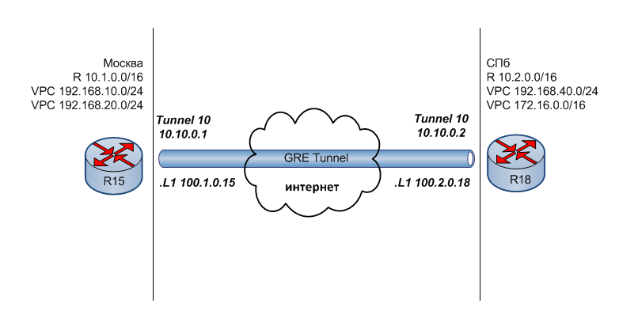
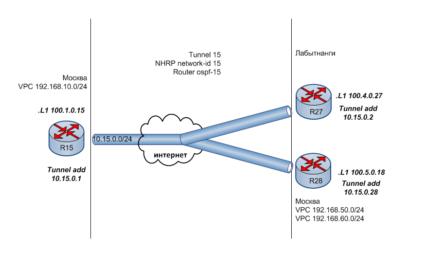

#  VPN.GRE.DmVPN
### Топология


###  Цели

  1. Настроить GRE между офисами Москва и СПб.
  2. Настроить DMVPN между офисами Москва и Чокурдах, Лабытнанги.
  
  Описание задания:
  - Настроить GRE между офисами Москва и СПб.
  - Настроить DMVPN между Москва и Чокурдах, Лабытнанги.
  - Все сети должны иметь IP связность.
  
#### Часть 1. Настройка GRE Москва-СПб
##### Укрупненный участок общей схемы с отображением настроек туннеля GRE


 Интерфейсы роутеров настроены  в предыдущих работах.
 
 R15
 ```
R15#sh ip int brie
Interface                  IP-Address      OK? Method Status                Protocol
....
Loopback1                  100.1.0.15      YES NVRAM  up                    up
...
R15#

 ``` 
Настройка GRE нуннеля на R15
```
R15#conf t
R15(config)#int tunnel 10
R15(config-if)#
R15(config-if)#tunnel mode gre ip
R15(config-if)#ip add 10.10.0.1 255.255.255.0
R15(config-if)#tunn source 100.1.0.15
R15(config-if)#tunn dest 100.2.0.18
R15(config-if)#ip mtu 1400
R15(config-if)#ip tcp adjust-mss 1360
R15(config-if)#^Z
R15#
```
Настройка туннеля на R18
```
R18#conf t
R18(config)#int tunnel 10
R18(config-if)#tunnel mode gre ip
R18(config-if)#ip add 10.10.0.2 255.255.255.0
R18(config-if)#tunn source 100.2.0.18
R18(config-if)#tunn dest 100.1.0.15
R18(config-if)#ip mtu 1400
R18(config-if)#ip tcp adjust-mss 1360
R18(config-if)#^Z
R18#

```
Туннель появился в ТМ Москвы и СПб (на примере R15)
```
R15#sh ip route

Gateway of last resort is 100.7.0.1 to network 0.0.0.0
...
...
C        10.10.0.0/24 is directly connected, Tunnel10
L        10.10.0.1/32 is directly connected, Tunnel10
...
R15#
```
Настройка маршрутизации в Москве. Маршрут к сетям Спб будет лежать через тоннель,чтобы Москва и СПБ работали как бы в одной сети.
```
R15#conf t
R15(config)#ip route 192.168.40.0 255.255.255.0 tunnel 10
R15(config)#ip route 172.16.0.0 255.255.0.0 tunnel 10
R15(config)#ip route 10.2.0.0 255.255.0.0 tunnel 10
R15(config)#^Z
R15#
```
 Настройка маршрутизации в СПб к внутренним сетям Москвы через тоннель:
```
R18#conf t
R18(config)#ip route 192.168.10.0 255.255.255.0 tunnel 10
R18(config)#ip route 192.168.20.0 255.255.255.0 tunnel 10
R18(config)#ip route 10.1.0.0 255.255.255.0 tunnel 10
R18(config)#^Z
```
Проверила связность внутренних сетей Москвы и СПб друг с другом. R15 (Москва) обращается к R18 (Спб) по серому адресу, используя при этом туннель
```
R15#ping 10.2.0.18
Type escape sequence to abort.
Sending 5, 100-byte ICMP Echos to 10.2.0.18, timeout is 2 seconds:
!!!!!
Success rate is 100 percent (5/5), round-trip min/avg/max = 1/1/1 ms
R15#


R15#trace 10.2.0.18
Type escape sequence to abort.
Tracing the route to 10.2.0.18
VRF info: (vrf in name/id, vrf out name/id)
  1 10.10.0.2 [AS 301] 6 msec *  5 msec
R15#
``` 
Пользователи москвы (VPC 172.168.10.3) и СПб (VPC1 172.16.1.2) видят друг друг так, будто они находятся в одной сети. Из Спб (VPC) пропинговала Москву (VPC1)

```
VPCS> ping 192.168.10.3 source 172.16.1.2

84 bytes from 192.168.10.3 icmp_seq=1 ttl=59 time=1.763 ms
84 bytes from 192.168.10.3 icmp_seq=2 ttl=59 time=1.809 ms
84 bytes from 192.168.10.3 icmp_seq=3 ttl=59 time=1.799 ms
84 bytes from 192.168.10.3 icmp_seq=4 ttl=59 time=1.768 ms
84 bytes from 192.168.10.3 icmp_seq=5 ttl=59 time=1.739 ms

VPCS> trace 192.168.10.3
trace to 192.168.10.3, 8 hops max, press Ctrl+C to stop
 1   172.16.1.1   0.538 ms  0.238 ms  0.242 ms
 2   10.1.1.225   0.434 ms  0.374 ms  0.356 ms
 3   10.10.0.1   0.965 ms  0.939 ms  0.772 ms
 4   10.1.1.225   1.006 ms  0.873 ms  0.950 ms
 5   *192.168.10.3   1.309 ms (ICMP type:3, code:3, Destination port unreachable                                                    )

VPCS>
```
#### Часть 2. Настройка DMVPN между Москва и Чокурдах, Лабытнанги

##### Укрупненный участок общей схемы с отображением настроек туннеля DMVPN



1. Настроила HUB R15 (Москва) 
```
R15#conf t
R15(config)#interface tunnel 15
R15(config-if)#tunnel mode gre mult
R15(config-if)#ip add 10.15.0.1 255.255.255.0
R15(config-if)#tunnel source 100.1.0.15
R15(config-if)#ip mtu 1400
R15(config-if)#ip tcp adj 1360
R15(config-if)#ip nhrp network-id 15
R15(config-if)#ip nhrp map multi dyn
R15(config-if)#^Z
R15#
```
SPOKE Чокурдах (R27) и Лабытнанги (R28) настроила для фазы 2.

R27
```
R27#conf t
R27(config)#int tun 15
R27(config-if)#tun mode gre mult
R27(config-if)#ip add 10.15.0.2 255.255.255.0
R27(config-if)#tun sour 100.4.0.27
R27(config-if)#ip mtu 1400
R27(config-if)#ip tcp adj 1360
R27(config-if)#ip nhrp netw 15
R27(config-if)#ip nhrp nhs 100.1.0.15
R27(config-if)#ip nhrp nhs 10.15.0.1
R27(config-if)#ip nhrp map 10.15.0.1 100.1.0.15
R27(config-if)#^Z
R27#
```
R28
```
R28#conf t
R28(config)#int tun 15
R28(config-if)#tun mode gre mult
R28(config-if)#ip add 10.15.0.28 255.255.255.0
R28(config-if)#tun sour 100.5.0.28
R28(config-if)#ip mtu 1400
R28(config-if)#ip tcp adj 1360
R28(config-if)#ip nhrp netw 15
R28(config-if)#ip nhrp nhs 100.1.0.15
R28(config-if)#ip nhrp nhs 10.15.0.1
R28(config-if)#ip nhrp map 10.15.0.1 100.1.0.15
R28(config-if)#^Z
R28#
```
Туннель требуемой конфигурации сформирован

```
R15>sh ip nhrp
10.15.0.2/32 via 10.15.0.2
   Tunnel15 created 00:05:26, expire 01:54:33
   Type: dynamic, Flags: unique registered used nhop
   NBMA address: 100.4.0.27
10.15.0.28/32 via 10.15.0.28
   Tunnel15 created 00:00:49, expire 01:59:10
   Type: dynamic, Flags: unique registered used nhop
   NBMA address: 100.5.0.28


R15#sh dmvpn
Legend: Attrb --> S - Static, D - Dynamic, I - Incomplete
        N - NATed, L - Local, X - No Socket
        # Ent --> Number of NHRP entries with same NBMA peer
        NHS Status: E --> Expecting Replies, R --> Responding, W --> Waiting
        UpDn Time --> Up or Down Time for a Tunnel
==========================================================================

Interface: Tunnel15, IPv4 NHRP Details
Type:Hub, NHRP Peers:2,

 # Ent  Peer NBMA Addr Peer Tunnel Add State  UpDn Tm Attrb
 ----- --------------- --------------- ----- -------- -----
     1 100.4.0.27            10.15.0.2    UP 00:08:07     D
     1 100.5.0.28           10.15.0.28    UP 00:03:30     D

```
Концы туннеля пингуют друг друга (на примере R27-R28)
```
R28#ping 10.15.0.2
Type escape sequence to abort.
Sending 5, 100-byte ICMP Echos to 10.15.0.2, timeout is 2 seconds:
!!!!!
Success rate is 100 percent (5/5), round-trip min/avg/max = 1/1/2 ms
R28#
```
#### Часть 3. Настройка маршрутизации в туннеле DMVPN.
Для настройки маршрутизации на концах туннеля я использовала OSPF (non-broadcast)
Настроила HUB R15 (Москва)
```
R15#conf t
R15(config)#router ospf 15
R15(config-router)#netw 192.168.10.0 0.0.0.255 area 0
R15(config-router)#netw 10.15.0.0 0.0.0.255 area 0
R15(config-router)#nei 10.15.0.2
R15(config-router)#nei 10.15.0.28
R15(config-router)#exit
R15(config)#int tun 15
R15(config-if)#ip ospf netw non-b
R15(config-if)#ip ospf prio 255
R15(config-if)#^Z
R15#
```
Настроила SPOKE R27 R28

R27
```
R27#conf t
R27(config)#router ospf 15
R27(config-router)#netw 10.4.0.0 0.0.255.255 area 0
R27(config-router)#netw 10.15.0.0 0.0.0.255 area 0
R27(config-router)#exit
R27(config)#int tun 15
R27(config-if)#ip ospf netw non-b
R27(config-if)#ip ospf prio 0
R27(config-if)#^Z
R27#
```
R28
```
R28#conf t
R28(config)#router ospf 15
R28(config-router)#netw 192.168.50.0 0.0.0.255 area 0
R28(config-router)#netw 192.168.60.0 0.0.0.255 area 0
R28(config-router)#netw 10.15.0.0 0.0.0.255 area 0
R28(config-router)#exit
R28(config)#int tun 15
R28(config-if)#ip ospf netw non-b
R28(config-if)#ip ospf prio 0
R28(config-if)#^Z
R28#wr
```
Фиксирую, что OSPF настроен
```
R15#sh ip ospf 15 neighbor

Neighbor ID     Pri   State           Dead Time   Address         Interface
10.4.0.27         0   FULL/DROTHER    00:01:52    10.15.0.2       Tunnel15
100.5.0.28        0   FULL/DROTHER    00:01:44    10.15.0.28      Tunnel15
R15#
```
Роутеры обменялись информацией о маршрутах (На примере R15- получены маршруты от R28)
```
R15#sh ip rou ospf 15

Gateway of last resort is 100.7.0.1 to network 0.0.0.0

O     192.168.50.0/24 [110/1010] via 10.15.0.28, 00:27:17, Tunnel15
O     192.168.60.0/24 [110/1010] via 10.15.0.28, 00:27:17, Tunnel15
R15#
```
Проверка связности. Пользователь из Чокурдах (192.168.50.3) пингует пользователя из Москвы (192.168.10.3) через тоннель DMVPN, будто они находятся в одной сети.

```
VPCS> sh ip

NAME        : VPCS[1]
IP/MASK     : 192.168.50.3/24
GATEWAY     : 192.168.50.1
DNS         :
DHCP SERVER : 192.168.50.1
DHCP LEASE  : 74974, 86400/43200/75600
MAC         : 00:50:79:66:68:1e
LPORT       : 20000
RHOST:PORT  : 127.0.0.1:30000
MTU         : 1500

VPCS> ping 192.168.10.3

84 bytes from 192.168.10.3 icmp_seq=1 ttl=60 time=2.028 ms
84 bytes from 192.168.10.3 icmp_seq=2 ttl=60 time=2.015 ms
84 bytes from 192.168.10.3 icmp_seq=3 ttl=60 time=1.933 ms
84 bytes from 192.168.10.3 icmp_seq=4 ttl=60 time=2.127 ms
84 bytes from 192.168.10.3 icmp_seq=5 ttl=60 time=2.070 ms


```

Configs can be found [here](configs/).
###  The End 