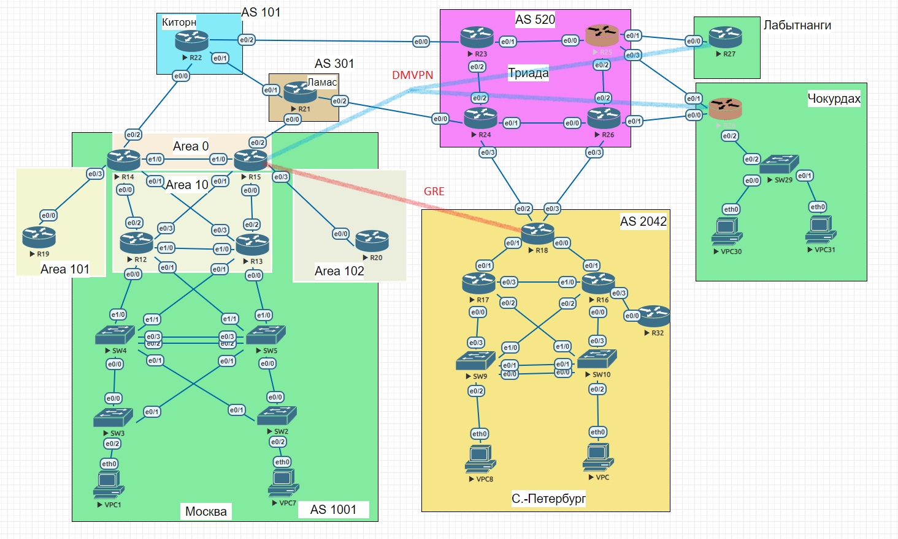
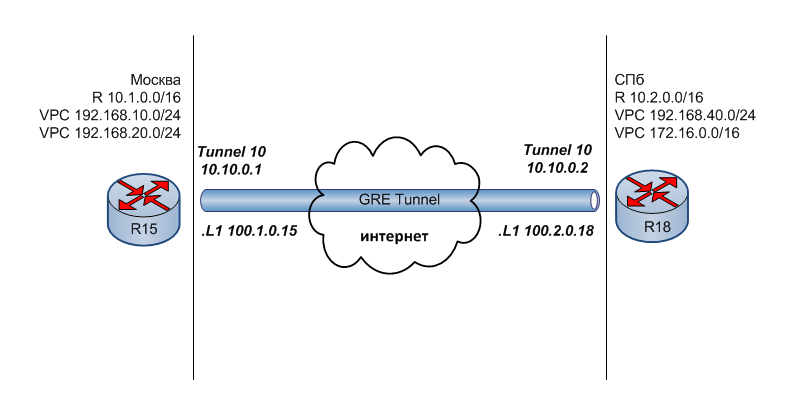
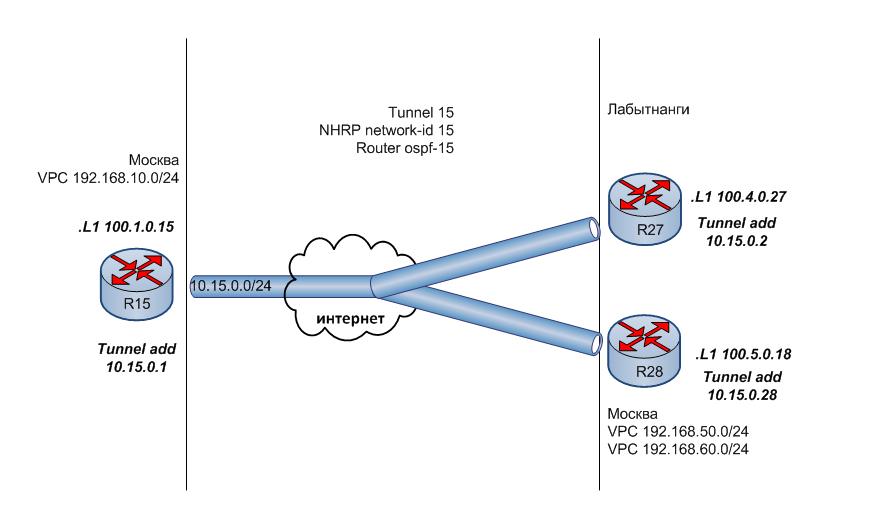

#  IPSec over DmVPN
### Топология


###  Цели

  1. Настроите GRE поверх IPSec между офисами Москва и С.-Петербург.
  2. Настроите DMVPN поверх IPSec между Москва и Чокурдах, Лабытнанги.
  
  Описание задания:
  - Настроите GRE поверх IPSec между офисами Москва и С.-Петербург.
  - Настроите DMVPN поверх IPSec между Москва и Чокурдах, Лабытнанги.
  - Все сети должны иметь IP связность.
  
#### Часть 1. Настройка GRE поверх IPSec между офисами Москва и С.-Петербург.
В предыдущей лабораторной работе был настроен GRE туннель между Москвой и СПб (между R15 и R18). 



 Интерфейсы роутеров настроены  в предыдущих работах.
 
Оконечное оборудование с соответствующими IP-адресами в Мск и Спб могутработать так, будто они находятся в одной сети, используя тоннель GRE
```
R12#ping 10.10.0.2
Type escape sequence to abort.
Sending 5, 100-byte ICMP Echos to 10.10.0.2, timeout is 2 seconds:
!!!!!
Success rate is 100 percent (5/5), round-trip min/avg/max = 1/1/1 ms

R12#trace 192.168.40.1 source 192.168.10.1
Type escape sequence to abort.
Tracing the route to 192.168.40.1
VRF info: (vrf in name/id, vrf out name/id)
  1 10.1.1.194 1 msec 0 msec 0 msec
  2 10.1.1.10 1 msec 0 msec 0 msec
  3 10.10.0.2 1 msec 1 msec 1 msec
  4 10.1.1.230 0 msec *  1 msec
R12#

```
На этом этапе трафик не шифруется. 
Цель работы- зашифровать трафик, идущий по туннелю GRE с помощью IPSec. Я буду испльзовать IKEv1.

Сначала настрою R15:
Настройка политики ISAKMP Phase 1
```
R15#conf t
R15(config)#crypto isakmp policy 10
R15(config-isakmp)#enc aes 128
R15(config-isakmp)#hash sha256
R15(config-isakmp)#group 5
R15(config-isakmp)#authentication pre-share
R15#
```
Определяю Pre Shared Key (PSK) для аутентификации с другим концом туннеля R18

```
R15(config)#crypto isakmp key KEY address 100.2.0.18
```
Создаю набор преобразований, используемый для защиты данных GT

```
R15(config)#crypto ipsec transform-set GT esp-aes esp-sha-hmac
R15(cfg-crypto-trans)#mode transport
R15(cfg-crypto-trans)#

```
Создаю профиль IPSec для соединения ранее определенной конфигурации ISAKMP и IPSec
```
R15#conf t
R15(config)#crypto ipsec profile GPRO
R15(ipsec-profile)#set transform-set GT
R15(ipsec-profile)#^Z
R15#
```
 Применяю шифрование IPSec к интерфейсу туннеля

```
R15#conf t
R15(config)#int Tunnel 10
R15(config-if)#tunnel protection ipsec profile GPRO
```
Такую же конфигурацию применяю на ругом конце туннеля R18
```
R18#conf t
R18(config)#crypto isakmp policy 10
R18(config-isakmp)#enc aes 128
R18(config-isakmp)#hash sha256
R18(config-isakmp)#group 5
R18(config-isakmp)#authentication pre-sha
R18(config-isakmp)#exit
R18(config)#crypto isakmp key KEY address 100.1.0.15
R18(config)#crypto ipsec transform-set GT esp-aes esp-sha-hmac
R18(cfg-crypto-trans)#mode transp
R18(cfg-crypto-trans)#exit
R18(config)#crypto ipsec profile GP
R18(ipsec-profile)#set transform-set GT
R18(ipsec-profile)#exit
R18(config)#int tunn 10
R18(config-if)#tunnel protection ipsec profile GP
R18#
``` 
Пинги по туннелю по прежнему проходят (R12, офис Мск, пингует адрес туннеля в СПб 10.10.0.2)
```
R12>ena
R12#ping 10.10.0.2
Type escape sequence to abort.
Sending 5, 100-byte ICMP Echos to 10.10.0.2, timeout is 2 seconds:
!!!!!
Success rate is 100 percent (5/5), round-trip min/avg/max = 1/1/1 ms
R12#
```
Туннель теперь шифруется 
```
R15#sh crypto session
Crypto session current status

Interface: Tunnel10
Session status: UP-ACTIVE
Peer: 100.2.0.18 port 500
  Session ID: 0
  IKEv1 SA: local 100.1.0.15/500 remote 100.2.0.18/500 Active
  IPSEC FLOW: permit 47 host 100.1.0.15 host 100.2.0.18
        Active SAs: 2, origin: crypto map

R15#
```
#### Часть 2. Настройка DMVPN поверх IPSec между Москва и Чокурдах, Лабытнанги.


В прошлой работе был настроен DMVPN туннель между Москвой и Чокурдах, Лабытнанги.




Все три филиала могут видеть друг друга так, будто они находятся в одной сети. Отправлю ping из Чокурдах (R28, сеть 192.168.60.0/24) в Мск (R15, сеть 192.168.10.0/24)
```
R28#ping 192.168.10.1 source 192.168.60.1
Type escape sequence to abort.
Sending 5, 100-byte ICMP Echos to 192.168.10.1, timeout is 2 seconds:
Packet sent with a source address of 192.168.60.1
.!!!!
```
На данном этапе трафик не зашифрован. Настрою шифрование IPSec. 
Поскольку хабом будет являться R15, на котором ранее уже был настроен GRE over IPSec, настройки R15 минимальные 

```
R15#conf t
Enter configuration commands, one per line.  End with CNTL/Z.
R15(config)#crypto isakmp key KEY add 0.0.0.0
R15(config)#int tunnel 15
R15(config-if)#tunnel protection ipsec profile GPRO

```
Настрою Чокурдах (R28) и Лабытнанги (R27)
```
R27#conf t
R27(config)#crypto isakmp polic 10
R27(config-isakmp)#authen pre-share
R27(config-isakmp)#encrypt aes 128
R27(config-isakmp)#group 5
R27(config-isakmp)#hash sha256
R27(config-isakmp)#exit
R27(config)#crypto ipsec transform-set DT esp-aes esp-sha-hmac
R27(cfg-crypto-trans)#mode transp
R27(cfg-crypto-trans)#exit
R27(config)#crypto isakmp key KEY add 0.0.0.0
R27(config)#crypto ipsec profile DP
R27(ipsec-profile)#set transform-set DT
R27(ipsec-profile)#exit
R27(config)#int tunnel 15
R27(config-if)#tunnel protection ipsec profile DP
R27(config-if)#^Z
R27#
```
```
R28#conf t
Enter configuration commands, one per line.  End with CNTL/Z.
R28(config)#crypto isakmp polic 10
R28(config-isakmp)#authen pre-share
R28(config-isakmp)#encrypt aes 128
R28(config-isakmp)#group 5
R28(config-isakmp)#hash sha256
R28(config-isakmp)#exit
R28(config)#crypto ipsec transform-set DT esp-aes esp-sha-hmac
R28(cfg-crypto-trans)#mode transp
R28(cfg-crypto-trans)#exit
R28(config)#crypto isakmp key KEY add 0.0.0.0
R28(config)#crypto ipsec profile DP
R28(ipsec-profile)#set transform-set DT
R28(ipsec-profile)#exit
R28(config)#int tunnel 15
R28(config-if)#tunnel protection ipsec profile DP
R28(config-if)#
*Apr  6 21:21:04.772: %CRYPTO-6-ISAKMP_ON_OFF: ISAKMP is ON
R28(config-if)#^Z
R28#
```
Сети остались связными благодаря DMVPN, как и раньше (Сеть Чокурдах 192.168.60.0/24 видит сеть Мск 192.168.10.0/24) 

```
R28#ping 192.168.10.1 source 192.168.60.1
Type escape sequence to abort.
Sending 5, 100-byte ICMP Echos to 192.168.10.1, timeout is 2 seconds:
Packet sent with a source address of 192.168.60.1
!!!!!
Success rate is 100 percent (5/5), round-trip min/avg/max = 5/5/6 ms

```
Но данные в туннеле теперь зашифрованы.

Чокурдах: 
```
R28#sh crypto sess
Crypto session current status

Interface: Tunnel15
Session status: UP-ACTIVE
Peer: 100.1.0.15 port 500
  Session ID: 0
  IKEv1 SA: local 100.5.0.28/500 remote 100.1.0.15/500 Active
  Session ID: 0
  IKEv1 SA: local 100.5.0.28/500 remote 100.1.0.15/500 Active
  IPSEC FLOW: permit 47 host 100.5.0.28 host 100.1.0.15
        Active SAs: 4, origin: crypto map

```
Лабытнанги:

```
R27#ping 10.15.0.1
Type escape sequence to abort.
Sending 5, 100-byte ICMP Echos to 10.15.0.1, timeout is 2 seconds:
!!!!!
Success rate is 100 percent (5/5), round-trip min/avg/max = 5/5/6 ms
R27#sh cry
R27#sh crypto sess
Crypto session current status

Interface: Tunnel15
Session status: UP-ACTIVE
Peer: 100.1.0.15 port 500
  Session ID: 0
  IKEv1 SA: local 100.4.0.27/500 remote 100.1.0.15/500 Active
  IPSEC FLOW: permit 47 host 100.4.0.27 host 100.1.0.15
        Active SAs: 2, origin: crypto map
```

Configs can be found [here](configs/).
###  The End 